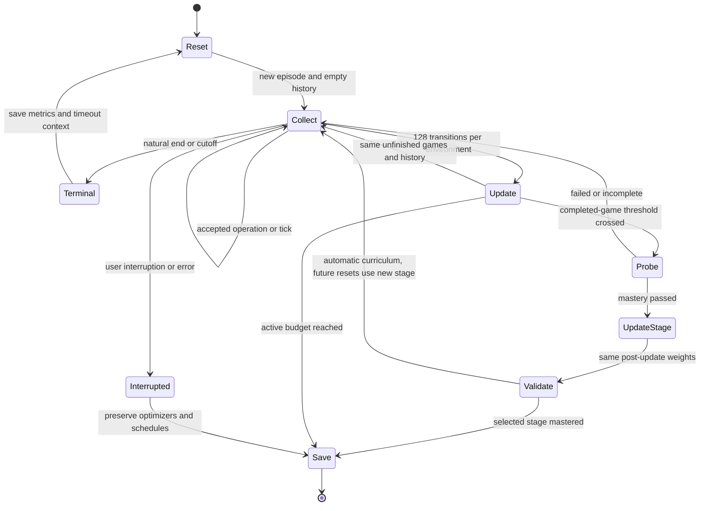

# Architecture

One CUDA MaskablePPO learner controls one shared playing policy. The separately
pinned game package owns combat rules. Its Python simulator verifies GPU traces;
training and optimization run on CUDA. Model inputs contain public information only.

```mermaid
flowchart LR
    Config[Single resolved TOML] --> Scenarios[Seeded CPU scenario queue]
    Scenarios --> Sim[100 Hz ordered CUDA simulator]
    Sim --> Public[281 public values and legal masks]
    Public --> Memory[Bounded causal public history]
    Memory --> Actor[Independent actor Transformer]
    Actor --> Kind[Wait / dig / plant]
    Kind --> Action[Conditional species and tile]
    Action --> Transport[One integer command on CUDA]
    Transport --> Sim
    Sim --> Reward[Net realized value and elapsed ticks]
    Memory --> Buffer[CUDA token archive and rollout sequences]
    Reward --> Buffer
    Buffer --> Critic[Independent critic Transformer]
    Critic --> GAE[Timeout bootstrap and duration-aware GAE]
    GAE --> PPO[Contiguous chunks with public-history burn-in]
    PPO --> Actor
    PPO --> Critic
    PPO --> Schedule[Completed-game curriculum and validation]
    Schedule --> Save[Checkpoints and run records]
    Save --> Replay[GPU action traces verified by CPU]
    Replay --> Output[Compact demos and offline HTML]
```

## Game and observations

Package 1.4.0 / simulation 1.1.0 advances 100 ticks/second. Durations originate in
seconds; integer positions, remainders and processing order are shared by CPU and
CUDA. Accepted plant/dig operations take zero ticks; waits/rejections take one.
Scenario names, seeds, entity IDs, private schedules and snapshots never enter a
policy token. Snapshots and hashes remain available only for verification.

The `event_v6` observation has 281 values: 135 plant values (type, health, behavior
per tile), 135 regional zombie values and 11 globals.
Each of five lanes has three regions. Each region contains five zombie-type counts,
total health, total armor, nearest zombie distance and nearest unused-pole distance.
Both distances use `(x - house_x) / (spawn_x - house_x)`; absence is -1, distinct
from a carrier at either endpoint. Counts and asset totals are scaled but not clipped.
Zombie behavior labels and pole counts are absent. `has_pole` supplies the unused-pole
distance; it becomes false when vaulting begins. The schema defines feature offsets
once for CPU encoding, CUDA constants and memory admission. Globals contain sun,
elapsed time, current/total waves, initial/defeated zombie counts and five mower-spent flags.
Projectiles and spawned counts are absent. Ready and moving mowers are indistinguishable
from mower input alone; only spent differs. The simulator and accounting retain full state.
No plant, zombie or card countdown is encoded. Legal masks still reveal immediate
action legality. Plant/state category embeddings have zero padding for empty tiles.
During gradient calculation, small one-hot matrix products accumulate their gradients without repeated
index sorting; inference uses ordinary lookups. The learned tables and optimizer semantics
are identical. Previous-action embeddings keep the ordinary implementation.

## Actions and legality

One shared 128×128 actor head feeds three action-kind logits and eight conditional
plant-species logits. Nine board maps supply the planting and digging positions.
Wait has no arguments; dig selects a tile; plant selects a legal species and then
its tile. The three heads are produced in one forward pass. Masks exclude unavailable
branches. Harmless dummy conditionals keep unavailable branches finite but contribute
no joint mass or action-likelihood gradient. Deterministic evaluation selects each
learned head greedily, without injected exploration.

The existing simulator command remains one integer per game, with a centralized
kind/species/tile codec. A 406-entry action-history embedding remembers the complete
executed command. This compact transport does not require a 406-way classifier.
The game package and replay API are unchanged.

## Episode memory

Both encoders consume the same deterministic public history, with independent
learned representations and Adam states. A bank contains eight recent decision
tokens, 32 retained event tokens, and eight compressed summaries. Tokens contain
the observation, previous accepted action, reset marker and public tick. Rejected
actions have wait as their executed-action marker. No activations cross game boundaries.

Plant health/behavior changes, zombie counts/health/armor,
sun/wave changes, mower-spent flags and legal-mask changes admit events. A region gaining
its first or losing its last unused pole also admits an event, determined from the
distance sentinel alone. Changes to the clock or either nearest distance within a
region alone do not admit events. Removed projectiles, spawned counts, mower
positions/ready/moving states and zombie behaviors never supply hidden event flags.
Every decision still sees the current public state.
Local eviction sends events to a FIFO, and quiet tokens
or older events to summaries. A summary keeps the latest public state, earliest
represented tick and count; it never averages category identifiers. Summary stride
and all capacities are configurable. Finite history can lose timing information.

The current query attends to valid retained tokens at or before its own time.
Relative elapsed time, summary span and count describe temporal context; no hidden
entity countdown is reconstructed from engine fields. Two gated pre-normalized
attention blocks default to width 128, four heads and feed-forward width 256.
History is re-encoded using current weights, avoiding stale learned key/value caches.
This is a project-specific bounded Transformer, not a reproduction of GTrXL.

## Learning data and transitions

Each rollout contains 128 environments × 128 transitions (16,384 total).
Collection freezes actor and critic weights. Actor-only inference supplies actions
and true mixed kind/species/tile log probabilities. The buffer archives each raw token once
and stores compact context references. Terminal contexts are captured before resets;
truncated games bootstrap from these, natural outcomes do not. The unchanged critic
evaluates stored causal contexts in batches before duration-based GAE.

Optimization shuffles contiguous per-environment chunks (default 16 transitions),
never the transitions within them. At each chunk boundary it restores retained
public history and replays up to eight prefix transitions without loss. The prefix
reconstructs event admission/compression, not learned hidden state. Both encoders
then re-encode this history; the remaining chunk contexts use the exact archive.
Deterministic boundary banks are reconstructed once per rollout and reused across
epochs and shuffled environment groups. Learned features are never cached across updates.
No old rollout is reused after optimization. All tensors stay on CUDA apart from
batched diagnostics and completed-game records.

Independent clipping and optimizers isolate policy and value learning. Actor KL
stopping leaves critic epochs active. Exploratory noise is fixed within a rollout,
held during stage critic adaptation and decays by completed games. Evaluation uses
greedy actor inference with its own episode banks, so it cannot alter collection memory.

Selected-stage runs can enable `until_stage_complete`. The game and wall-clock
ceilings become inactive; elapsed time and completed games still drive diagnostics,
exploration and probes. Failed probes continue the same stage. A complete passing
probe marks mastery, saves its checkpoint and triggers normal-game validation before
finalization. The selected stage never promotes automatically. Bounded training is
the default; conflicting explicit ceilings fail before output creation.

## Storage, compatibility and failure paths

Each run records resolved settings, source and structural signatures, reward and
discount settings, seeds, elapsed allowance, curriculum state, episodes and optimizer
metrics. Checkpoints include both optimizers. Stage transfers copy compatible weights
only; resume restores the saved experiment, starts fresh games and empty memory,
and preserves cumulative schedules. Resume is not a bitwise continuation of partial games.
All earlier observation/policy signatures are rejected before model loading.

The engine is installed non-editably from a commit-verified archive and complete
source manifest. Missing CUDA, changed pins, unsupported settings and incompatible
weights fail before a new run is created. Capacity exhaustion fails rather than
clipping entities. Deadline checks stop at completed updates and preserve explicitly
incomplete evaluation/export state. Validation alone selects best checkpoints.

Demos replay GPU actions through the CPU engine and require identical final outcome,
decisions and hash before publication. Native 100 Hz recordings remain model-free.
Video rendering samples a configurable lower rate while stepping/verifying every
tick. Offline reports read stored metrics, not models. Historical reports survive;
20 Hz recordings and incompatible models are not accepted by the current engine/policy.
