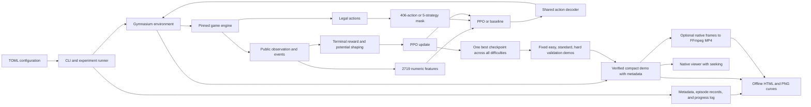
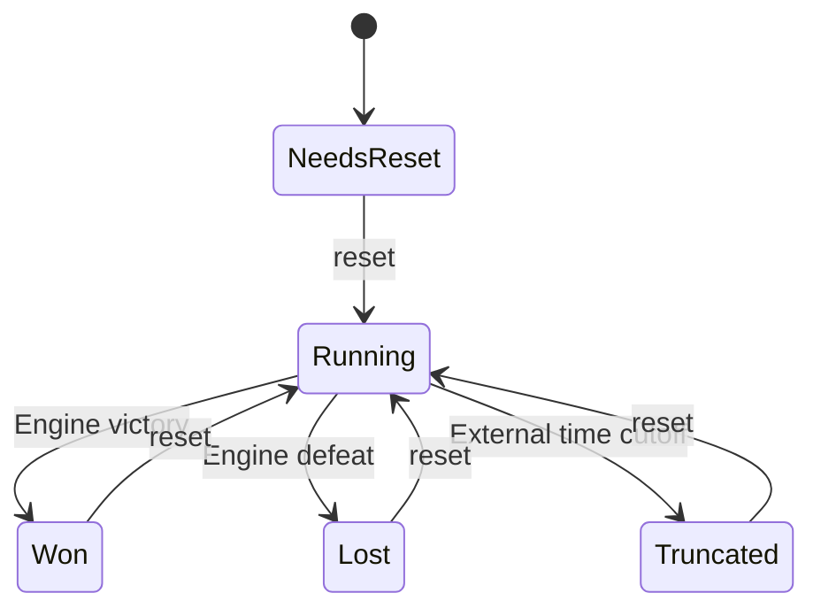
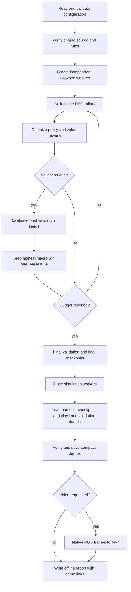
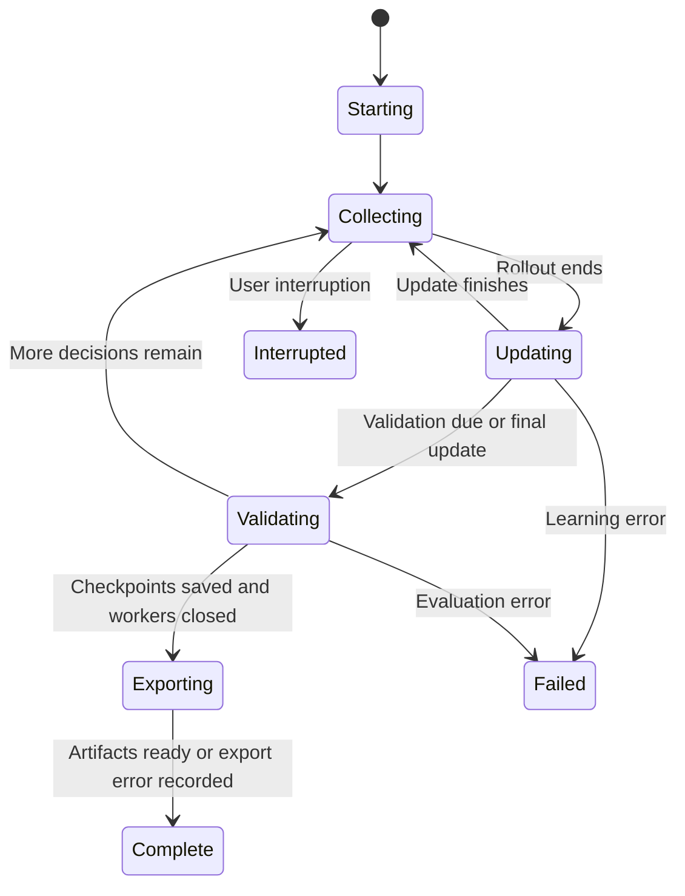
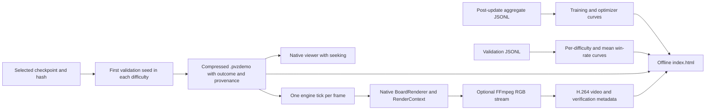
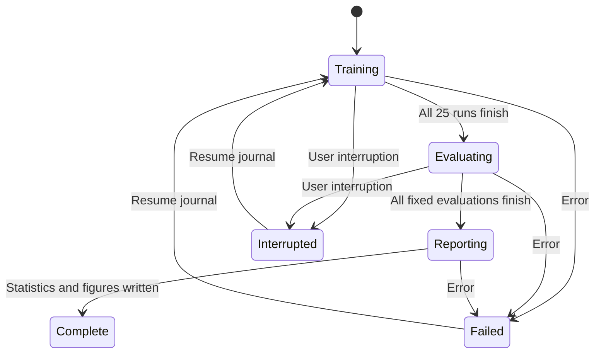

# Current architecture

The research project depends on a pinned, separately installed game. Only the game
owns simulation state. A manifest verifies package version 1.2.1, simulation version
1.0.0, the Git source pin, source hashes, and rules hash before experiments. The
installer stages a verified Git archive in this project's build directory and
installs non-editably from there, without writing to the game checkout.

## Ownership and interfaces

| Part | Responsibility |
|---|---|
| Configuration and provenance | Constants, seed splits, source verification, hashes, versions |
| Actions and encoding | Stable public schemas, no private state or future schedule |
| Environment | One game per worker, one action per 10 ticks, explicit episode lifecycle |
| Rewards | Potential from public observations, true terminals versus truncations |
| Controllers | Frozen original heuristic, shared public-state facade, strategy proposals |
| Training | PPO updates, curriculum progress, validation-only checkpoint selection |
| Runtime transport | Masks carried with observations, local mask access, reusable CUDA rollout tensors |
| Timings/benchmark | Separate collection and update costs, warmup excluded from measurements, paired data-path comparisons |
| Evaluation | Same cases and timing, independent policy RNG, complete episode records |
| Statistics/reporting | Run/scenario bootstrap, paired comparisons, figures and report |
| Progress | Shared phase names and throttled console/file events; no per-episode printing |
| Visualization | Offline run report, optional metrics, resume segments, checkpoint-identified demos |
| Recording compatibility | Native metadata, legacy sidecar fallback, natural outcome precedence |
| Rendering/video | Thin native-renderer adapter, verified playback, optional MP4 encoding |
| Suite | Restart journal for attempts, fixed settings, training before final testing |

Direct policies see a flat 2,719-element float32 vector. Plants occupy a 5×9×17
grid, zombies a 5×20×16 grid, projectiles a 5×20×3 grid, and globals have 54 values.
Integer sums precede scaling, so tuple order does not alter aggregated observations.
IDs and scenario labels are not inputs. The encoding is intentionally partially observed.

Actions are wait 0, 360 plant/tile combinations, and 45 digs. The hybrid has five
strategy choices, each proposing at most one placement. Invalid direct actions
follow the engine contract; unavailable hybrid strategies wait and are logged as
rejected choices. Masks use only current legality.

The engine may still be running when the adapter is truncated. Vector wrappers
retain the terminal observation for PPO bootstrapping before resetting that worker.
True terminal potential is zero; truncated potential is preserved.

## Training and evaluation

The installed game is package 1.2.1 at source pin
`6fd1f54706369915013a49eab5c1790f8c55ab0a`, simulation version 1.0.0.
The native HUD displays defeated/total zombies. The research adapter does not
duplicate the counter or change the numeric observation fields.

The bundled configuration uses CUDA for policy inference during training and PPO
updates. Each spawned game worker simulates on the CPU. `--device cpu` selects CPU
training; CUDA requests fail early when unavailable. Device settings are retained
in experiment metadata and must match when resuming. Standalone evaluation and
demo generation load the shared checkpoint on the CPU by default.

```mermaid
flowchart LR
    Worker[CPU game worker] --> Response[Observation and legal mask together]
    Response --> Cached[Local mask cache]
    Response --> Collect[Stock SB3 rollout collector]
    Cached --> Collect
    Collect --> GAE[Stock returns and advantages]
    GAE --> Copy[One completed rollout copied to CUDA]
    Copy --> Batch[Original NumPy minibatch order]
    Batch --> Update[Stock PPO update on device tensors]
    Update --> Reset[Release cached tensors at next rollout]
```

Transport wrappers retain SB3's spawned-worker implementation. Masks are metadata,
not observation features. On automatic reset, the mask comes from the new episode;
the old terminal observation remains available for time-limit bootstrapping. Mask
queries use a local copy and unknown worker mutations invalidate cached entries.
The adapter reuses the engine's legal-action query until public legality inputs
change: status, occupied tiles, and each card's affordability/recharge availability.
It queries the engine again on changes or reset. Strategy candidates still update
each decision because threats and plant health matter to placement. This bounded
single-state cache applies to training, validation, and demos, with unchanged masks.

The device buffer subclasses retain SB3's GAE calculation, flattening, and NumPy
permutation generator. Only minibatch indexing moves onto the GPU. CPU sampling
uses the original implementation. Loss functions and validation stay unchanged.
Resuming may recreate an empty runtime buffer, preserving policy and optimizer.

Runtime flags live in `[runtime]`, have defaults for older configurations, and are
recorded in full provenance. They do not affect research compatibility. Networks,
precision, worker counts, rollout size, minibatches, rewards, curriculum, and
checkpoint selection are still governed by the same research settings.

Each worker tracks global collection progress in increments of the worker count,
so curriculum changes apply at episode reset without querying workers every action.
Resume restores weights and optimizer, sets curriculum progress before reset, and
starts fresh episodes. It preserves earlier eligible best checkpoints.
Checkpoints with a different engine source pin are rejected before deserializing
model weights. Archived reports and recordings can be read without loading a model;
archived checkpoints cannot generate new gameplay. Comparisons retain distinct
protocol hashes for each engine source pin, even when combat rules match.

Each run owns one policy and optimizer throughout all curriculum stages. One
`best.zip` maximizes the equal-weight easy/standard/hard validation win rate;
earlier checkpoints win ties. Every difficulty demo records the same checkpoint
hash. The independent seeds and ablation conditions in the suite are separate
shared-policy experiments, not models selected by difficulty.

The progress reporter shares a wall-clock throttle across training, evaluation,
and export. Routine messages default to every 15 seconds; important events print
immediately. Collection/update phase changes update status without printing every
rollout. Aggregates cover the last 100 completed training games. PPO statistics are
read after updates, at the next rollout start and at training end, including the
last optimized policy. Training ETA excludes validation and report time; export
time is recorded separately. TensorBoard remains controlled by SB3.
Collection/update timing uses rollout boundaries and captures the final update;
validation and report gaps are excluded. Completed phase totals and latest phase
durations enter the aggregate metrics and progress log. The benchmark warms up
one full rollout and reports setup/warmup separately. Optional paired measurement
alternates reference/configured order and compares final policy hashes.

## Result artifacts

Report assets use relative links and need no network or server. Charts refresh
after validation and at completion. Compact demos are generated after training by
default; videos require configuration or an explicit `--videos` flag. Raw episode
records remain the research evidence. Missing metrics from old runs are shown as
unavailable. Resume metadata supplies an exact boundary for including ancestor
measurements; each segment retains its own wall time.

Video output uses temporary files and is published only after replay hashes and
encoder completion pass. The adapter records truncation and provenance in native
replay metadata, outside simulation state. The engine can correctly remain `running`.
The shared loader fills missing metadata from legacy sidecars but gives embedded
fields precedence. `Playback.display_outcome` controls labels at the verified end,
and natural outcomes take precedence over annotations. The encoder holds one frame at
a time and stores its error output in a temporary file. The final outcome is held
for two seconds by default. Export status is independent of completed training,
so dependency/encoder failures preserve checkpoints and support regeneration.

`visualize --run` rebuilds reports and missing/changed demo assets without training.
`replay --video` exports an individual recording. Configuration separates logging
and visualization preferences from research compatibility checks, while full
resolved settings remain in run provenance. The pinned game is not modified.

The Gym renderer retains a writable `(600, 1000, 3)` NumPy RGB array. MP4 output
defaults to native 1280×820 dimensions, configurable with two positive even numbers.
Rendering uses only public observations and explicitly provided presentation context.
The game owns drawing, action descriptions, seek controls, and compressed-file I/O;
the research project owns experiment selection, provenance, reports, and FFmpeg.
Compact recording and reports do not require pygame or FFmpeg.

## Formal suite

Resume walks the journal and skips completed jobs. Every retry uses a new attempt
directory. Formal test cases do not enter learning or checkpoint selection.
Replays contain privileged snapshots for verification, but policy code only receives
encoded public observations and masks. Human-readable reports consume evaluation
records, never reward curves as a substitute for win rates.
