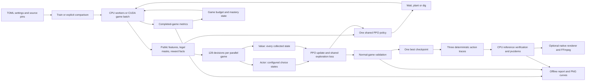
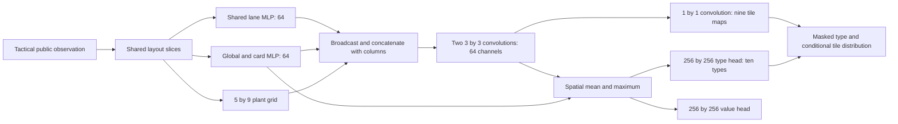
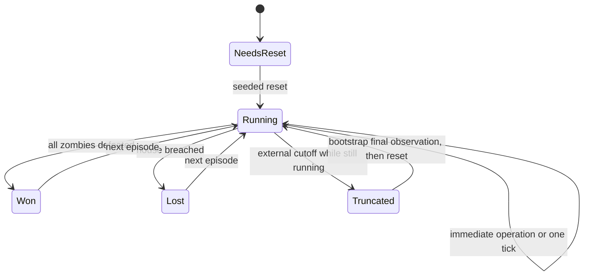
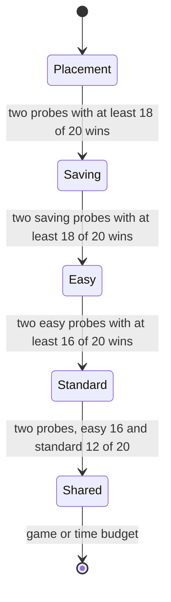
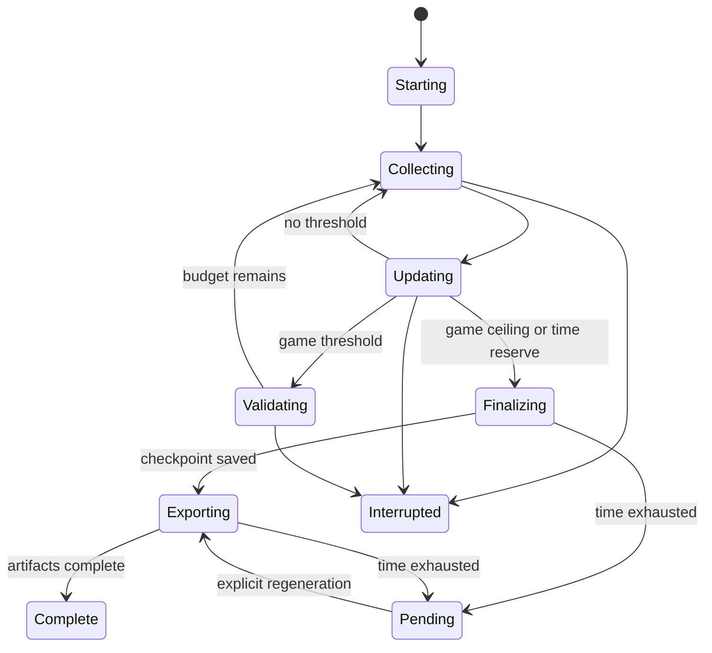

# Current architecture

Research package 0.7.1 consumes the separately pinned game package 1.3.0,
simulation 1.0.0. Training/evaluation verify installed package and source hashes,
the engine commit and combat rules. Policies receive only public observations.
The Python simulator is the reference; the CUDA simulator preserves its rules.

## Policy

All direct-placement policies use Discrete(406): wait; eight plant types on 45
tiles; dig on 45 tiles. The engine's legality determines masks. Valid placements
and digs are immediate; waiting and rejected requests advance one tick. Multiple
legal operations can occur at the same tick, with revalidation after each.

Spatial-v1 and tactical-v2 are versioned encoders. Tactical-v2 contains 1,140
values: 765 plant, 240 regional zombie, 45 projectile, 54 global, 16 card economy,
and 20 lane-summary features. Accumulation preserves crowds and ignores entity
iteration order. Seeds, task labels, entity IDs and future schedules are excluded.

The flat and grouped MLPs remain available. Grouped policies factor the joint
probability into type and tile terms; wait has no tile term. Deterministic
inference selects the most likely available type, then its most likely tile.

`exploration_loss` is used by CPU and CUDA PPO. Joint-entropy profiles preserve
the original objective. Balanced profiles add type entropy and mean normalized
conditional tile entropy without multiplying by type probability. The logged
true joint entropy is never substituted with the exploration bonus. PPO ratios,
clipping, advantage normalization and optimizer updates use the actual joint
policy probability.

CUDA collection keeps observations, masks, actions, rewards, values, advantages
and returns on-device. Compact completion facts cross to the host. A 45-slot
planting-time ledger per game measures early voluntary digging; it changes neither
simulation state nor rewards. Device GAE and timeout bootstrap use the same gamma
as potential shaping. The long-horizon profile changes only that discount.

## Reward and episode lifecycle

Reward is the sum of terminal outcome, potential difference and public-event
combat/defense terms. User coefficients remain in configuration. Win is +1 and
loss is -2. Killing credit distinguishes plants/projectiles from mowers. Damage,
mower activation/sun penalty, wall-nut absorption, empty explosion and economy
potential are independently reported. See [research rewards](research.md#rewards)
for the formulas.

Natural terminal outcomes take precedence over cutoff. CUDA automatic resets
preserve the final observation for timeout bootstrapping and retain completion
metrics before reusing device storage.

## Curriculum and scheduling

The experimental teaching state machine changes the distribution on future
resets. A stage tag belongs to the episode from its reset to completion; it is
metadata, never a policy feature. A game begun before promotion cannot satisfy
new-stage residency.

For the SC2 profiles, each promotion additionally needs 100 completed games
started in the stage. Probes are due every 100 completed games. Placement/saving use their existing
restricted lesson plant sets and permit digging; normal games allow all plants.
Easy rehearses both lessons; standard rehearses saving; shared uses 20% easy,
40% standard and 40% hard. Expiry never forces promotion. Policy and optimizer
instances remain the same throughout.

New full validation defaults to every 1,000 completed games. Checkpoints are
selected by equal-weight win rate across easy/standard/hard on the fixed 50 seeds
per difficulty; ties retain the earlier checkpoint. Evaluation follows the PPO
update. Multiple crossed thresholds coalesce into one call and actual/nominal
counts are both recorded. The current-weight result cache lets matching mastery
probes reuse full validation results. Partial validation never selects a model.

## Time allowance and recovery

`RunBudget` counts startup, validation and presentation. With a 120-minute limit,
15 minutes are reserved for finalization; shorter runs reserve at most one eighth
of their limit. New rollouts use the measured prior collection/update duration to
estimate whether another full cycle fits. Stops occur between complete updates.
Evaluation checks before batches and steps; video export checks before frames.
An in-flight operation finishes safely. Pending artifacts keep checkpoints,
completed recordings and an offline status page.

Every checkpoint stores curriculum state, global games, validation schedule and
elapsed budget. Resume uses the larger recorded checkpoint/run elapsed total and
retains the original configuration. Output segments have separate wall-time axes.
Changed learning profiles require fresh models; existing compatible models keep
their saved encoder, distribution, reward and curriculum semantics.

## Results and explicit experiments

`train` creates `train.log`, episode records, aggregated optimization metrics,
validation curves and checkpoints. Reports distinguish training behavior from
validation performance. Demonstrations load the single selected checkpoint,
generate deterministic actions for validation seed 100000 on each difficulty,
and verify the traces using Python state hashes before saving compact recordings.
The native viewer supplies seeking; native rendering supplies optional MP4 frames.

`compare-sc2` is separate from the formal suite and old short pilot. It runs
bounded learning diagnostics followed by A-F with learner seeds 101/102 in opposite
orders. Comparison reports require shared engine/resource/evaluation controls,
consistent profile identities, complete final-weight validation and paired cases.
They show actual counts rather than requiring identical rollout overshoot. Bootstrap
resampling preserves learner and scenario pairing. Missing comparisons remain
explicit; no final-test case is used. `--report-only` reads records without training.

Availability and tests never launch either the comparison matrix or formal suite.

## Game boundary and GPU implementation

| Owner | Responsibilities |
|---|---|
| Pinned game 1.3.0 / `8861824` | Seeded scenarios, combat rules, CPU oracle, optional CuPy/NVRTC batch simulator, public observations/events, native recording/rendering |
| Research package | Versioned encoders, legal/lesson masks, rewards, PPO, curriculum, game/time schedules, experiment provenance and comparisons |
| Native reader checkouts | CPU 1.2.2 / `a95524e`, CUDA 1.3.1 / `314528a`; view research action-phase demos without replacing the installed simulator |

The installer stages a verified Git archive outside the game checkout. Runtime
checks enforce package version, source manifest, simulation version and rules hash.
New source pins require fresh models; archived reports/replays remain readable.
Runtime/presentation preferences are excluded from research compatibility, but
learning settings and profile identity are retained.

CUDA stores plants, zombies, projectiles, timers and episode state in contiguous
arrays. A warp belongs to each game, with one lane executing combat in reference
order. This preserves integer movement, competing-hit credit and state hashes.
Capacity is checked rather than silently dropping entities. Custom scenarios use
the CPU seeded generator; modified rules and scripted hybrid use the CPU simulator.
Arbitrary mid-game snapshots need additional projectile headroom.

Observations, masks, actions, rewards, values, log probabilities, advantages and
returns stay on-device through CuPy/PyTorch zero-copy views and a shared stream.
A compact synchronization remains each decision: three integers per game for
completion, timeout and elapsed ticks. Finished-game summaries transfer in batches.
CPU curriculum state chooses resets through a bounded staging queue; this is not
fully asynchronous simulation. GPU validation refills finished slots, then emits
results/traces in original level/seed order. `runtime.refill_evaluation=false`
selects the fixed-batch control.

`plant_rewards` attributes eaten plants through public placement/removal events.
CUDA uses the existing diagnostic event buffer on-device, adding about 252 MiB
at 128 games for the optional plant-role profile. IDs only join transient events;
they never enter policy features. A separate planting-time ledger measures early
digging without changing game state. Shared actor/exploration interfaces serve
CPU and CUDA; their equations are in [research design](research.md#policies-and-optimization).

On the CPU path, runtime flags cache authoritative legality while its inputs
match, deliver masks alongside worker observations, and reuse rollout tensors on
CUDA across epochs. These preserve mask semantics, precision and NumPy minibatch
order. Each Windows worker owns its game and uses `spawn`; API entry scripts need
an `if __name__ == "__main__":` guard.

## Replay and rendering

The CPU research adapter applies legal plant/dig requests immediately by suppressing
the pinned advance hook; wait/rejection still advances. CUDA implements the same
semantics. The public native `Game.step` contract remains positive-time.
`pvz-rl/actions-v1` explicitly records zero-time operations; renaming it to native
version 1 would change playback semantics. Both newer native readers and the
research command dispatch the format to an action-phase playback adapter.

Playback drains instantaneous operations before displaying/caching a tick, reuses
native seeking, and verifies final/intermediate hashes. Embedded metadata supplies
policy/checkpoint identity and external truncation; legacy sidecars only fill missing
fields. Natural outcomes take precedence. Full-file checksums protect caller metadata
as well as the separately verified simulation hash. Metadata is never a policy input.

`BoardRenderer`/`RenderContext` supply the board and HUD, `Playback.last_operation`
and `display_outcome` supply presentation state. Gym RGB stays 1000×600; optional
FFmpeg export streams packed RGB at the replay tick rate, default 1280×820,
H.264/yuv420p with fast-start and a final outcome hold. No duplicated board renderer
or frame list is maintained.

## Remaining implementation opportunities

Profile before further parallelization. Ordered combat is small compared with
encoding/inference launches, synchronization and PPO minibatches in the measured
workload. An on-device reset queue could remove host synchronization but needs
queue-exhaustion and curriculum-boundary proofs. More intra-game concurrency needs
ordering/collision proofs; see [measurements](validation.md#gpu-performance).

A public immediate-action API could replace pinned private advance/playback hooks.
An explicit death `source_kind` could replace the tested negative-source-ID mower
convention. These are follow-ups, not implemented promises. Native numeric masks,
compressed recordings, rendering and provenance are already supplied upstream;
they no longer need separate feature proposals.
