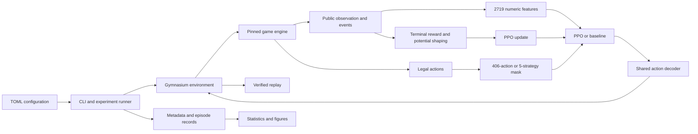
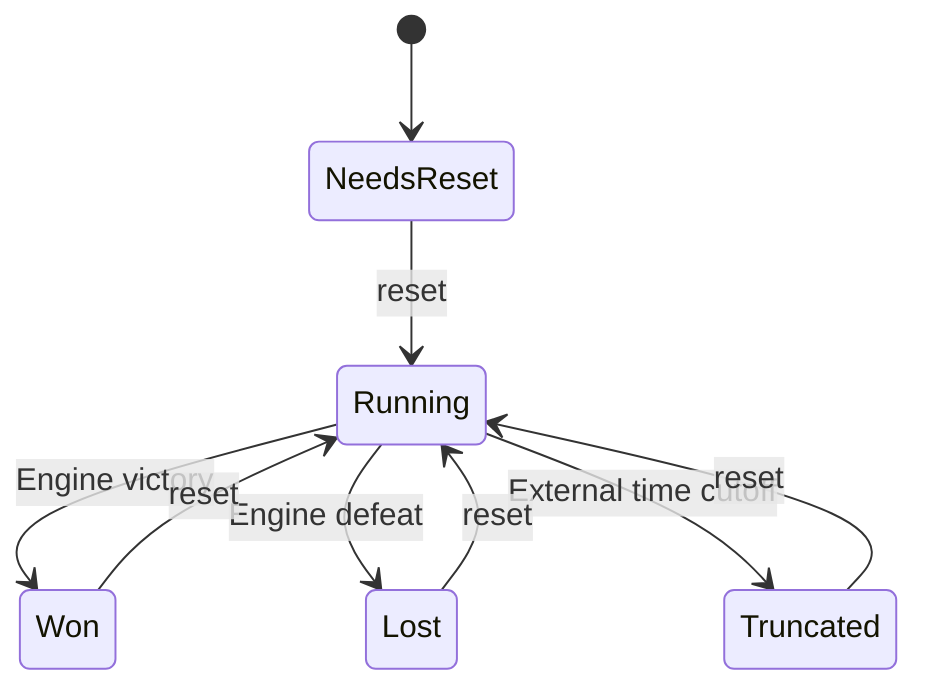
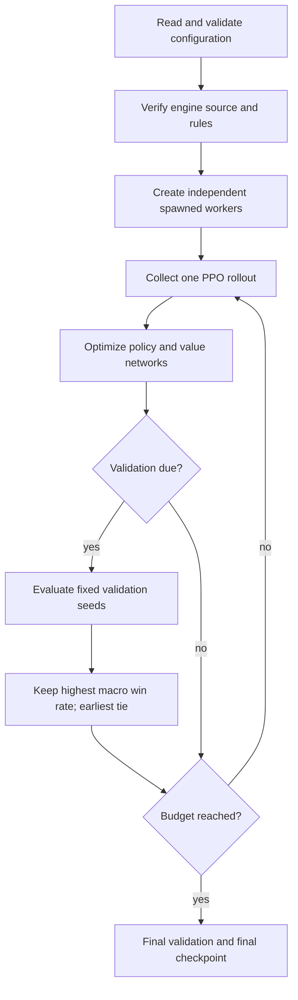
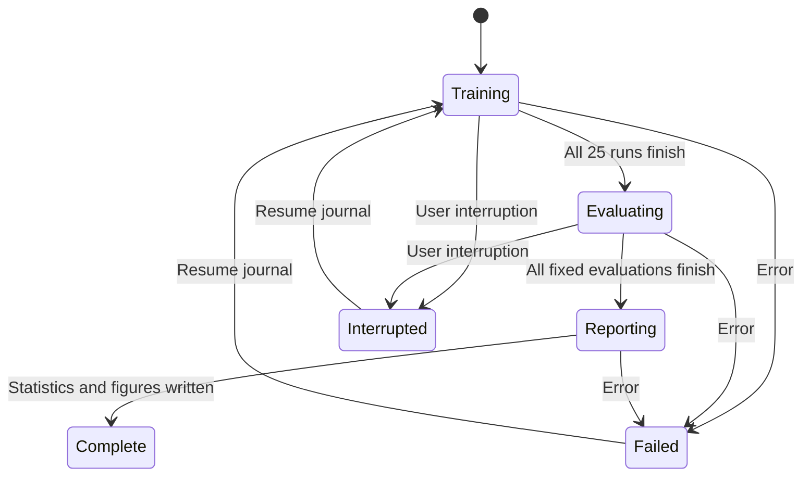

# Current architecture

The research project depends on a pinned, separately installed game. Only the game
owns simulation state. A manifest verifies the installed engine before experiments.

## Ownership and interfaces

| Part | Responsibility |
|---|---|
| Configuration and provenance | Constants, seed splits, source verification, hashes, versions |
| Actions and encoding | Stable public schemas, no private state or future schedule |
| Environment | One game per worker, one action per 10 ticks, explicit episode lifecycle |
| Rewards | Potential from public observations, true terminals versus truncations |
| Controllers | Frozen original heuristic, shared public-state facade, strategy proposals |
| Training | PPO updates, curriculum progress, validation-only checkpoint selection |
| Evaluation | Same cases and timing, independent policy RNG, complete episode records |
| Statistics/reporting | Run/scenario bootstrap, paired comparisons, figures and report |
| Suite | Restart journal for attempts, fixed settings, training before final testing |

Direct policies see a flat 2,719-element float32 vector. Plants occupy a 5×9×17
grid, zombies a 5×20×16 grid, projectiles a 5×20×3 grid, and globals have 54 values.
Integer sums precede scaling, so tuple order does not alter aggregated observations.
IDs and scenario labels are not inputs. The encoding is intentionally partially observed.

Actions are wait 0, 360 plant/tile combinations, and 45 digs. The hybrid has five
strategy choices, each proposing at most one placement. Invalid direct actions
follow the engine contract; unavailable hybrid strategies wait and are logged as
rejected choices. Masks use only current legality.

The engine may still be running when the adapter is truncated. Vector wrappers
retain the terminal observation for PPO bootstrapping before resetting that worker.
True terminal potential is zero; truncated potential is preserved.

## Training and evaluation

Each worker tracks global collection progress in increments of the worker count,
so curriculum changes apply at episode reset without querying workers every action.
Resume restores weights and optimizer, sets curriculum progress before reset, and
starts fresh episodes. It preserves earlier eligible best checkpoints.

Resume walks the journal and skips completed jobs. Every retry uses a new attempt
directory. Formal test cases do not enter learning or checkpoint selection.
Replays contain privileged snapshots for verification, but policy code only receives
encoded public observations and masks. Human-readable reports consume evaluation
records, never reward curves as a substitute for win rates.
