# Current architecture

The research project depends on a pinned, separately installed game. Only the game
owns simulation state. A manifest verifies package version 1.3.0, simulation version
1.0.0, the Git source pin, source hashes, and rules hash before experiments. The
installer stages a verified Git archive in this project's build directory and
installs non-editably from there, without writing to the game checkout.

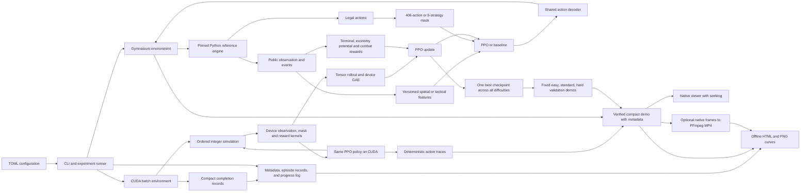

## Ownership and interfaces

| Part | Responsibility |
|---|---|
| Configuration and provenance | Constants, seed splits, source verification, hashes, versions |
| Actions and encoding | Stable public schemas, no private state or future schedule |
| Environment | Explicit Python workers or batched CUDA games; immediate legal actions, one tick on wait/rejection; explicit lifecycle |
| Action timing | Pinned research subclass suppresses only the advance hook for immediate actions |
| Budget | Completed training games drive stopping, validation and curriculum; legacy decision mode is explicit |
| Rewards | Terminal, plant-plus-sun potential, public-event kills/damage, sun-weighted mower activation, wall-nut absorption, empty explosions |
| Controllers | Frozen original heuristic, shared public-state facade, strategy proposals |
| Training | PPO updates, curriculum progress, validation-only checkpoint selection |
| Grouped policy | Masked action type and conditional tile; joint PPO probability and entropy |
| Curriculum state | Mastery probes, next-reset stage changes, persisted advancement counters |
| Pilot | Timed diagnostics, alternating profile order, matched-budget comparison |
| Runtime transport | CPU mask caching or zero-copy CuPy/PyTorch tensors on a shared stream; only compact completion records cross to CPU |
| Timings/benchmark | Separate collection/update, optional CUDA event phases, CPU/GPU load sampling, warmup/setup excluded, repeated bounded backend comparisons |
| Evaluation | Same cases and timing, independent policy RNG, complete episode records |
| Statistics/reporting | Run/scenario bootstrap, paired comparisons, figures and report |
| Progress | Shared phase names and throttled console/file events; no per-episode printing |
| Visualization | Offline run report, optional metrics, resume segments, checkpoint-identified demos |
| Recording compatibility | Versioned zero-time operations, shared playback adapter, native metadata, legacy sidecars, natural outcome precedence |
| Rendering/video | Thin native-renderer adapter, verified playback, optional MP4 encoding |
| Suite | Restart journal for attempts, fixed settings, training before final testing |

Direct policies see a versioned float32 vector. Spatial v1 has 2,719 values:
plants occupy a 5×9×17 grid, zombies a 5×20×16 grid, projectiles a 5×20×3 grid,
and globals have 54 values. Tactical v2 has 1,140 values: the same plant grid and
globals, three distance regions per lane for zombies/projectiles, 16 card economy
features, and 20 lane summaries. Fixed scales live in the profile configuration.
Integer sums precede scaling, so tuple order does not alter aggregated observations.
IDs and scenario labels are not inputs. The encoding is intentionally partially observed.

Actions are wait 0, 360 plant/tile combinations, and 45 digs. The hybrid has five
strategy choices, each proposing at most one placement. Invalid direct actions
advance one tick; unavailable hybrid strategies wait and are logged as
rejected choices. Normal masks use only current legality. Placement/saving lessons
add explicit permitted-plant restrictions; prohibited requests wait, consume time,
and are recorded as rejected. Lessons still allow legal digs on the full board.

Each successful Place/Dig is an immediate action phase operation; it applies
native validation, sun spending, cooldown start and occupancy without advancing
combat. Wait or a rejected request advances one native tick (20 ticks/second).
New observations/masks are returned after every operation. No extra action cap is
imposed. Positive card recharge and a finite board bound zero-time sequences.
`ActionPhaseGame` isolates the pinned private `_advance` hook; game sources and
installed files remain unchanged. Old configurations use native fixed-tick steps.

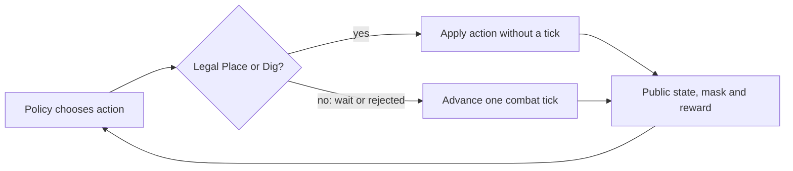

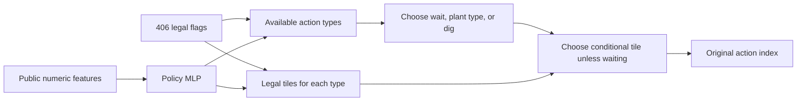

Grouped PPO uses `log P(type) + log P(tile|type)`, with no tile term for waiting.
Joint entropy is type entropy plus type-probability-weighted conditional entropy.
Unavailable types have zero mass. Deterministic evaluation greedily chooses type
then tile. Policy and distribution subclasses retain SB3's collector, PPO loss,
GAE, optimizer, and optimized transport buffers.

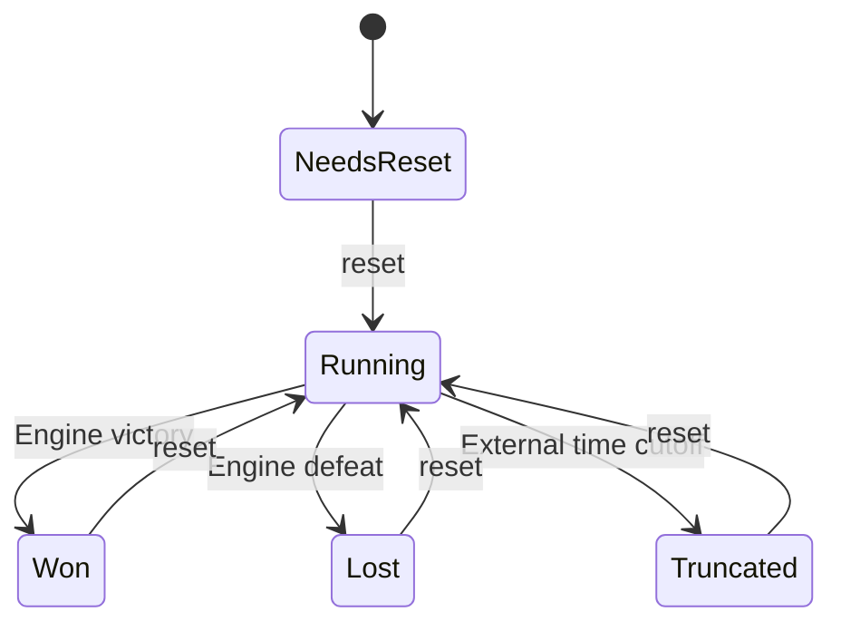

The engine may still be running when the adapter is truncated. Vector wrappers
retain the terminal observation for PPO bootstrapping before resetting that worker.
True terminal potential is zero; truncated potential is preserved.

Public `DamageApplied`, `ZombieSpawned`, `ZombieDefeated`, and `MowerActivated`
events, plus `PlantPlaced`, `SunProduced`, `PlantDamaged`, and `PlantExploded`,
pass through one combat-accounting interface. A transient ID join identifies
the killing hit; IDs never enter policy observations. Plant kills earn +1/N,
mower kills −2/N, and earlier nonlethal plant hits earn removed base HP divided
by the type's full starting HP and N. Armor damage and the lethal hit earn no
damage reward. Type comes from the prior public observation or public spawn
event; maximum health comes from active rules. Empty activations cost 0.2,
matched by mower lane and engine tick even within multi-tick decisions. Every
activation additionally costs current sun/300, reconstructed from ordered income
and spending. Wall-nut bite damage earns 0.2 times its fraction of full HP. A blast
with no same-source, same-tick HP or armor damage costs 0.2. Terminal defeat is −2.

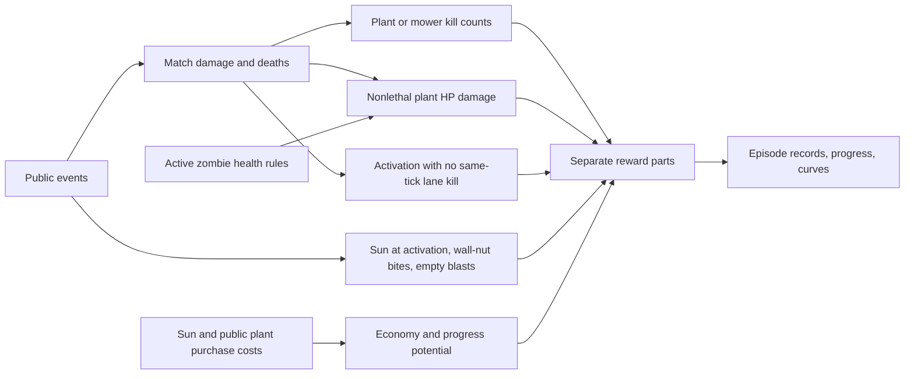

The potential is `0.5 * defeated/N + 0.5 * (sun + living plant costs)/300`.
Economy is uncapped and independent of plant health; purchases preserve value,
digging and plant deaths remove value. Configurable weights and scales live in
TOML. The shaping difference retains gamma and terminal/truncation handling.
Event rewards explicitly change the task objective; checkpoint selection uses
win rate. Legacy configs without `potential_mode` retain the original capped
sun/sunflower formula; absent event weights mean zero. Changed reward settings
require a fresh run and cannot be pooled under the same research configuration.

## Training and evaluation

The installed game is package 1.3.0 at source pin
`8861824df6893a34c2cd4df7f9b68613376d7964`, simulation version 1.0.0.
The native HUD displays defeated/total zombies. The research adapter does not
duplicate the counter or change the numeric observation fields.

New unconstrained commands use CUDA simulation and policy updates with 128 games
and 128 decisions/game/rollout. Explicit archived-style configurations keep their
CPU simulation defaults. `--simulator cpu` uses spawned Python workers;
`--device cpu` also selects CPU policy updates. CUDA requests fail early when
unavailable. Backend/device settings are retained in metadata and must match on
resume. CUDA validation uses batched policy inference and simulation; its demo
traces must match CPU playback. The explicit CPU transport path is:

```mermaid
flowchart LR
    Worker[CPU game worker] --> Response[Observation and legal mask together]
    Response --> Cached[Local mask cache]
    Response --> Collect[Stock SB3 rollout collector]
    Cached --> Collect
    Collect --> GAE[Stock returns and advantages]
    GAE --> Copy[One completed rollout copied to CUDA]
    Copy --> Batch[Original NumPy minibatch order]
    Batch --> Update[Stock PPO update on device tensors]
    Update --> Reset[Release cached tensors at next rollout]
```

Transport wrappers retain SB3's spawned-worker implementation. Masks are metadata,
not observation features. On automatic reset, the mask comes from the new episode;
the old terminal observation remains available for time-limit bootstrapping. Mask
queries use a local copy and unknown worker mutations invalidate cached entries.
The adapter reuses the engine's legal-action query until public legality inputs
change: status, occupied tiles, and each card's affordability/recharge availability.
It queries the engine again on changes or reset. Strategy candidates still update
each decision because threats and plant health matter to placement. This bounded
single-state cache applies to training, validation, and demos, with unchanged masks.

The device buffer subclasses retain SB3's GAE calculation, flattening, and NumPy
permutation generator. Only minibatch indexing moves onto the GPU. CPU sampling
uses the original implementation. Loss functions and validation stay unchanged.
Resuming may recreate an empty runtime buffer, preserving policy and optimizer.

Runtime flags live in `[runtime]`, have defaults for older configurations, and are
recorded in full provenance. They do not affect research compatibility. Networks,
precision, worker counts, rollout size, minibatches, rewards, curriculum, and
checkpoint selection are still governed by the same research settings.

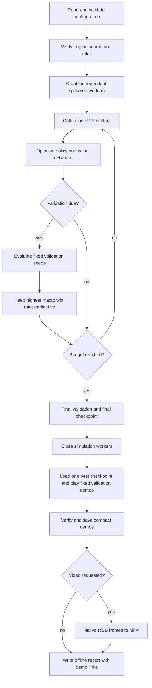

Each worker tracks global collection progress in increments of the worker count,
so curriculum changes apply at episode reset without querying workers every action.
Resume restores weights and optimizer, sets curriculum progress before reset, and
starts fresh episodes. It preserves earlier eligible best checkpoints.
Checkpoints with a different engine source pin are rejected before deserializing
model weights. Archived reports and recordings can be read without loading a model;
archived checkpoints cannot generate new gameplay. Comparisons retain distinct
protocol hashes for each engine source pin, even when combat rules match.

Each run owns one policy and optimizer throughout all curriculum stages. One
`best.zip` maximizes the equal-weight easy/standard/hard validation win rate;
earlier checkpoints win ties. Every difficulty demo records the same checkpoint
hash. The independent seeds and ablation conditions in the suite are separate
shared-policy experiments, not models selected by difficulty.

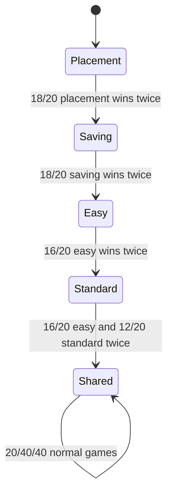

Teaching gates run after updates every 20 completed training games and require
at least 20 games in the stage. The fixed curriculum uses fractions of the total
game target. Validation defaults to every 250 games; default training target is
10,000 games across all workers. Wins, losses, and timeouts count; evaluation and
probe games do not. Completion checks follow PPO optimization, so extra games in
the last rollout are recorded explicitly.
Failures reset the consecutive-pass counter. Distribution changes are sent to all
workers for their next resets; active games finish under their original task.
Checkpoint attributes persist global completed games, stage, entry game, last
probe game, and pass counters.
Resume restores this state before workers reset. Lesson probes live in separate
files and never choose `best.zip`. Budget exhaustion leaves the actual stage intact.
Baseline profiles retain the fixed progress schedule instead of mastery gates.

The timed pilot first runs two pure-RL diagnostics, then four profiles at two seeds
in alternating order. A deadline check at an update boundary prevents partial PPO
updates from becoming comparison checkpoints. Completed evaluations have separate
learning-profile and game-protocol hashes. Cross-profile reports require the same
engine, game rules, timing, and reward objective; they retain distinct method names.
Only an identical actual completed-game budget across all profiles and both seeds
enters the new pilot comparison. Extra rollout games may leave no matched budget;
that is reported as inconclusive. Legacy decision curves keep their original unit.

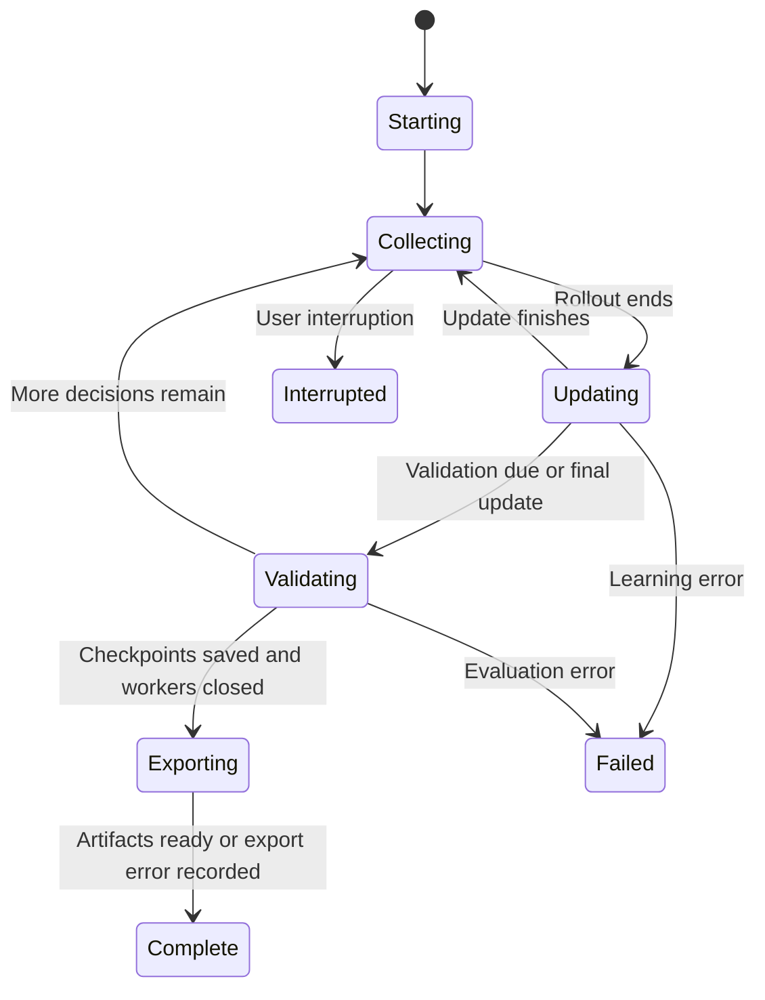

The progress reporter shares a wall-clock throttle across training, evaluation,
and export. Routine messages default to every 15 seconds; important events print
immediately. Collection/update phase changes update status without printing every
rollout. Aggregates cover the last 100 completed training games. PPO statistics are
read after updates, at the next rollout start and at training end, including the
last optimized policy. Training ETA uses completed games per second and excludes validation and report time; export
time is recorded separately. TensorBoard remains controlled by SB3.
Collection/update timing uses rollout boundaries and captures the final update;
validation and report gaps are excluded. Completed phase totals and latest phase
durations enter the aggregate metrics and progress log. The benchmark warms up
one full rollout and reports setup/warmup separately. This microbenchmark still
counts decisions to compare transport costs; it does not schedule research training. Optional paired measurement
alternates reference/configured order and compares final policy hashes.

## Result artifacts

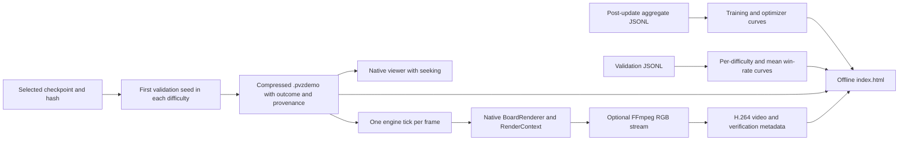

Report assets use relative links and need no network or server. Charts refresh
after validation and at completion. Compact demos are generated after training by
default; videos require configuration or an explicit `--videos` flag. Raw episode
records remain the research evidence. Missing metrics from old runs are shown as
unavailable. Resume metadata supplies an exact boundary for including ancestor
measurements; each segment retains its own wall time.

Video output uses temporary files and is published only after replay hashes and
encoder completion pass. The adapter records truncation and provenance in native
replay metadata, outside simulation state. The engine can correctly remain `running`.
The shared loader fills missing metadata from legacy sidecars but gives embedded
fields precedence. `Playback.display_outcome` controls labels at the verified end,
and natural outcomes take precedence over annotations. The encoder holds one frame at
a time and stores its error output in a temporary file. The final outcome is held
for two seconds by default. Export status is independent of completed training,
so dependency/encoder failures preserve checkpoints and support regeneration.

`visualize --run` rebuilds reports and missing/changed demo assets without training.
`replay --video` exports an individual recording. Configuration separates logging
and visualization preferences from research compatibility checks, while full
resolved settings remain in run provenance. The pinned game is not modified.

The Gym renderer retains a writable `(600, 1000, 3)` NumPy RGB array. MP4 output
defaults to native 1280×820 dimensions, configurable with two positive even numbers.
Rendering uses only public observations and explicitly provided presentation context.
The game owns drawing, action descriptions, seek controls, and compressed-file I/O;
the research project owns experiment selection, provenance, reports, and FFmpeg.
Compact recording and reports do not require pygame or FFmpeg.

## Formal suite

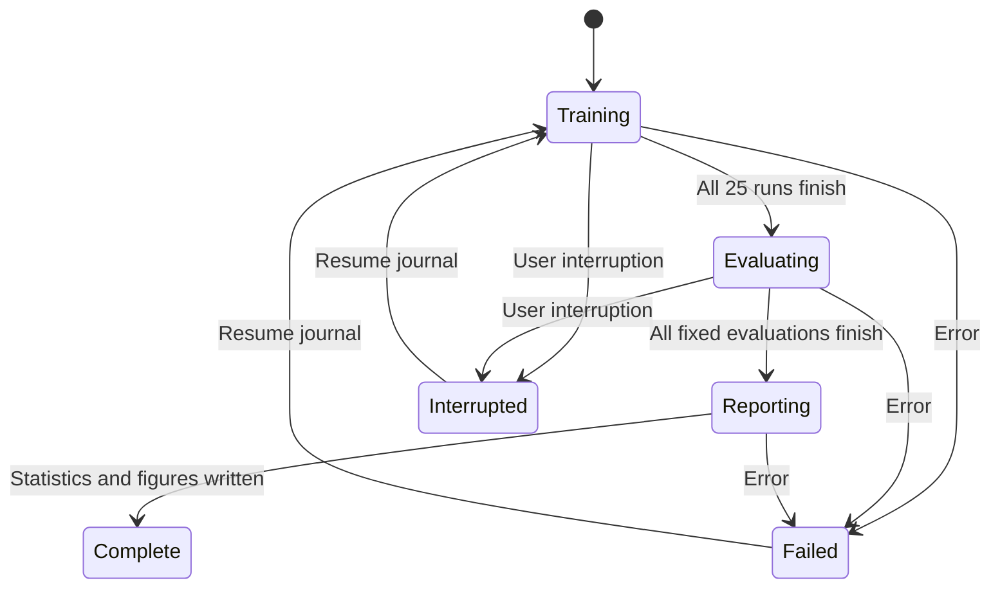

Resume walks the journal and skips completed jobs. Every retry uses a new attempt
directory. Formal test cases do not enter learning or checkpoint selection.
Replays contain privileged snapshots for verification, but policy code only receives
encoded public observations and masks. Human-readable reports consume evaluation
records, never reward curves as a substitute for win rates.

## Replay action phases and progress accounting

`.pvzdemo` uses the research version `pvz-rl/actions-v1` for zero-time actions.
The shared loader verifies native snapshots/hashes and applies instantaneous
operations before displaying each tick. The playback subclass reuses native
seeking/caches, draining actions before caching the resulting tick. Native files
remain supported through the same loader. The project command supplies playback
to the native UI; standalone native loading rejects the new format explicitly.
Video receives one packed RGB frame per simulated tick, never per policy action.

`budget.py` defines the active progress unit. The training callback counts actual
completed episodes and saves that count on the model before checkpoints. Workers
receive the global count after each completion batch for subsequent resets. The
vector wrapper may already have auto-reset a worker before that broadcast; its
current episode keeps its original difficulty. Teaching changes likewise wait for
future resets. PPO rollout/minibatch sizes and per-decision discount remain fixed.
Validation/checkpoint selection use equal-weight normal-game win rate, independent
of shaped score, elapsed ticks, and game duration.

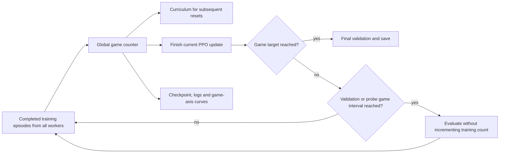

## CUDA data ownership and workflow

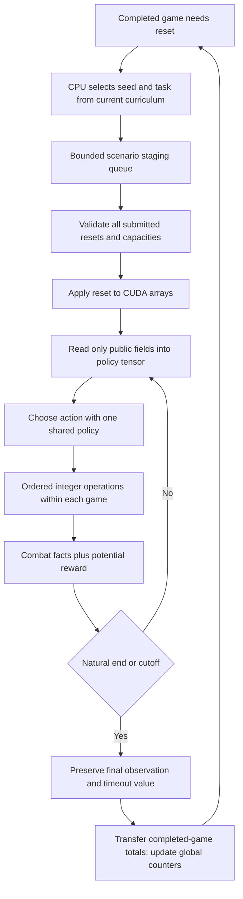

PPO stores **128 decisions per parallel game**, with total rollout size derived
from the number of games. The CUDA buffer preserves SB3's environment-major
flattening, NumPy minibatch permutations, normalized advantages and four update
epochs. Single-kernel GAE runs on-device. Episode counts drive stopping, validation
and curriculum; policy/optimizer identities do not change at stage transitions.

The simulator preserves insertion order and tie breaking in contiguous int64
arrays. One warp handles each game; a single lane applies ordered combat.
Numeric masks and float32 encoders/rewards never include seeds, entity IDs,
private schedules, snapshots or task restrictions. Completion flags are one
compact synchronization per decision; full observations, action/value/log-probability
tensors, masks, GAE and returns remain on-device. Completed episode totals transfer
in a batch. CPU scenario selection occurs only at reset.

Validation batches fixed cases and retains the shared checkpoint scoring/tie rule.
GPU action traces are executed through the Python recording adapter and must match
final status and canonical state hash before a compact demo is saved. Rendering
and optional video encoding use the same native interfaces. The hybrid strategy
condition remains on the Python simulator; explicitly requesting it with CUDA
training raises an error. Suite orchestration assigns its hybrid job to Python
with at most eight CPU workers and the configured per-worker rollout length.
