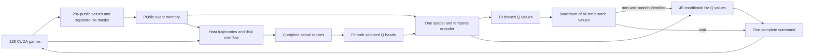
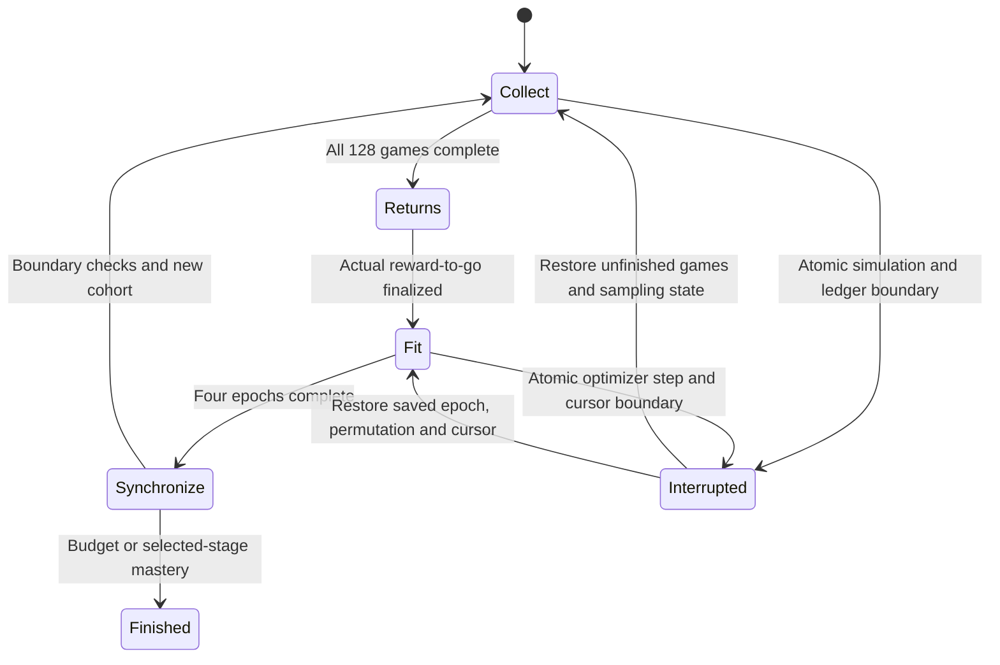

# Training architecture — 0.25.0

One CUDA Q network assembles each command in two levels: wait, one of eight
species, or dig; then a conditional tile for non-wait branches. The same model
plays every curriculum difficulty. Game 1.6.0 runs at 100 Hz without a wall-time
frame limit. The 286-value observation and net-value accounting remain unchanged;
explicit rejected-action penalties are added to transition rewards. Movement and
collision mechanics come from the strictly pinned game 1.6.0.

The game owns mechanics, gameplay RNG, legality, public views and snapshots.
Environment adapters own cutoff failures and accounting rewards. Policy owns
one shared encoder, deterministic tokenization and sequential selection with
occupancy-only tile masks.
Learning owns complete-game storage, returns, optimization and checkpoints.
Evaluation owns held-out seeds, mastery gates, recordings and checkpoint selection.

The first-level comparison always includes wait, all eight plant species, and
dig. Plant tile masks contain only empty tiles and dig masks contain all tiles;
sun and cooldown checks are deliberately left to the engine. Research lesson
roster restrictions are removed for the current controller. A rejected plant
advances one per-tick wait and receives `invalid_plant_penalty`; an empty dig
receives `empty_dig_penalty`. See the
[penalty derivation and limits](math/invalid-action-penalties.md). The journal
stores the exact ten Q values from the pre-action forward pass, so historical
rows are never recomputed with newer weights.

## Exact model inputs

All indices are zero-based and inclusive in the tables. Lanes 0–4 run from top
to bottom; columns 0–8 run left to right. Positions use the engine's fixed-point
units: 1,000 per tile, house at -500, spawn at 9,500. Counts and scaled totals
are not clipped. Category IDs are labels, not numerical magnitudes.

| Observation indices | Shape | Fields |
|---|---|---|
| 0–134 | 5 lanes × 9 columns × 3 | Plant type, health fraction, behavior |
| 135–269 | 5 lanes × 3 regions × 9 | Regional zombie counts, health, armor and distances |
| 270–280 | 11 | Global economy/progress and mower flags |
| 281–285 | 5 | Frontmost zombie headless flag for each lane |

A plant tile starts at `3 × (9 × lane + column)`.

| Tile offset | Input | Encoding |
|---|---|---|
| 0 | Plant type | 0 empty; 1 sunflower, 2 peashooter, 3 wall-nut, 4 cherry bomb, 5 potato mine, 6 snow pea, 7 chomper, 8 repeater |
| 1 | Remaining health | Current HP / that plant's maximum HP; empty 0 |
| 2 | Behavior | 0 empty; 1 ready, 2 arming, 3 armed, 4 fusing, 5 digesting/busy, 6 exploding, 7 detonating |

Mine rising maps to arming. Chomper biting, caught prey, digestion and recovery
all map to category 5. Other internal firing phases stay ready. The encoders
share this compact mapping; simulator phase numbers are not directly exposed.
Each tile's three raw values becomes an 8-value type embedding, one health
value and a 4-value behavior embedding: 13 learned spatial input values.

Zombie x denotes the body rectangle’s left edge (80 source pixels per tile).
Private gait phase, velocity and RNG remain excluded. A zombie region starts at `135 + 9 × (3 × lane + region)`.

| Region offset | Input | Encoding |
|---|---|---|
| 0 | Basic count | Count / 5 |
| 1 | Flag count | Count / 5 |
| 2 | Conehead count | Count / 5 |
| 3 | Buckethead count | Count / 5 |
| 4 | Pole-vaulter type count | Count / 5, including used poles |
| 5 | Aggregate body HP | Sum / (5 × largest configured body HP); default denominator 2,500 |
| 6 | Aggregate armor | Sum / (5 × largest configured armor); default denominator 5,500 |
| 7 | Nearest zombie distance | `(x − house_x) / (spawn_x − house_x)` |
| 8 | Nearest capable pole carrier distance | Same distance; requires unused pole and a head |

Empty counts, health and armor are zero. Absent distances are -1. Headless
bodies remain counted in these regional features until removal, so their HP
decline is observable. Regions are equal intervals of the house-to-spawn span,
not groups of three columns. The integer rule is
`clamp((x − house_x) × 3 // (spawn_x − house_x), 0, 2)`.
At default positions the boundaries are -500, 2,834, 6,167 and 9,500:
2,833 belongs to region 0, 2,834 to region 1, 6,166 to region 1 and 6,167 to
region 2. Both endpoints and out-of-range positions clamp to an endpoint region;
distance values themselves are not clipped.

| Index | Input | Encoding |
|---|---|---|
| 270 | Sun | Sun / largest plant cost; default 200 |
| 271 | Elapsed simulation time | Seconds / cutoff seconds; default 1,200 |
| 272 | Current wave | Wave / 15 |
| 273 | Total waves | Total / 15 |
| 274 | Initial zombie count | Count / 75 |
| 275 | Neutralized zombie count | Count / 75; first head loss or direct lethal removal counts once |
| 276–280 | Mower spent in lanes 0–4 | 1 spent, 0 otherwise |
| 281–285 | Frontmost zombie headless in lanes 0–4 | 1 headless, 0 headed or empty lane |

Frontmost means smallest x, nearest the house. At equal x a headed zombie wins
the tie; entity IDs and iteration order cannot affect the flags. Later body
removal does not increment neutralization again. Ready and moving mowers are
indistinguishable from the mower input alone.

These additional inputs are separate from the observation vector:

| Input | Role |
|---|---|
| 406 action-geometry booleans | Occupancy-only plant tiles and all dig tiles; not concatenated into the observation |
| Previous executed action | Public history; rejected proposals use the wait marker |
| Episode-reset marker | Clear history at game boundaries |
| Public simulation tick | Relative temporal positions |
| Memory validity, represented counts and start ticks | Identify retained/compressed public history |
| Fixed normalized column coordinate | `0, 1/8, …, 1`, derived from board layout |

A raw temporal token has **289 values**: 286 observations plus previous action,
reset marker and tick. The action integer is transport/history identity, not a
406-way policy classifier. One learned 406-entry action embedding is retained.

Excluded inputs are countdowns, future spawns, seeds, entity IDs, rewards,
return targets, optimizer statistics and hardware telemetry. Snapshots may
contain private simulator state for exact resume; they never enter an encoder.
Regional aggregation hides exact individual arrangements; removed projectile
and recharge information must be inferred from public history where possible.

## Memory, network and decisions

The bank retains 8 recent tokens, 32 event tokens and 8 older summaries. Current
tokens always include movement distances. Continuous movement within a region
and elapsed time alone do not admit an event. Health, type, armor, region,
active-pole presence, headless flags, plant categories, sun/wave/mower flags,
tile masks and accepted actions do. Old quiet ticks are summarized by latest
public state, earliest tick and represented count; old events eventually enter
that same bounded summary bank. No future token is attended to.

One set of type/behavior embeddings feeds two 32-channel 3×3 convolutions,
a 64-value global encoder and one gated temporal encoder: two blocks, width 128,
four attention heads, feed-forward width 256. Current queries attend only to
valid causal memory. Raw history is re-encoded with current parameters; learned
activations are never cached across optimizer updates.

Mean/max spatial pooling plus global features produce 128 pooled values.
The first head has two 128-unit ReLU hidden layers and ten outputs, ordered
wait, the eight species in the observation table, then dig. The shared tile MLP
has two 128-unit ReLU hidden layers. For each of 45 tiles it receives 32 local
features, 128 pooled features and a nine-category one-hot branch identifier.
It produces one conditional Q value per tile plus a trainable branch offset.
Ordinary selection evaluates the executed non-wait branch. If species exploration
changes that branch, one additional map records the unmodified greedy command.

All ten first-level branches remain in the comparison. Plant tiles use an
occupancy-only mask and dig tiles are all available; a full board selects tile
zero and lets the simulator reject the plant. Greedy ties prefer wait,
then species order, then dig; tile ties use row-major order. First-level wait
and species values initialize to zero and digging to the configured defeat
reward (-2). Conditional species values initialize to zero and digging to -2.
Both digging offsets remain trainable. The initial complete decision is wait.
Intermediate branch selection has no simulator step, reward or history entry.

After a planting branch wins, species and tile have independent epsilon-greedy
exploration coins. Each coin probability is `1 - sqrt(1 - budget)`; random choices
are uniform over all eight species and empty tiles, including the greedy choice. Wait
and dig winners stay greedy. Evaluation disables exploration completely. Values
are estimated returns, not confidence probabilities; the two heads estimate the
same remaining reward and are never added. First-level values describe continuation
under the collecting tile selector, so they need not equal maximum tile values.
See [the checked derivation](math/sequential-q-control.md).

## Complete-game collection and optimization

The network remains frozen throughout each 128-game cohort. Completed games pause
until the last game finishes. Gamma-one targets sum all subsequent actual rewards,
including zero-duration actions. Natural wins/losses terminate normally; at 1,200
seconds a separate cutoff failure applies defeat once and preserves physical
assets. Cutoffs do not bootstrap. External interruption is not an episode loss.

Every proposed command, including rejected proposals, fits its selected first-level
value. Non-wait proposals
also fit their selected tile value to the same return, averaging the two squared
errors. Wait uses its single squared error. Whole-cohort wait/plant/dig counts
give equal aggregate weight to each populated group, including the final partial
minibatch. One Adam optimizer uses learning rate 0.0003, epsilon 0.00001, default
moments, four epochs, minibatches up to 1,024 and gradient norm clipping at 0.5.
There is no replay, TD bootstrap, target network, actor, PPO, entropy loss or role
schedule. Non-finite targets, values, losses or gradients fail explicitly.

Exploration decays exponentially from a 10% combined coin budget to 0.1% over
3,000 stage games, then holds its floor. Resolve once per cohort and preserve
that value on resume. Stage progress resets the schedule. A negative all-wait
cohort can make initially zero planting estimates preferred, but greedy control
can still remain wrong with inaccurate values or unvisited alternatives.
Pre-fit branch/tile errors, group/species coverage, coin firings and actual
choice changes make that limitation visible; empty planting coverage is not success.

Curriculum remains saving → easy → standard → shared. Existing residency,
held-out tasks and 100/100 mastery requirements remain, with probes every 2,000
completed games at cohort boundaries. Selected-stage until-mastery mode has no
game/time ceiling and stops at that stage. Bounded training remains the default.
Validation, curriculum transitions and deadlines occur after a complete cohort.

## Storage, recovery and diagnostics

Compact CPU trajectories contain public observations, packed masks, commands,
rewards, collection-time branch/tile values, greedy commands and exploration
coins. Integer token references and compression metadata reconstruct exact causal
memory in bounded minibatches. A 6 GiB RAM budget spills blocks to disk.
Raw float32 tokens use only observation, previous executed action, reset and tick.
A disposable 2 GiB GPU token cache reserves at least 2 GiB free VRAM per allocation;
cache exhaustion falls back to host storage without dropping samples.
Two reusable pinned slots prefetch one subsequent minibatch on a transfer stream.
CUDA events protect readiness and staging-buffer reuse; no fitting occurs during
collection. Pre-action readbacks complete before simulator-mutated data are read.

Atomic ZIP checkpoints contain the single network and optimizer, all RNGs,
curriculum/exploration progress, unfinished simulator state, public memory,
streamed trajectory and diagnostic-journal blocks and optimization
epoch/permutation/cursor. Transfers are drained before saving; cache contents are
rebuilt after resume. A plain JSON protocol manifest is checked before class
deserialization. Training requires `event_sequential_q_v2`, `sequential_q_mc_v2` and
`sequential_q_unmasked_penalty_v1`. The pinned 0.24.0 network remains available
for inference with its original legality masks and zero rejection charges; it
cannot initialize or resume new training. The engine pin remains game 1.6.0.
New-protocol stage transfer uses compatible weights with fresh optimizer/counters; full resume
restores the same experiment exactly. Failed saves preserve the previous archive.
Every existing run, recording and report is preserved, and historical reports
remain regenerable without loading a retired model.

The four-board viewer and hardware monitor are diagnostic outputs and do not
change actions or policy inputs. The viewer shows ten branch return estimates,
complete current-game planting/digging journals, greedy and executed choices, value leads,
ties and exploration overrides at the recorded decision tick. Focus enlarges one board
and its scrollable Q table; switching retains the old board until the destination
board and history page arrive together. All environments retain non-wait actions
with their actual ten pre-action scores in 16 MiB of RAM plus disk overflow. The
journal is saved in checkpoints and never becomes a policy input. Rejected plants
are labelled as automatic waits and empty digs show their penalty; waiting boards
retain the last decision. Replacement selects only
unfinished undisplayed games. Terminal logs retain reward, net value, discounted
return and hardware measurements, alongside Q fitting and coverage metrics.
Reporting failure does not invalidate a checkpoint. Evidence and source limitations
are in [validation](validation.md), [references](references.md) and [iteration](iteration.md).
