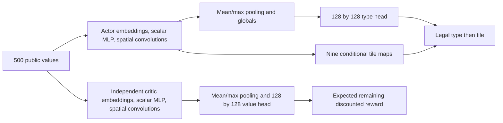
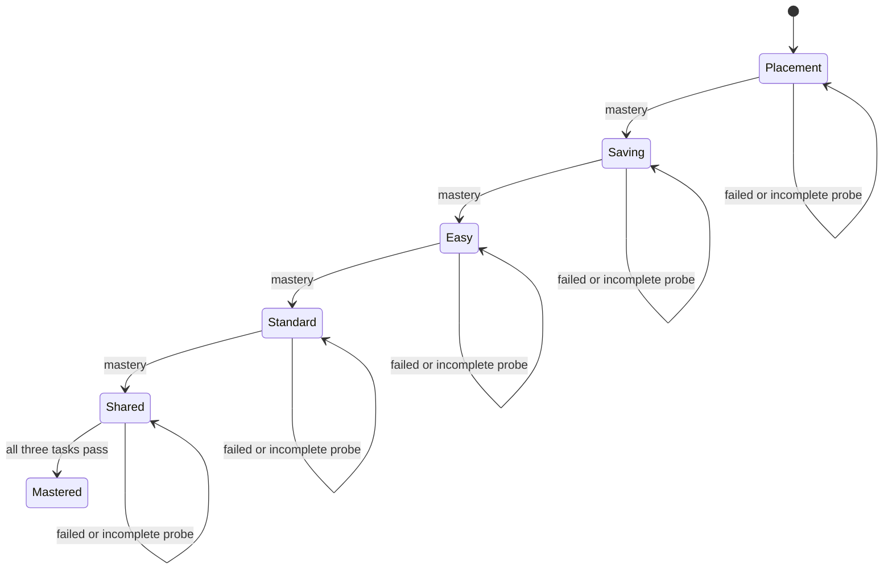

# Current architecture

Research 0.10.1 learns one shared policy for easy, standard and hard. Training
simulation and optimization require CUDA. Game package 1.3.0 / simulation 1.0.0
is pinned to `8861824df6893a34c2cd4df7f9b68613376d7964`. The Python simulator
is the reference for non-learning baselines, tests and replay verification.

## Responsibilities and flow

```mermaid
flowchart LR
    Config[Resolved train.toml and engine pin] --> Check[Validate structure, ranges and CUDA]
    Check --> Queue[CPU seeded scenario preparation]
    Queue --> Games[Parallel GPU games]
    Games --> Public[500 public features and 406 legal flags]
    Public --> Policy[Shared spatial grouped policy]
    Policy --> Action[Wait, plant or dig]
    Action --> Games
    Games --> Reward[Outcome, mower cost, potential difference]
    Public --> Buffer[GPU rollout buffer]
    Reward --> Buffer
    Buffer --> Critic[Independent value encoder, batched before updates]
    Critic --> GAE[Timeout bootstrap and GAE]
    GAE --> PPO[Clipped actor PPO and separate critic MSE]
    PPO --> Critic
    PPO --> Policy
    Games --> Counts[Completed games and diagnostic summaries]
    Counts --> Schedule[Mastery and validation state machines]
    Schedule --> Queue
    PPO --> Validation[Normal-game validation]
    Validation --> Best[Single best checkpoint]
    Best --> Trace[Deterministic action traces]
    Trace --> Verify[Replay through Python reference]
    Verify --> Recordings[Verified compact demos]
    Counts --> Report[Logs, TensorBoard and offline report]
    Validation --> Report
    Recordings --> Report
```

The external engine owns seeded waves, integer combat rules, entity storage,
recording and rendering. Research owns task selection, public-state encoding,
action grouping, rewards, learning, scheduling and artifacts. Scenario queues
stay on the CPU; observation, mask, rollout and optimizer tensors stay on the GPU
through shared CuPy/PyTorch views and one CUDA stream. Completion summaries cross
to CPU in batches. No policy input contains seeds, schedules, entity IDs, task
labels or private snapshots.

Startup validates the installed package version, source manifest, simulation
version and rule hash. CUDA compilation and tensor-sharing checks fail before a
training directory is created. Installation stages a Git archive of the pinned
commit under research `build/`; it never changes the game checkout or depends on
its current branch. A single `.venv` contains the common and CUDA dependency locks.

## Observation and policy

The observation contains 180 plant values (45 tiles × category, health fraction,
timer and behavior category), 240 regional zombie values, 45 regional projectile
values and 35 globals. Each lane has three distance regions. Globals include sun,
elapsed time, waves, initial/spawned/defeated counts, eight cooldowns and mower
states/positions. Integer sums are scaled after aggregation, without crowd
clipping. Regional nearest distance uses 1 for empty regions; type counts distinguish
emptiness. This compression loses exact enemy positions and is not a full state.

Each branch uses 8/4-dimensional plant/state embeddings and a 64-unit global
encoder. Regional lane features and global features are broadcast onto the 5×9
plant grid with column coordinates. Two 3×3 convolutions with 32 channels preserve
its resolution. Empty categories have zero embeddings; category IDs are never
ordinal inputs. Widths and embedding dimensions are configurable. The default has 169,467
parameters. Conditional map biases are omitted because they cancel under tile
softmax. There is no separate lane MLP, recurrence, attention or alternative policy.

Action indices remain wait=0, eight plants ×45 tiles, then 45 digs. Group masks
and conditional tile masks derive from those 406 legal flags. Sampling first
chooses a type, then a legal tile. Deterministic inference takes the most likely
type followed by its best tile. PPO uses the true joint log probability for ratios.
Balanced exploration regularizes type entropy and the unweighted mean normalized
tile entropy of available groups. The trainable initial dig bias is −6. Digging
stays legal; lessons only restrict plant types and mower availability as configured.

Accepted plant/dig actions consume no simulated ticks. A wait or rejected request
advances one tick. Discounting is per decision, including immediate actions.

## Reward and update

Reward is outcome (+1 win, −2 loss), minus 0.2 per new mower activation, plus
`gamma * Phi(next) - Phi(current)`. Potential is half the defeated fraction plus
0.1 times `(sun + full purchase value of living plants) / 300`. All coefficients are
configurable. The denominator does not cap sunlight. Natural terminal potential
is zero; truncation retains potential and adds the correctly discounted terminal
value before GAE. No separate damage, kill, planting, eating, biting, explosion or
early-dig reward exists. Combat events and early digs remain diagnostics.

The collector stores 128 decisions per game by default, across 1,024 parallel games
(131,072 transitions per rollout).
GAE and masked PPO use the configured gamma/lambda, standard all-transition
minibatch normalization and mean losses, four epochs and batches of 1,024.
Singleton minibatches skip advantage normalization. Approximate KL is checked
before each actor optimizer step; a value above 1.5×`target_kl` stops actor updates
for that rollout. The independent critic completes its configured epochs. Zero
disables the check. Each parameter group owns an Adam state and clips its own
gradients; no learned tensors are shared. Critic loss cannot alter action outputs.

Collection invokes only the actor. Both networks remain frozen until the complete
rollout is stored. The critic then evaluates observations in batches (default 1,024),
including pre-reset timeout states and the final rollout state. Natural terminals
have no bootstrap. Timeout corrections are applied once, then GAE runs. Unfinished
games continue across updates; optimized rollouts are discarded. This schedule
changes the timing of value inference, not the policy that generated the samples.
Evaluation uses the actor without computing values. Post-update drift and dig
probability on legal-dig states are diagnostics, not additional loss terms.

## Curriculum, checkpoints and failure paths

The five task mixtures and per-task mastery counts live in the configuration.
Scenario preparation samples `lanes_per_spawn` distinct lanes per lesson and
spawns one basic zombie in each sampled lane at each configured tick. Omitted
lane counts preserve the archived single-lane seed mapping. Saving uses three
lanes, 50 starting sun and a simultaneous tick-1000 arrival with no mowers. Its
free-sun budget before an unblocked breach is below the three-shooter cost;
sunflower production is necessary. The simulator and policy receive ordinary
game state and rules; there is no special reward or action constraint enforcing
sunflower purchases. Placement keeps one lane and its original timings.
Default mastery requires 100/100 cases for each required task, at least 100
completed games that started in the current stage, and one passing probe. Probes
run every 500 completed games using a separate 100-case validation pool. Promotion
changes future resets only; active games keep their starting stage and restrictions.
Actor, critic and both optimizer identities stay unchanged. A selected standalone stage never
promotes; it saves a checkpoint and stops on mastery or budget.

Normal validation runs every 2,000 completed games after optimization, with 50
seeds per difficulty. Crossed thresholds coalesce; cached results reuse only the
same weights and cases. The highest equal-weight macro win rate selects one
`best.zip`, with earlier ties retained. Lesson mastery never selects that model.
Time allowances include finalization; expired evaluations and exports remain
explicitly pending. Exhausted game/time budgets do not imply mastery.

`--init-from` compares engine, observation layout and network structural signatures,
then copies weights into a fresh model and two optimizers. Counts, schedules and time
allowance restart; reward/PPO/curriculum parameters may change. Metadata records
source hash and parameter differences. `--resume` requires the saved experiment
settings and restores weights, both Adam states, counts, mastery and schedules. Active
episodes restart; it does not promise bitwise trajectory continuation.
The sole conversion accepts 0.9.0 compact shared-encoder tensors for weights-only
initialization. Identical encoder aliases are checked, then copied into independent
encoders. Their shapes and the engine must match. Shared checkpoints cannot resume;
no retired training implementation is loaded. Pre-0.9.0 networks are not loadable. Reports and recordings are independent of model
loading and remain usable after obsolete weights are removed.

## Storage and presentation

Every run owns a new directory. Metadata records resolved configuration, structural
signature, source hashes, engine/rules pin, learner seed and initialization origin.
JSONL records separate training episodes, post-update metrics, normal validation
and mastery probes. Checkpoints store optimizer and scheduling state; logs and
TensorBoard provide progress without printing every game. Per-task windows each
retain the latest 100 completed games; empty ratios are missing, never zero.
Cumulative starts, completions and transitions survive resume; active counts describe
the current environments. Restarting unfinished episodes creates additional starts.
Task labels remain diagnostics only and never enter observations or rewards.

The selected model is loaded once for three demos using seed 100000. GPU traces
must reproduce CPU outcome and canonical state hash before `.pvzdemo` files are
saved. Embedded metadata identifies the shared checkpoint and provenance. Rendering
uses native `BoardRenderer`/`RenderContext`, never changes simulation state, and
optional MP4 streams RGB frames at 20 ticks/second to H.264 FFmpeg. Reports use
relative local assets and label missing metrics, interruptions and resumed segments.
Export failure preserves checkpoints; `visualize` can regenerate derived outputs.
