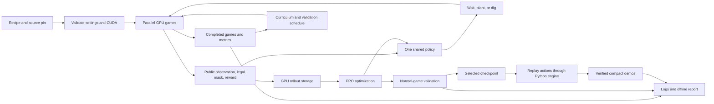
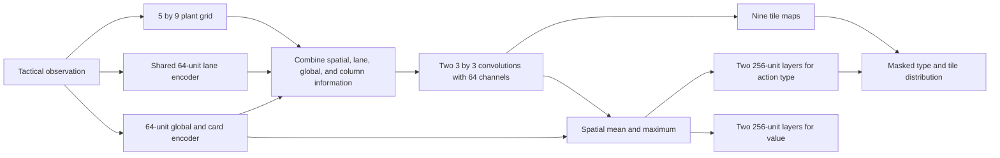
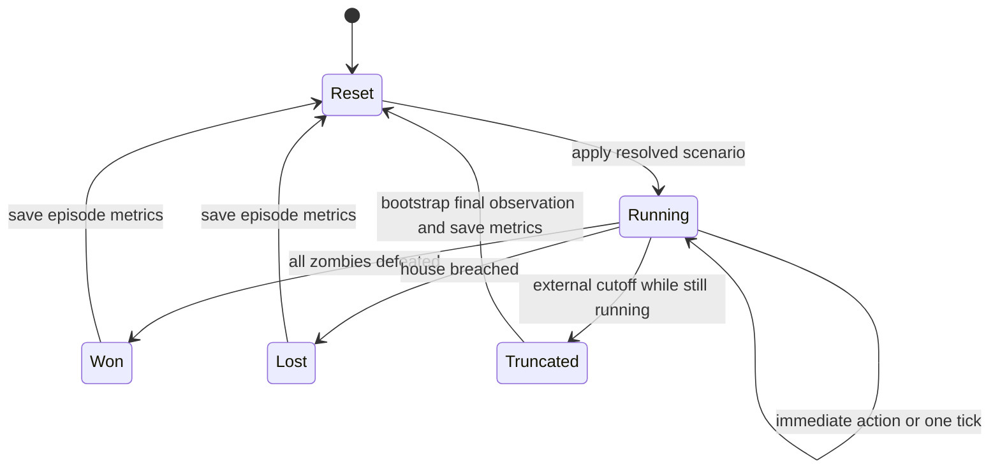
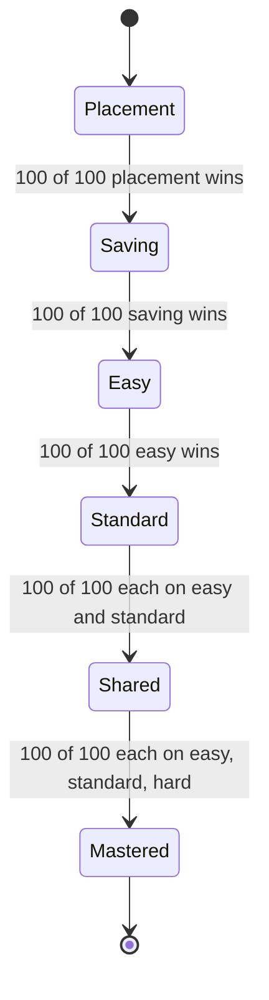
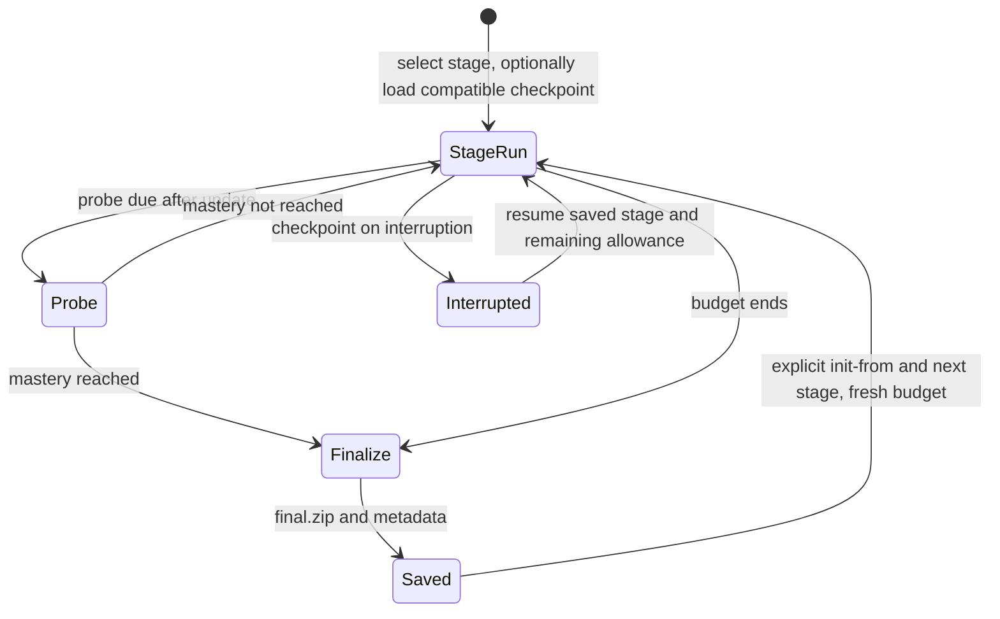
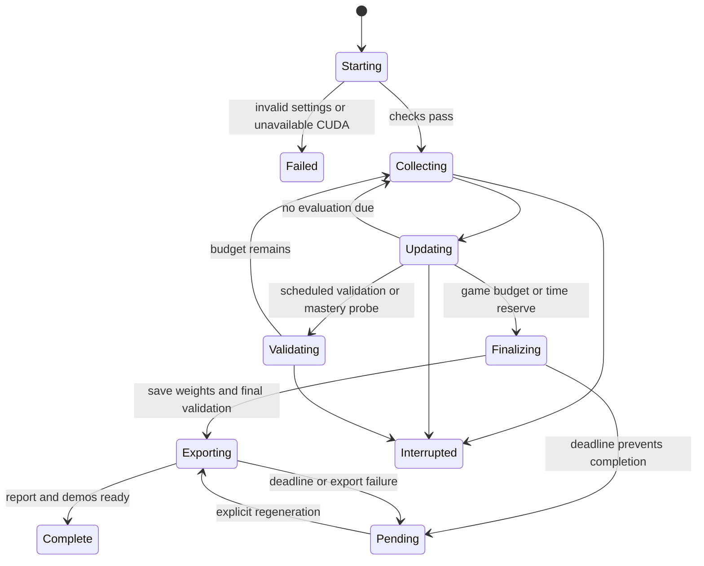

# Current architecture

PVZ research learns one shared plant-placement policy for easy, standard, and
hard. Research 0.8.1 uses game package 1.3.0, simulation 1.0.0, pinned to commit
`8861824df6893a34c2cd4df7f9b68613376d7964`. CUDA runs training simulation and
optimization. The Python engine verifies recordings and supplies independent
correctness controls and non-learning baselines.

## Components and data flow

| Component | Responsibility |
|---|---|
| Pinned game dependency | Seeded scenarios, combat rules, Python reference, CUDA batch simulation, recording, rendering |
| Research environment | Public observation encoding, legal and lesson masks, rewards, metrics, episode resets |
| Shared policy and PPO | Choose actions, estimate values, collect GPU rollouts, update policy and critic |
| Curriculum and scheduler | Count completed games, test mastery, change future tasks, schedule validation and stops |
| Evaluation and presentation | Select checkpoints, verify demos, produce reports and optional videos |
| Configuration and provenance | Validate settings, enforce engine pin, preserve protocol and checkpoint identity |

Startup verifies the installed package, simulation version, source hashes, and
combat rules. Training additionally requires CUDA tensors and successful kernel/
shared-memory probes. Unsupported CPU or hybrid training fails before a run
folder is created. CPU baseline evaluation and replay viewing remain available.

The installer reads the pinned Git tree from an external game repository. It
verifies the manifest and builds a non-editable package from staging under the
research project. It never changes the game repository's branch or working files.
One research virtual environment holds the locked dependencies.

## Policy and learning

The policy receives only public information. Seeds, future schedules, entity IDs,
task names, and diagnostic snapshots never become numerical policy inputs.
The two supported encodings have 2,719 and 1,140 values. The tactical encoding
retains each plant tile and aggregates enemies/projectiles into three regions per
lane, with card economy and lane summaries. Counts are scaled without clipping
crowds. Aggregation means the observation is partially informative.

There are 406 actions: wait, eight plant types on 45 tiles, and dig on 45 tiles.
A flat policy scores concrete actions. Grouped policies select an action type
and then a tile; their joint probability is used for PPO ratios and clipping.
Deterministic inference picks the most likely legal type, then its best tile.
The masks exclude illegal actions and explicit lesson restrictions. Normal games
retain every legal plant and digging choice.

Each rollout collects 128 decisions per parallel game; defaults use 128 games.
Observations, masks, actions, rewards, values, log probabilities, advantages, and
returns remain on the GPU. Each recipe specifies minibatch size, discount, GAE,
entropy objective, and actor sample weighting; all retained recipes use four PPO
epochs. The critic and GAE use every transition. Choice-state actor profiles use
only states with multiple legal actions for actor reductions.

SC2 recipes regularize action-type entropy and mean normalized tile entropy
separately, preventing large tile groups from automatically dominating exploration.
Actual joint entropy remains a separate metric. The plant-reward recipe adds a
trainable initial dig bias; it does not forbid digging. Reward coefficients and
mathematical definitions are in [research design](research.md).

## Episode and curriculum workflows

Legal planting and digging execute immediately and refresh legality. Wait and
rejected actions advance one engine tick, at 20 ticks per simulated second.
Several legal operations can happen at the same tick. Discounting still counts
policy decisions, including immediate actions.

Natural wins and losses take precedence over the 1,200-second cutoff. Terminal
potential is zero; truncation retains final-state potential and value bootstrapping.
Rewards combine terminal outcome, potential differences, and attributed public
combat events. Plant kills, mower kills, damage, defensive events, and plant-role
terms are recorded separately. Truncations count as unsuccessful in evaluation.

The teaching curriculum is a mastery state machine:

SC2 mastery probes run every 500 completed training games. One perfect probe
per required task passes the stage; promotion also requires 100 completions from
games started in that stage. A loss, truncation or incomplete probe cannot pass.
Each task uses 100 fixed seeds from the separate curriculum split; checkpoint
validation keeps its 50 seeds. Lessons retain the full board, limited plant sets,
and legal digging; normal games permit all eight plants. Rehearsal retains earlier tasks until the
shared stage uses 20% easy, 40% standard, and 40% hard.

Stage changes affect future resets, preserving the same policy and optimizer.
An episode's start-stage tag is scheduling metadata only. Budget exhaustion never
forces promotion; unfinished teaching is labeled explicitly. Fixed-schedule and
mixed-difficulty comparison conditions use their configured distributions instead.

A single-stage run fixes the selected stage before the first environment reset.
Probes retain the same thresholds, passing streak and residency rules, but mark
mastery instead of advancing. Mastery or the budget ends learning after a complete
update; shared mastery completes the whole curriculum. Final validation and
demonstrations still use normal easy/standard/hard cases. Stage progress is saved
after probes.

Stage initialization preserves policy parameters and optimizer moments, resets
local counters and schedules, and records the parent checksum and progress. It
accepts explicitly changed budgets, mastery criteria and validation schedules while
requiring matching engine, learning rules, task definitions and sampling mixtures.
Existing models need no weight conversion.
Resume requires the identical selected stage and preserves its mastery state.
Neither operation supplies demonstrations or scripted training actions.

## Validation, stopping, and recovery

Normal validation defaults to every 2,000 completed games, after the PPO update
that crosses a threshold. Multiple crossed thresholds produce one evaluation;
actual game counts and nominal milestones are both recorded. Matching mastery
probes in archived protocols can reuse same-weight, same-case evaluation results.
New mastery cases are disjoint from normal checkpoint validation, training, and
held-out cases. Probe results never select the best checkpoint.

The equal-weight mean win rate over easy/standard/hard selects one checkpoint,
using 50 fixed seeds per difficulty. Earlier ties win. Lesson scores and shaped
returns cannot select the checkpoint; incomplete validation cannot replace it.
Final validation avoids evaluating unchanged weights twice.

A typical SC2 run allows 120 minutes, including startup, validation, and outputs;
15 minutes are reserved for finalization. The scheduler estimates whether another
complete collection/update cycle fits and stops between updates. Evaluation and
export check the deadline between operations. Checkpoints and completed artifacts
survive interruptions and presentation failures.

Checkpoints retain optimizer state, curriculum, game counters, validation schedule,
and consumed time. Resume restores these into a new run folder, using the greater
recorded elapsed total. Active episodes restart, so continuation is not bit-for-bit.
Saved mastery gates and intervals remain unchanged on resume, including legacy
recipes with no shared-stage gate. Learning settings and engine pin must match;
dormant historical conditions do not change individual-run compatibility.
CPU/hybrid checkpoints are inference-only.
Retired buffer metadata is replaced during loading without changing policy weights.

## Storage and presentation

Each run stores configuration/provenance JSON, status, episode JSONL, aggregate
training JSONL, validation curves/cases, TensorBoard events, and checkpoints.
Teaching runs additionally store curriculum state and probe results. A 15-second
progress log summarizes the latest 100 episodes without printing every episode.
Research and engine revisions, rule/configuration hashes, and seeds identify results.
Stage handoffs also record source checkpoint identity in run metadata. They start
separate chart segments with local budgets; parent statistics are not pooled into
the new stage. The report distinguishes selected-stage mastery from completing
the whole curriculum.

Offline reports contain relative chart/demo links. Missing metrics and resumed
segments are explicit; results from different profiles or engine pins are not
pooled. The four-condition suite and CUDA SC2 comparisons are explicit commands
and never start from availability checks. The CUDA benchmark compares 32/64/128
games, separating setup/warmup from complete collection/update throughput.

Automatic demonstrations load one selected checkpoint and use deterministic
validation seed 100000 for all three difficulties. Diagnostic runs produce only
a diagnostic demo. CUDA action traces must reproduce CPU outcomes and final
state hashes before compressed recordings are saved.

Recordings distinguish immediate actions from timed steps. Playback processes
zero-time operations before displaying a tick and verifies final/intermediate
hashes. Embedded metadata records checkpoint identity and external truncation;
legacy sidecars fill missing fields only. Metadata never enters simulation state
or policy observations. Seeking and rewind preserve the actual presentation outcome.

The game supplies the board and HUD renderer. Gym RGB arrays remain 1000×600.
Optional MP4 streams RGB frames to FFmpeg at 20 frames/second, default 1280×820,
using H.264/yuv420p, fast-start, and a final outcome hold. Compact recordings and
reports do not require FFmpeg. Existing recordings can be exported even when their
models are incompatible with the current training pin.

## Important constraints

CUDA stores entities and episode state in contiguous arrays. Each game preserves
reference integer movement and combat ordering, including competing killing hits.
Capacity checks reject insufficient storage rather than dropping entities.
Modified combat rules are limited to CPU reference evaluation.

CuPy and PyTorch share zero-copy device views and one CUDA stream. CPU scenario
preparation uses bounded queues. Compact completion/timeout/tick information still
synchronizes to the CPU each decision; resets are not fully asynchronous. GPU
validation refills completed slots and returns results in the original case order.

The action-phase adapter relies on pinned engine hooks, and mower killing credit
uses the engine's tested source convention. Strict source verification and parity
tests protect those assumptions. Optional plant-role rewards use an on-device
event buffer; IDs only join events and never become policy features. A separate
planting-time ledger measures early voluntary digging without changing rewards.
