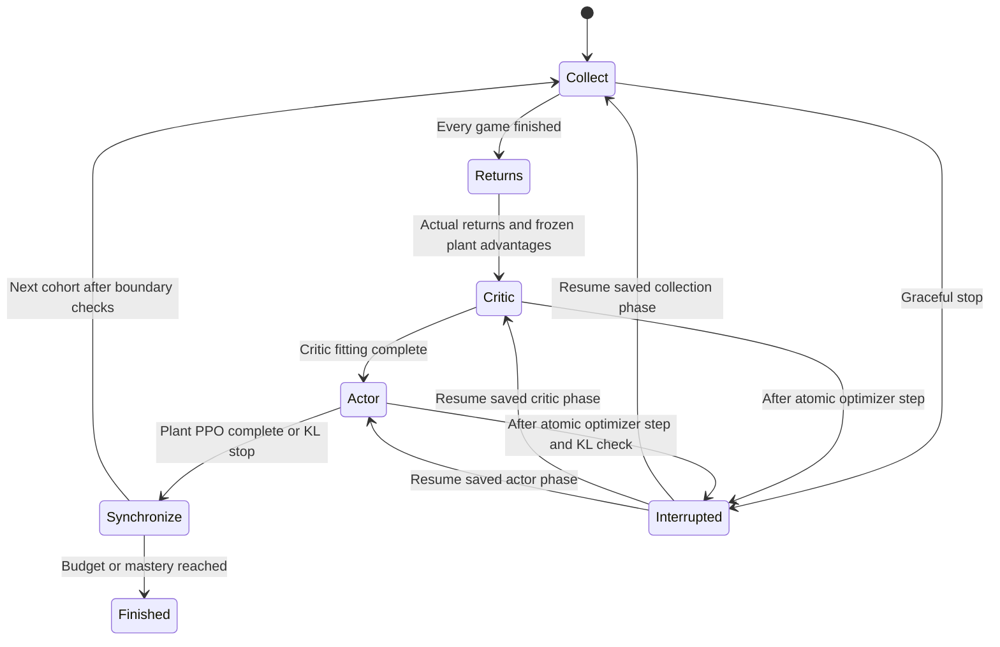

# Training architecture — 0.21.0

One CUDA controller plays every curriculum difficulty. An independent critic
selects wait, plant or a digging tile greedily; an independent actor samples
plant species and planting tiles during collection. Evaluation uses greedy
plant arguments and disables injected exploration. Game 1.5.0 runs at 100 Hz.

```mermaid
flowchart LR
    Game[32 independent CUDA games] --> Public[286 public values and legal masks]
    Public --> History[Bounded public event memory]
    History --> Critic[Independent critic: 47 action values]
    Critic --> Controller[Maximum legal value]
    Controller -->|plant| Actor[Independent actor: species and tile]
    Controller -->|wait or dig| Command[Executed command]
    Actor --> Command
    Command --> Game
    Game --> Rewards[Accounting rewards and episode outcome]
    History --> Store[Bounded host trajectories and disk overflow]
    Rewards --> Store
    Store --> Returns[Complete actual reward-to-go]
    Returns --> FitCritic[Fit critic]
    FitCritic --> FitActor[Conditional plant PPO]
    FitActor --> Sync[Synchronize next cohort]
    Sync --> Critic
    Sync --> Actor
```

The game package owns mechanics, gameplay RNG, legality, public views and
snapshots. Research environment adapters own cutoff failures and accounting
rewards. Policy code owns deterministic tokenization, two temporal encoders and
conditional action selection. Learning owns complete-game storage, returns,
separate optimization phases and checkpoints. Evaluation owns held-out seeds,
mastery gates, recordings and checkpoint selection.

## Exact model inputs

All indices are zero-based and inclusive in the tables. Lanes 0–4 run from top
to bottom; columns 0–8 run left to right. Positions use the engine's fixed-point
units: 1,000 per tile, house at -500, spawn at 9,500. Counts and scaled totals
are not clipped. Category IDs are labels, not numerical magnitudes.

| Observation indices | Shape | Fields |
|---|---|---|
| 0–134 | 5 lanes × 9 columns × 3 | Plant type, health fraction, behavior |
| 135–269 | 5 lanes × 3 regions × 9 | Regional zombie counts, health, armor and distances |
| 270–280 | 11 | Global economy/progress and mower flags |
| 281–285 | 5 | Frontmost zombie headless flag for each lane |

A plant tile starts at `3 × (9 × lane + column)`.

| Tile offset | Input | Encoding |
|---|---|---|
| 0 | Plant type | 0 empty; 1 sunflower, 2 peashooter, 3 wall-nut, 4 cherry bomb, 5 potato mine, 6 snow pea, 7 chomper, 8 repeater |
| 1 | Remaining health | Current HP / that plant's maximum HP; empty 0 |
| 2 | Behavior | 0 empty; 1 ready, 2 arming, 3 armed, 4 fusing, 5 digesting/busy, 6 exploding, 7 detonating |

Mine rising maps to arming. Chomper biting, caught prey, digestion and recovery
all map to category 5. Other internal firing phases stay ready. The encoders
share this compact mapping; simulator phase numbers are not directly exposed.
Each tile's three raw values becomes an 8-value type embedding, one health
value and a 4-value behavior embedding: 13 learned spatial input values.

A zombie region starts at `135 + 9 × (3 × lane + region)`.

| Region offset | Input | Encoding |
|---|---|---|
| 0 | Basic count | Count / 5 |
| 1 | Flag count | Count / 5 |
| 2 | Conehead count | Count / 5 |
| 3 | Buckethead count | Count / 5 |
| 4 | Pole-vaulter type count | Count / 5, including used poles |
| 5 | Aggregate body HP | Sum / (5 × largest configured body HP); default denominator 2,500 |
| 6 | Aggregate armor | Sum / (5 × largest configured armor); default denominator 5,500 |
| 7 | Nearest zombie distance | `(x − house_x) / (spawn_x − house_x)` |
| 8 | Nearest capable pole carrier distance | Same distance; requires unused pole and a head |

Empty counts, health and armor are zero. Absent distances are -1. Headless
bodies remain counted in these regional features until removal, so their HP
decline is observable. Regions are equal intervals of the house-to-spawn span,
not groups of three columns. The integer rule is
`clamp((x − house_x) × 3 // (spawn_x − house_x), 0, 2)`.
At default positions the boundaries are -500, 2,834, 6,167 and 9,500:
2,833 belongs to region 0, 2,834 to region 1, 6,166 to region 1 and 6,167 to
region 2. Both endpoints and out-of-range positions clamp to an endpoint region;
distance values themselves are not clipped.

| Index | Input | Encoding |
|---|---|---|
| 270 | Sun | Sun / largest plant cost; default 200 |
| 271 | Elapsed simulation time | Seconds / cutoff seconds; default 1,200 |
| 272 | Current wave | Wave / 15 |
| 273 | Total waves | Total / 15 |
| 274 | Initial zombie count | Count / 75 |
| 275 | Neutralized zombie count | Count / 75; first head loss or direct lethal removal counts once |
| 276–280 | Mower spent in lanes 0–4 | 1 spent, 0 otherwise |
| 281–285 | Frontmost zombie headless in lanes 0–4 | 1 headless, 0 headed or empty lane |

Frontmost means smallest x, nearest the house. At equal x a headed zombie wins
the tie; entity IDs and iteration order cannot affect the flags. Later body
removal does not increment neutralization again. Ready and moving mowers are
indistinguishable from the mower input alone.

These additional inputs are separate from the observation vector:

| Input | Role |
|---|---|
| 406 legal-action booleans | Constrain selection; not concatenated into the observation |
| Previous executed action | Public history; rejected proposals use the wait marker |
| Episode-reset marker | Clear history at game boundaries |
| Public simulation tick | Relative temporal positions |
| Memory validity, represented counts and start ticks | Identify retained/compressed public history |
| Fixed normalized column coordinate | `0, 1/8, …, 1`, derived from board layout |

A raw temporal token has **289 values**: 286 observations plus previous action,
reset marker and tick. The action integer is transport/history identity, not a
406-way policy classifier. One learned 406-entry action embedding is retained.

Excluded inputs are countdowns, future spawns, seeds, entity IDs, rewards,
return targets, optimizer statistics and hardware telemetry. Snapshots may
contain private simulator state for exact resume; they never enter an encoder.
Regional aggregation hides exact individual arrangements; removed projectile
and recharge information must be inferred from public history where possible.

## Memory, networks and action selection

The bank retains 8 recent tokens, 32 event tokens and 8 older summaries. Current
tokens always include movement distances. Continuous movement within a region
and elapsed time alone do not admit an event. Health, type, armor, region,
active-pole presence, headless flags, plant categories, sun/wave/mower flags,
legal masks and accepted actions do. Old quiet ticks are summarized by latest
public state, earliest tick and represented count; old events eventually enter
that same bounded summary bank. No future token is attended to.

Actor and critic each use type/behavior embeddings, two 32-channel 3×3 spatial
convolutions, a 64-value global encoder, and a separate gated temporal encoder
with two blocks, width 128, four attention heads and feed-forward width 256.
Each current query attends only to valid retained history. Relative age, span
and represented count describe temporal position. Raw memory is re-encoded by
current parameters; no learned activation survives an episode boundary.
The heads use two 128-neuron hidden layers. The actor outputs eight species
logits and eight 45-tile maps. The critic outputs 47 values: wait, plant, then
45 row-major digging values. Parameters and Adam states never overlap.

The controller masks illegal values and takes the maximum. Ties prefer wait,
then plant, then the first digging tile. Plant availability requires at least
one legal species/tile; digging requires a legal occupied tile. If plant wins,
the actor chooses a species then a tile using one consistent conditional
mixture. Injected exploration is uniform across legal species and uniformly
across that species' legal tiles. It never alters controller or digging choices.
Both probability factors contribute to plant PPO ratios, entropy and exact KL.

Initial wait/plant values are zero; every digging value starts at the defeat
reward (-2). Actor final weights are zero, giving uniform legal conditionals.
The first all-wait cohort supplies negative waiting targets and can make
planting preferred. Greedy selection provides no coverage guarantee: inaccurate
values or untried actions can still cause a poor policy. Pre-fit error and
per-action coverage must be examined when diagnosing that behavior.

## Collection and optimization

The default cohort is 32 environments, one complete game each. Finished games
pause until all finish. Actor and critic are frozen throughout collection;
optimizer phases never overlap it. Actual reward-to-go uses gamma 1 and includes
zero-duration actions. Natural win/loss ends the episode. At 1,200 seconds,
research records a separate cutoff failure, applies defeat reward once and
keeps physical assets. It does not bootstrap. External interruption is not a loss.

Plant advantages are actual return minus collection Q(plant), fixed before
critic fitting and normalized once over planting decisions. Critic MSE fits
selected outputs to unnormalized returns, with equal aggregate weight for each
populated wait/plant/dig group. The actor then runs conditional PPO only on
planting decisions. A no-plant cohort skips actor fitting. Defaults remain four
epochs, minibatches at most 1,024, actor/critic learning rates 0.0001/0.0003,
clip 0.2 and gradient norm limit 0.5. No initial actor freeze remains.

The collector's controller is fixed for interpreting that cohort's actor data.
Critic changes affect the next cohort. Sampled KL stops actor steps; exact KL
checks the complete conditional plant distribution against collection weights.
Exceeding target 0.01 restores actor weights and Adam moments and stops its
phase. Critic fitting and completed experience remain retained. Zero disables
the threshold. Non-finite values fail explicitly or roll back the actor.

Plant-only injected exploration decays exponentially from 10% to 0.1% over
3,000 stage games and then holds. Species/tile entropy coefficients begin at
0.001 each and decay to 10% of those values. The resolved schedule is fixed for
a whole cohort and resets with stage progress. See [the derivation](math/complete-game-learning.md).

Curriculum is saving → easy → standard → shared. Existing held-out mastery
tasks, residency and 100/100 requirements remain; probes occur every 2,000
completed games at cohort boundaries. Selected-stage until-mastery training
has no game/time ceiling and does not advance past that stage. Bounded training
remains the default. Normal-game stage-success validation is deterministic.

## Storage, recovery and failures

Compact trajectories store observations, packed masks, actions, actual rewards,
durations, collection likelihoods and values on the CPU. Memory token references
and compression metadata reconstruct the exact causal bank per minibatch;
there is no whole-episode graph or rollout-tail bootstrap. The default 6 GiB
trajectory RAM budget spills additional blocks to disk. Bounded minibatches
transfer through pinned host memory to CUDA. Disk space remains a practical
limit; failed writes must preserve prior checkpoints.

One atomically replaced checkpoint archive contains both networks and optimizers.
An interrupted cohort additionally stores simulator and gameplay
RNG state, environment selection RNGs, public memory, collection progress,
optimization phase/cursor, behavior weights, actor rollback state and sampler
RNGs and streamed trajectory blocks inside that archive. Resume continues the saved phase.
Missing runtime data or damaged blocks fail explicitly. Stage transfer loads compatible weights
into a new experiment with fresh optimizer/counters. The new observation,
controller and optimizer protocols reject previous models; no conversion exists.
Existing runs and recordings remain preserved for their original versions.

The viewer and hardware monitor are diagnostic outputs. They neither select
actions nor add model inputs. Last boards remain visible during critic/actor
fitting and validation; hardware curves and terminal logs describe phase,
reward, net value, discounted return and throughput. Reporting failure does
not invalidate a checkpoint. Detailed evidence and source limitations belong
in [validation](validation.md), [references](references.md) and
[iteration history](iteration.md).
