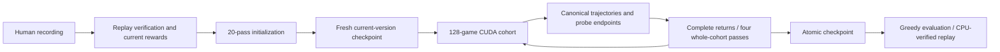
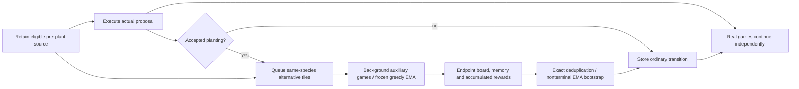
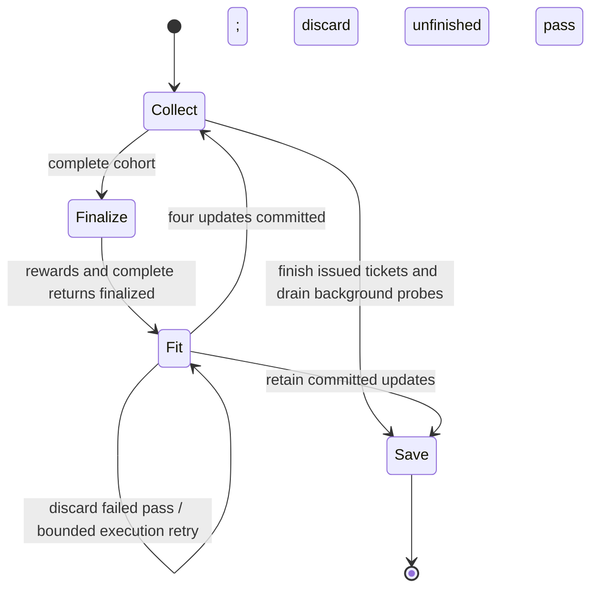

# System architecture

One joint-value Transformer–LSTM supports human initialization, autonomous
collection and evaluation on a separate, pinned 100 Hz Plants vs. Zombies
simulator. The policy reads public current state and public event history only.

## Boundaries and ownership

The bundled training profile is the sole parameter source. Fresh runs use
current defaults; current-version recovery retains saved learning settings and
refreshes execution/logging settings. Previous checkpoints fail before simulator
allocation. There is no migration or historical collector.

| Component | Responsibility and owned data |
|---|---|
| Environment adapters | Public observations, actual action outcomes, timing and reward ledgers |
| Policy and runner | Joint action values and independent per-episode event memory |
| Exploration controller | Persistent species commitments, separate from learned memory |
| Scheduler and probe pool | Retained decisions, immutable sources, background EMA games and endpoint patches |
| Cohort learner | Complete returns, whole-pass optimization and actual-behavior EMA history |
| Storage and transport | Canonical slots, ragged entities, bounded RAM/disk spill and pinned transfers |
| Checkpoint inspection/recovery | Protocol validation and atomic model/optimizer/episode restoration |
| Monitoring/presentation | Host-side reports, read-only journals and viewer snapshots |

The simulator stays pinned and unmodified. Private snapshots and schedules may
be copied into forks or checkpoints; they never become policy inputs.

```mermaid
flowchart LR
    Human[Human recording] --> Verify[Replay verification and current rewards]
    Verify --> Demo[20-pass initialization]
    Demo --> Weights[Fresh current-version checkpoint]
    Weights --> Collect[128-game CUDA cohort]
    Collect --> Records[Canonical trajectories and probe endpoints]
    Records --> Fit[Complete returns / four whole-cohort passes]
    Fit --> Collect
    Fit --> Save[Atomic checkpoint]
    Save --> Evaluate[Greedy evaluation / CPU-verified replay]
```

## Decisions and event memory

Encoding preserves individual mowers, plants, zombies and projectiles, plus
resource, cooldown and population globals. Canonical ordering makes storage
reproducible; attention is independent of entity row order. Truncation is
diagnosed, and globals count entities before truncation. CPU and CUDA encoding
represent the same public facts.

Every decision encodes its current board. Attention supplies a global summary
and tile features; scalar features and event memory join the current summary
through a shared fusion layer. Position, health and cooldown can therefore
affect Q values without a memory write.

Memory writes only for gross sunlight gain/spend, zombie spawn/defeat/removal
and plant addition/removal. A write consumes one transition's facts exactly once
with its resulting board and time since the preceding write. Initial entities
are not additions; simultaneous gains/losses stay separate. Quiet decisions
preserve hidden/cell state. Reset clears only the replaced episode's memory;
inactive slots remain frozen.

The network predicts wait and species-conditioned tile values. Species/dig
branch values are candidate-tile maxima, not independent predictions.
Normal branch selection is greedy; existing tile exploration follows it.
Plant candidates are empty tiles; dig candidates include every tile.
A full-board plant retains tile-zero rejection fallback. Resources and cooldown
never hide normal policy branches.

Accepted planting/digging takes zero ticks. Waits and rejected proposals advance
one tick. Trajectories retain actual proposal, acceptance, execution, duration
and reward; fitting supervises the actual complete action. Original policy
proposals and exploration provenance are diagnostics, never memory inputs.

After accepted normal planting, a separate exploration coin may commit to
another species. Ordinary waits persist until resources, cooldown and geometry
permit it, without a timeout. Successful exploratory planting clears the
commitment without recursively triggering that coin.
Exploration schedules freeze per cohort and reset on stage promotion.

Reward ledgers track actual physical changes. Eligible early Sunflower income
receives its development bonus; sky income and cap-discarded sun do not.
Development scaling applies once. Cohort finalization supplies a shared duration
median for actual and counterfactual victory-time shaping.

Field definitions and formulas belong in [entity inputs](math/entity-inputs.md),
[recurrent training](math/recurrent-training.md) and
[reward accounting](math/training-objective.md).

## Plant-triggered counterfactuals

Every actual accepted planting, including exploratory placement, triggers
counterfactuals. Waits, digs, rejected plants and initial plants do not.
Separate zero-time placements remain separate triggers.

Before execution, the pinned simulator's read-only legality mask gates copies
into a pre-plant source bank. This execution-only mask never replaces policy
geometry masks. The immutable source includes simulator state, accounting
ledgers and complete EMA memory after consuming pending source-board events.
The existing actual-transition handoff authorizes rollouts using real acceptance.

```mermaid
flowchart LR
    Source[Retain eligible pre-plant source] --> Actual[Execute actual proposal]
    Actual --> Gate{Accepted planting?}
    Gate -->|no| Store[Store ordinary transition]
    Gate -->|yes| Fork[Queue same-species alternative tiles]
    Source --> Fork
    Fork --> Rollout[Background auxiliary games / frozen greedy EMA]
    Rollout --> Endpoint[Endpoint board, memory and accumulated rewards]
    Endpoint --> Tail[Exact deduplication / nonterminal EMA bootstrap]
    Tail --> Store
    Actual --> Continue[Real games continue independently]
    Store --> Continue
```

Defaults are up to four same-species alternative tiles with a 30-second simulated
horizon. Alternative tiles exclude the actual tile. A shared tile-only layout
determines storage and fitting shapes; selection advances only on acceptance and
consumes no behavior RNG. There are no alternative-branch probes.

The scheduler advances ready real slots and occupied auxiliary lanes in short,
fair rounds. Frozen greedy EMA forks never trigger further probes or exploration.
Stops are true terminal/cutoff, horizon or the 4,096-transition cap. Horizon/cap
stops bootstrap; true terminal/cutoff stops do not. Limits invent no waits/defeat.

The pool defaults to 256 active lanes and 128 immutable source jobs; unused
allocation rows execute nothing. FIFO admission and one-lane/source fallback
retain every probe. Capacity pressure holds only another eligible planting,
including its proposal/draws; other slots and the original planting game continue.
Unfinished, ready, source-blocked and terminal states are distinct.

Completed endpoints leave their lane immediately. Owned public boards, memory,
reward components and bootstrap results patch their source trajectory rows
exactly once through subsequent pinned handoffs. Deduplication compares complete
public/recurrent/event/timing inputs; ongoing games never merge.
Heavy control reporting occurs every 64 continuation rounds.

Only endpoint evidence is retained, not rollout frames. Fork events, rewards
and memory never reach actual histories. Actual EMA history follows actual
execution, including committed exploration.

## Cohorts, storage and recovery

A cohort contains up to 128 complete games at fixed weights. Finished slots
remain inactive and are not refilled. Active-only plans gather boards/memory,
infer compact batches and restore original slot identities. Padding carries
no episode state or supervision. Behavior RNG retains original-slot order.

Canonical decision metadata and ragged entity slabs share one RAM/disk budget,
including pinned staging, retained decisions, sequence maps, private workspaces
and endpoints. Auxiliary/source workspace usage is reported separately.
Insufficient minimum memory fails explicitly
rather than dropping evidence. Recovery validates layout, offsets, entities
and outcome counts.

Each fitting pass reconstructs memory from zero, processes genuine event rows
and gathers latest memory onto every decision. Sequence preparation ignores
capacity gaps; existing 256-actual-decision detach boundaries remain. Quiet
decisions still supervise current-state values.
Nonempty wait/plant/dig groups receive equal weight, with accepted/rejected
strata split equally when both exist. Probe Huber loss balances represented
branches and initial outcomes. EMA updates once per committed optimizer update.

```mermaid
stateDiagram-v2
    [*] --> Collect
    Collect --> Finalize: complete cohort
    Finalize --> Fit: rewards and complete returns finalized
    Fit --> Fit: next whole-cohort pass
    Fit --> Fit: discard failed pass / bounded execution retry
    Fit --> Collect: four updates committed
    Collect --> Save: finish issued tickets and drain background probes
    Fit --> Save: retain committed updates; discard unfinished pass
    Save --> [*]
```

Actual execution and storage are atomic. Saving stops new selection, finishes
issued capacity-waiting decisions, and drains every background endpoint/bootstrap
patch. Checkpoints contain no unfinished probe evidence; private forks are transient.
Atomic ZIP replacement couples model, optimizer, counters, curriculum, RNG,
commitments, event memory, probe cursors and trajectories. Failed saving leaves
the preceding checkpoint intact.

Recovery restores a canonical decision boundary. Uncommitted fitting passes
recompute from evidence; committed updates are not repeated. Compact maps and
graph caches rebuild rather than serialize. Protocol/schema inspection precedes
CUDA probing and simulator allocation. Previous weights/resumes require fresh
initialization.

Collection and fitting own separate bounded graph captures and workspaces.
Quiescent transitions drain transfers and release outgoing resources before
the next phase. Headroom/capture failure preserves exact eager inference.
Fitting owns activations/gradients and bounded precision/allocation retries;
exhaustion stops without an optimizer commit.
See [execution and throughput](math/training-throughput.md).

## Demonstrations, evaluation and monitoring

Demonstrations verify archive/replay hashes, public facts, outcomes and timing,
then recompute rewards without rewriting recordings. Verified transitions
supply complete returns and accepted-action preferences. Twenty demonstration
passes are independent of four autonomous passes; demonstrations run no probes.

Curriculum gates use held-out cases. Promotion changes future resets only.
Evaluation uses the same policy/runner without exploration, probes or updates;
CUDA action traces are checked against CPU replay.

Viewers and journals are read-only. Episode identities reject stale responses.
Terminal reports use host records for cohort wins/returns and interval active
throughput, distinguishing provisional and finalized rewards. Detailed reports
include accepted planting triggers, tile counts, queued/active lanes, blocked slots,
queue age, drain duration, stop reasons, timing,
graph activity and workspace use without new telemetry device synchronization.

[Training](training.md) owns commands/configuration; [validation](validation.md)
owns test coverage. Version history and measurements belong only in
[iteration history](iteration.md). Correctness controls do not establish mastery
or promise improved win rate.
