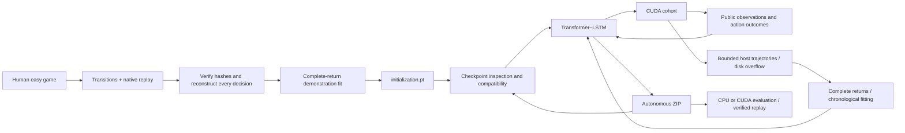
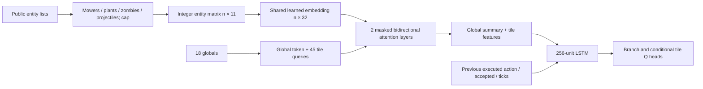
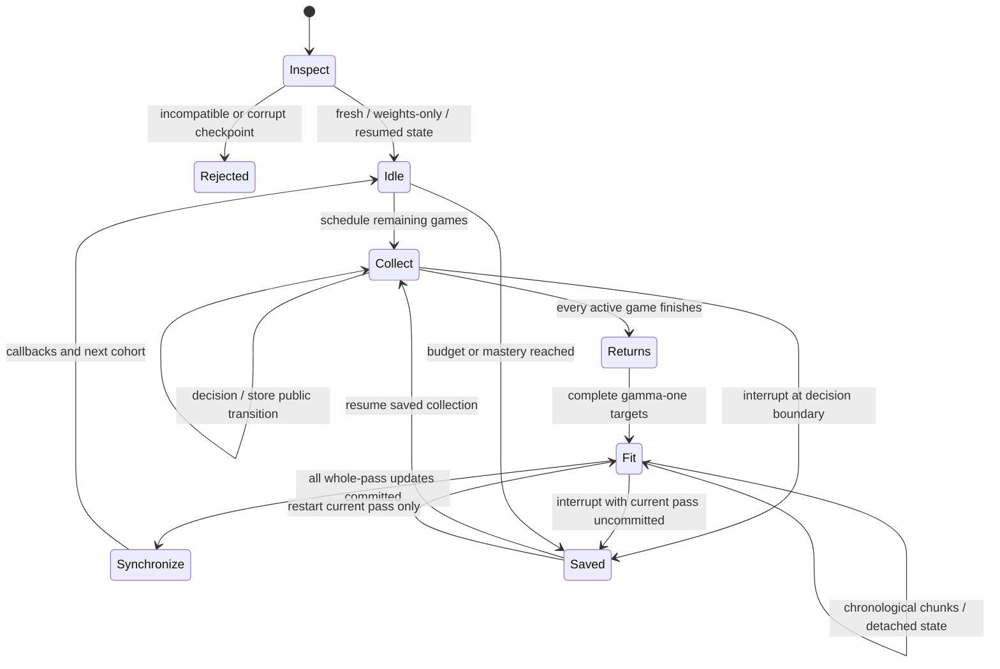
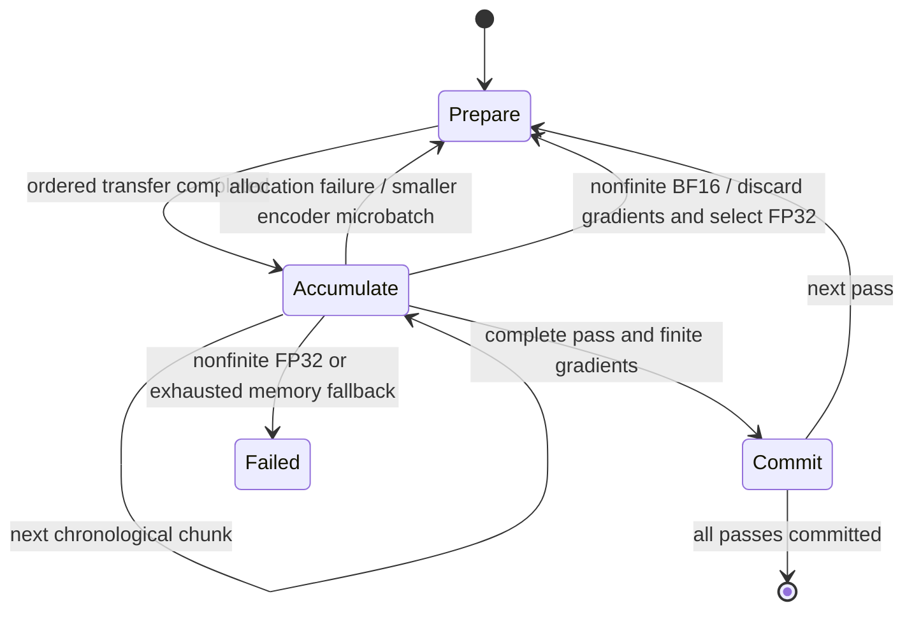
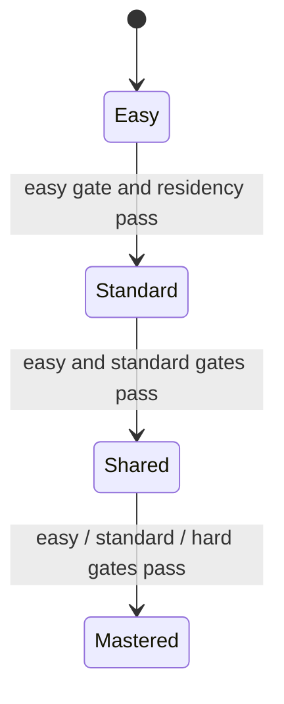

# System architecture

This project learns plant-placement decisions from complete games on a pinned
100 Hz Plants vs. Zombies simulator. One Transformer–LSTM model supports human
demonstration initialization, autonomous collection, evaluation and replay.
The game package remains separate and pinned; this repository adapts its public
observations, action timing and reward accounting.

```mermaid
flowchart LR
    Human[Human easy game] --> Archive[Transitions + native replay]
    Archive --> Verify[Verify hashes and reconstruct every decision]
    Verify --> Init[Complete-return demonstration fit]
    Init --> Weights[initialization.pt]
    Weights --> Inspect[Checkpoint inspection and compatibility]
    Saved[Autonomous ZIP] --> Inspect
    Inspect --> Policy[Transformer–LSTM]
    Policy --> Simulator[CUDA cohort]
    Simulator --> Public[Public observations and action outcomes]
    Public --> Policy
    Simulator --> Store[Bounded host trajectories / disk overflow]
    Store --> Fit[Complete returns / chronological fitting]
    Fit --> Policy
    Policy --> Saved
    Saved --> Evaluate[CPU or CUDA evaluation / verified replay]
```

## Components and ownership

Configuration defines model dimensions and the protocol. The single bundled
`src/pvz_rl/data/train.toml` file contains the shared parameters plus sparse
`train` and `demo` overlays. Installed CLI use and source-tree commands resolve
the same values. There is one entity Transformer–LSTM architecture.
Shared checkpoint inspection validates format, model/optimizer protocols,
configuration identity and weight structure before environment creation. Loading
without an explicit target uses saved settings and missing execution defaults.
Engine, complete observation encoding, timing, action algebra, reward definition
and network structure must match for transfer. Budgets and output preferences
are execution choices. Invalid input raises an error; there is no random fallback.

Environment adapters encode only public state: one int32 row per mower, plant,
zombie and projectile, with 11 fields per row. State categories preserve public
behavior phases, and numerical fields keep individual coordinates, health,
armor, timers, slowing, pole/headless flags and projectile damage together.
Eighteen globals contain sun, elapsed time, wave/total waves, initial/defeated
counts, eight cooldowns and four full-list entity counts. No IDs, allocation
slots, schedules, RNG state or private movement fields enter the policy.

The configured cap retains mowers, plants, zombies and projectiles in that order.
It omits projectiles first, then zombies, then plants. Zombies nearest the house
come first; public fields break ties. All five mowers remain, including spent
ones. Canonical ordering makes storage reproducible; attention does not depend
on row order. Global entity counts are measured before truncation. Diagnostics
record retained and omitted counts; omitted details cannot be recovered from counts.

CPU encoding consumes public observation objects. CUDA encoding derives equivalent
public countdowns and records directly from device arrays, including projectiles.
Only occupied simulator slots become records. Shared field definitions, categorical
maps and pinned-rule normalization describe both paths. Batching pads to its
largest retained list and carries a boolean validity mask.

```mermaid
flowchart LR
    Public[Public entity lists] --> Cap[Mowers / plants / zombies / projectiles; cap]
    Cap --> Raw[Integer entity matrix n × 11]
    Raw --> Embed[Shared learned embedding n × 32]
    Globals[18 globals] --> Readout[Global token + 45 tile queries]
    Embed --> Attention[2 masked bidirectional attention layers]
    Readout --> Attention
    Attention --> Summary[Global summary + tile features]
    Summary --> LSTM[256-unit LSTM]
    Feedback[Previous executed action / accepted / ticks] --> LSTM
    LSTM --> Heads[Branch and conditional tile Q heads]
```

Each shared entity embedding sums type and state lookups and a projection of nine
normalized numerical values, then applies layer normalization. Coordinates use
pinned units, health uses species maximum health, armor uses maximum armor,
durations use seconds, and damage uses normal-pea damage. Valid values are never
clipped. The default width is 32, with two four-head attention layers, feed-forward
width 64 and no dropout. A global readout token and 45 coordinate tile queries
join the sequence. Queries let empty tiles receive features. Padded keys are
masked in every layer and padded entity outputs are zero. No entity-order or
causal attention mask is added; the LSTM supplies chronological memory.

Global summary, scalar features, elapsed time, previous executed action and previous
acceptance/duration feed the LSTM. An accepted proposal is the previous executed
action; a rejected proposal executes and feeds back as wait (`0`).
The shared Q selector compares wait, eight species and dig greedily, then
explores only the selected branch's tile target. It chooses a tile for a
non-wait branch. Occupancy limits plant tiles; dig can target every tile.
A full board gives a deterministic tile-zero plant proposal that the simulator
may reject. Affordability and cooldown never remove a plant branch from that
comparison. The CPU adapter and CUDA batch pass the selected proposal unchanged
to validation, so a rejected plant advances exactly one tick, carries the pinned
reason into the transition, and receives `invalid_plant_penalty`. The proposal
is retained for rewards, Q fitting, journals and viewers; the resolved execution
action is exposed separately as wait.

```mermaid
flowchart LR
    Q[Ten branch Q comparison] --> Tile[Wait or selected branch's tile]
    Tile --> Proposal[Selected proposal]
    Proposal --> Validate[CPU or CUDA validation]
    Validate -->|accepted| Execute[Execute proposal]
    Validate -->|rejected| Wait[Execute wait / advance one tick]
    Wait --> Penalty[Rejection reason + applicable penalty]
    Validate -->|accepted| History[Previous action = proposal]
    Wait --> History2[Previous action = wait (0)]
    History --> Outcome[accepted + duration]
    History2 --> Outcome
```

The stateful policy runner owns hidden/cell state and public previous outcomes.
It resets only new episode slots. Rejected proposals remain the action target,
while the next recurrent input uses previous action `0`, `accepted=false` and
the simulator duration. Accepted plants and digs take zero ticks; waits and
rejections advance one tick. Finished collection slots are frozen. Evaluation uses
the same runner with tile exploration disabled.

## Recording and initialization

A human session owns one easy attempt. The recorder checks unused output paths,
records action-phase order, and streams every proposal and its public observation,
outcome, duration, reward and episode boundary into JSONL. Native replay and
manifest describe completion; closing early leaves an incomplete archive.
Compact viewer history never replaces the complete fitting sequence.

Initialization rejects missing manifests, unsupported protocols, replay-hash or
engine/schema mismatches, incomplete episodes and reconstruction differences. Only entity-v1
archives and weights are accepted; earlier archives require a new recording.
Verification compares recorded facts rather than the full configuration digest;
changing optimizer settings does not invalidate a recording.
The generated `initialization.pt` stores weights and source metadata; it omits
encoder batching and performance settings. Fresh `--init-from` resolves the
current configuration before weight transfer. Source learning/reward metadata
is used for provenance, never to override the new run's settings. Compatibility
checks validate the engine, input/action semantics and network dimensions;
reward coefficients are excluded from weight compatibility.
Complete gamma-one returns supervise both Q heads. Whole-pass gradients are
clipped once using the same `training.max_grad_norm` limit as autonomous fitting;
only completed passes atomically replace `initialization.pt`.

## Autonomous lifecycle and recovery

```mermaid
stateDiagram-v2
    [*] --> Inspect
    Inspect --> Rejected: incompatible or corrupt checkpoint
    Inspect --> Idle: fresh / weights-only / resumed state
    Idle --> Collect: schedule remaining games
    Collect --> Collect: decision / store public transition
    Collect --> Returns: every active game finishes
    Returns --> Fit: complete gamma-one targets
    Fit --> Fit: chronological chunks / detached state
    Fit --> Synchronize: all whole-pass updates committed
    Synchronize --> Idle: callbacks and next cohort
    Collect --> Saved: interrupt at decision boundary
    Fit --> Saved: interrupt with current pass uncommitted
    Saved --> Collect: resume saved collection
    Saved --> Fit: restart current pass only
    Idle --> Saved: budget or mastery reached
```

A cohort holds at most 128 games at fixed weights. Completed slots remain inactive
until the next cohort, and the final cohort uses only the remaining game count.
Trajectories retain fixed transition metadata and globals, entity offset/count,
and contiguous append-only int32 entity slabs containing only real rows. Metadata
and entities share one RAM budget with disk overflow. Proposals, executed previous
actions, current outcomes, omission counts, rewards and boundaries remain explicit.
Only recovery state stores private simulator snapshots and scenario RNGs.

Fitting visits episodes chronologically from zero recurrent state each pass.
The learning batch remains 1,024 decisions and each recurrent boundary remains
256 decisions, but the execution path groups four independent batches into a
single 4,096-decision transfer and forward/backward call when the environment
count permits. State is reset between slot groups, so no episode can observe
another episode's hidden state. Short episodes are padded; padding contributes
no target or loss. Encoder work uses at most 128 observations and a 65,536-token
budget. Allocation fallback lowers the encoder microbatch to 64, 32 and 16,
then enables one outer checkpoint without dropping entities.

Full-sequence SDPA selects the available efficient backend; an exact 64-query
fallback attends to all keys. When compilation is enabled, fixed-shape encoder
calls use CUDA graphs on Windows and the platform compiler elsewhere; a failed
backend is recorded once and the exact eager path remains active. CPU preparation
caches sequence index templates,
gathers entity slabs into reusable buffers and fills metadata in bulk. Two
pinned buffers and one ordered worker prepare the next fused batch; transfer
events prevent reads or host-buffer reuse before the copy completes.

The Windows backend captures forward and backward separately. Every output,
including internal activations saved for backward and returned parameter
gradients, is copied out of reusable graph storage. Copies retain tensor strides
and attention alignment. Consequently, replay cannot overwrite a preceding
microbatch's saved activations or accumulated gradients. Input buffers are
refreshed on every call, including updated FP32 weights. If backward capture
fails, the uncommitted pass discards gradients and restarts eagerly without
changing precision or counting an optimizer update. Allocation failures retain
the bounded memory fallback above.

CUDA fitting computes entity features, embeddings and auxiliary projections with
BF16 temporary values. Stored weights, normalization reductions, residual sums,
LSTM state/computation, Q heads, loss, gradients and Adam state remain FP32.
Collection, evaluation and demonstration fitting use FP32. Demonstration
initialization settings are independent of autonomous execution settings;
precision does not change raw observations, parameter shapes, or the learning
objective.

Each pass is an uncommitted transaction until finite gradients are clipped and
Adam updates once. Nonfinite BF16 computation discards the pass and retries in
FP32, retained for the rest of the cohort. An FP32 failure stops before updating.
CUDA timing records one fitting event per pass instead of one event per chunk;
intermediate progress uses cached metrics and does not drain the device. Exhaustion fails explicitly;
entity caps and recurrent sequence lengths never shrink. Equal weighting of nonempty wait/plant/dig groups is computed
across the entire cohort. Every pass accumulates chunk gradients before one
clipped Adam update; four passes are the default. Collection states are never
reused as fitting states after weights change.

```mermaid
stateDiagram-v2
    [*] --> Prepare
    Prepare --> Accumulate: ordered transfer completed
    Accumulate --> Accumulate: next chronological chunk
    Accumulate --> Prepare: allocation failure / smaller encoder microbatch
    Accumulate --> Prepare: nonfinite BF16 / discard gradients and select FP32
    Accumulate --> Commit: complete pass and finite gradients
    Accumulate --> Failed: nonfinite FP32 or exhausted memory fallback
    Commit --> Prepare: next pass
    Commit --> [*]: all passes committed
```

Execution precision and fallback status accompany recovery metadata. Older entity
checkpoints default to FP32. Ordinary resume keeps saved settings;
`--refresh-performance` replaces only precision, prefetch, encoder batching,
attention fallback size and instrumentation settings from current configuration.
Learning parameters and input/output schemas are excluded from that refresh.
Fresh weight initialization uses current learning and execution settings.
Recovery retains saved rewards and clipping because collected returns and
optimizer state belong to that saved configuration.

Atomic ZIP replacement couples model, optimizer, counters, curriculum, exploration,
RNGs, trajectory/entity slabs and collection states. Schema metadata records
field order, categories, normalization and cap; configuration records dimensions.
CUDA recovery allocates the proved future projectile bound plus an equal headroom
for active shots already present in a mid-game snapshot. Recovery validates slab
dtype, shape and contiguous offsets/counts before reuse. A failed save leaves the previous
ZIP intact. Resume restores a decision boundary during collection. Fitting
restores completed updates and recomputes only the uncommitted pass with cleared
gradients. The network has no stochastic dropout, and fitting does not sample
minibatches. Run metadata is embedded so checkpoints can be moved independently
of adjacent JSON reports. In-place resume appends history.

## Curriculum, evaluation and presentation

```mermaid
stateDiagram-v2
    [*] --> Easy
    Easy --> Standard: easy gate and residency pass
    Standard --> Shared: easy and standard gates pass
    Shared --> Mastered: easy / standard / hard gates pass
```

Easy contains easy games only; standard mixes easy and standard equally; shared
uses 20%/40%/40% easy/standard/hard. Probes use held-out curriculum seeds. Progress
changes future resets, never a running game. Single-stage runs stop at that
stage's mastery; ordinary runs promote. Normal validation follows successful
stages.

Evaluation uses public observations through the same runner. CUDA evaluation can
refill finished slots or hold a fixed batch; only replaced episodes reset memory.
Selected action traces are replayed on the CPU reference before recordings are
published. Evaluation never uses exploration or updates weights.

The viewer receives Q values captured during actual decisions, plus bounded
history pages and retained/omitted entity counts. Generation and episode identities reject stale responses. **F**
clears selection/paging and follows the latest action while preserving horizontal
scroll. Presentation runs separately and supplies no simulation time or policy
inputs. Callback reports retain progress, coverage, probes and checkpoint status.
At viewer startup, the environment supplies a small immutable snapshot of the
resolved learning configuration: optimizer settings, sequence length, rewards
and tile exploration. The settings strip shows checkpoint-retained values on
resume, independently of refreshed execution settings. It is available before
the first board and during fitting; **S** changes visibility only. The viewer
never reloads defaults or reads GPU tensors to display these values.

Mathematical controls and verification limits are in
[entity inputs](math/entity-inputs.md) and [recurrent training](math/recurrent-training.md); chronological release evidence
belongs in [iteration history](iteration.md). Short integration checks establish
mechanics and recovery, not win-rate improvement or formal training success.
