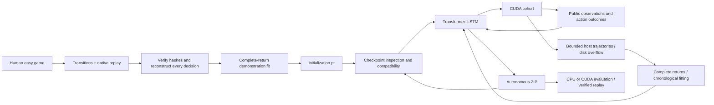
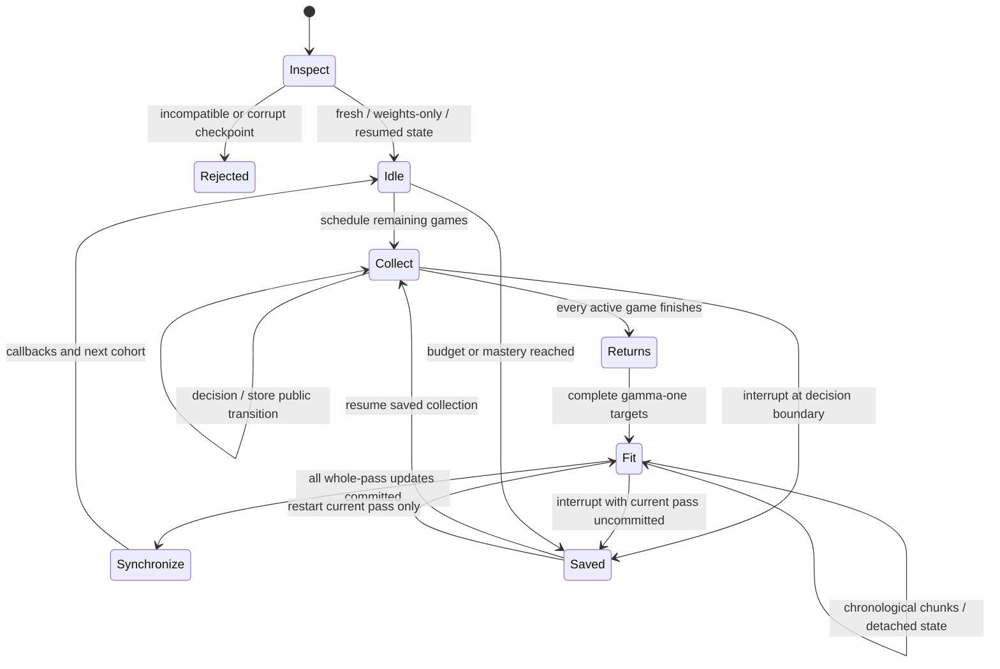
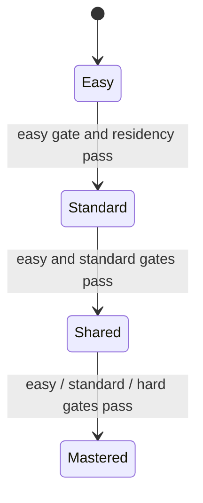

# System architecture

This project learns plant-placement decisions from complete games on a pinned
100 Hz Plants vs. Zombies simulator. One Transformer–LSTM model supports human
demonstration initialization, autonomous collection, evaluation and replay.
The game package remains separate and pinned; this repository adapts its public
observations, action timing and reward accounting.

```mermaid
flowchart LR
    Human[Human easy game] --> Archive[Transitions + native replay]
    Archive --> Verify[Verify hashes and reconstruct every decision]
    Verify --> Init[Complete-return demonstration fit]
    Init --> Weights[initialization.pt]
    Weights --> Inspect[Checkpoint inspection and compatibility]
    Saved[Autonomous ZIP] --> Inspect
    Inspect --> Policy[Transformer–LSTM]
    Policy --> Simulator[CUDA cohort]
    Simulator --> Public[Public observations and action outcomes]
    Public --> Policy
    Simulator --> Store[Bounded host trajectories / disk overflow]
    Store --> Fit[Complete returns / chronological fitting]
    Fit --> Policy
    Policy --> Saved
    Saved --> Evaluate[CPU or CUDA evaluation / verified replay]
```

## Components and ownership

Configuration selects the model and protocol. The single bundled
`src/pvz_rl/data/train.toml` file contains the shared parameters plus sparse
`train`, `demo`, and `event-memory` overlays. Installed CLI use and source-tree
commands therefore resolve the same values; `--profile event-memory` selects the
separate event-memory architecture.
Shared checkpoint inspection validates format, model/optimizer protocols,
configuration identity and weight structure before environment creation. Loading
without an explicit target uses saved settings and missing execution defaults.
Engine, complete observation encoding, timing, action algebra, reward definition
and network structure must match for transfer. Budgets and output preferences
are execution choices. Invalid input raises an error; there is no random fallback.

Environment adapters encode only public state. The recurrent observation has
294 values: 45 plant tiles, 15 zombie regions, public global/lane fields and eight
card cooldowns. Cooldowns use species order and `ticks / (recharge_ticks + 1)`.
Mower inputs are spent flags. Private seeds, schedules, simulator snapshots and
individual firing/arming/digestion timers never enter the policy.

The entity Transformer encodes all 45 tiles and 15 regions, including empty
entities. It uses position, type and segment embeddings, two no-dropout layers,
128-wide representations and four heads. A scalar encoder reads public global,
lane and cooldown fields. Pooled entity features, scalar features, elapsed time,
previous executed action and previous acceptance/duration feed a 256-unit LSTM.
An accepted proposal is the previous executed action; a rejected proposal is
executed and fed back as wait (`0`).
The shared Q selector compares wait, eight species and dig greedily, then
explores only the selected branch's tile target. It chooses a tile for a
non-wait branch. Occupancy limits plant tiles; dig can target every tile.
A full board gives a deterministic tile-zero plant proposal that the simulator
may reject. Affordability and cooldown never remove a plant branch from that
comparison. The CPU adapter and CUDA batch pass the selected proposal unchanged
to validation, so a rejected plant advances exactly one tick, carries the pinned
reason into the transition, and receives `invalid_plant_penalty`. The proposal
is retained for rewards, Q fitting, journals and viewers; the resolved execution
action is exposed separately as wait. The event-memory profile uses the same
proposal/execution split.

```mermaid
flowchart LR
    Q[Ten branch Q comparison] --> Tile[Occupancy tile selection]
    Tile --> Proposal[Selected plant proposal]
    Proposal --> Validate[CPU or CUDA validation]
    Validate -->|accepted| Place[Place immediately]
    Validate -->|rejected| Wait[Execute wait / advance one tick]
    Wait --> Penalty[Invalid-plant penalty + reason]
    Validate -->|accepted| History[Previous action = proposal]
    Wait --> History2[Previous action = wait (0)]
    History --> Outcome[accepted + duration]
    History2 --> Outcome
```

The stateful policy runner owns hidden/cell state and public previous outcomes.
It resets only new episode slots. Rejected proposals remain the action target,
while the next recurrent input uses previous action `0`, `accepted=false` and
the simulator duration. Finished collection slots are frozen. Evaluation uses
the same runner with both exploration coins disabled. The event-memory
alternative applies the same executed-action convention.

## Recording and initialization

A human session owns one easy attempt. The recorder checks unused output paths,
records action-phase order, and streams every proposal and its public observation,
outcome, duration, reward and episode boundary into JSONL. Native replay and
manifest describe completion; closing early leaves an incomplete archive.
Compact viewer history never replaces the complete fitting sequence.

Initialization rejects missing manifests, unsupported protocols, hash/config
mismatches, incomplete episodes and reconstruction differences. An exact digest
migration keeps the existing default recording valid after curriculum removal.
Execution device and fitting overrides do not modify verification configuration.
Complete gamma-one returns supervise both Q heads. Whole-pass gradients are
clipped once; only completed passes atomically replace `initialization.pt`.

## Autonomous lifecycle and recovery

```mermaid
stateDiagram-v2
    [*] --> Inspect
    Inspect --> Rejected: incompatible or corrupt checkpoint
    Inspect --> Idle: fresh / weights-only / resumed state
    Idle --> Collect: schedule remaining games
    Collect --> Collect: decision / store public transition
    Collect --> Returns: every active game finishes
    Returns --> Fit: complete gamma-one targets
    Fit --> Fit: chronological chunks / detached state
    Fit --> Synchronize: all whole-pass updates committed
    Synchronize --> Idle: callbacks and next cohort
    Collect --> Saved: interrupt at decision boundary
    Fit --> Saved: interrupt with current pass uncommitted
    Saved --> Collect: resume saved collection
    Saved --> Fit: restart current pass only
    Idle --> Saved: budget or mastery reached
```

A cohort holds at most 128 games at fixed weights. Completed slots remain inactive
until the next cohort, and the final cohort uses only the remaining game count.
Trajectories use bounded RAM blocks and disk overflow, retaining ordered public
observations, proposals, executed previous actions, current outcomes, rewards
and boundaries.
Only recovery state stores private simulator snapshots and scenario RNGs.

Fitting visits episodes chronologically from zero recurrent state each pass.
The default 1,024-decision budget batches four 256-decision chunks. Short episodes
are padded; padding contributes no target or loss. Carried state is detached at
chunk boundaries. Equal weighting of nonempty wait/plant/dig groups is computed
across the entire cohort. Every pass accumulates chunk gradients before one
clipped Adam update; four passes are the default. Collection states are never
reused as fitting states after weights change.

Atomic ZIP replacement couples model, optimizer, counters, curriculum, exploration,
RNGs, trajectory blocks and collection states. A failed save leaves the previous
ZIP intact. Resume restores a decision boundary during collection. Fitting
restores completed updates and recomputes only the uncommitted pass with cleared
gradients. The network has no stochastic dropout, and fitting does not sample
minibatches. Run metadata is embedded so checkpoints can be moved independently
of adjacent JSON reports. In-place resume appends history.

## Curriculum, evaluation and presentation

```mermaid
stateDiagram-v2
    [*] --> Easy
    Easy --> Standard: easy gate and residency pass
    Standard --> Shared: easy and standard gates pass
    Shared --> Mastered: easy / standard / hard gates pass
```

Easy contains easy games only; standard mixes easy and standard equally; shared
uses 20%/40%/40% easy/standard/hard. Probes use held-out curriculum seeds. Progress
changes future resets, never a running game. Single-stage runs stop at that
stage's mastery; ordinary runs promote. Normal validation follows successful
stages. The saving curriculum and per-lesson simulation changes are absent.

Evaluation uses public observations through the same runner. CUDA evaluation can
refill finished slots or hold a fixed batch; only replaced episodes reset memory.
Selected action traces are replayed on the CPU reference before recordings are
published. Evaluation never uses exploration or updates weights.

The viewer receives Q values captured during actual decisions, plus bounded
history pages. Generation and episode identities reject stale responses. **F**
clears selection/paging and follows the latest action while preserving horizontal
scroll. Presentation runs separately and supplies no simulation time or policy
inputs. Callback reports retain progress, coverage, probes and checkpoint status.

Mathematical controls and verification limits are in
[recurrent training](math/recurrent-training.md); chronological release evidence
belongs in [iteration history](iteration.md). Short integration checks establish
mechanics and recovery, not win-rate improvement or formal training success.
