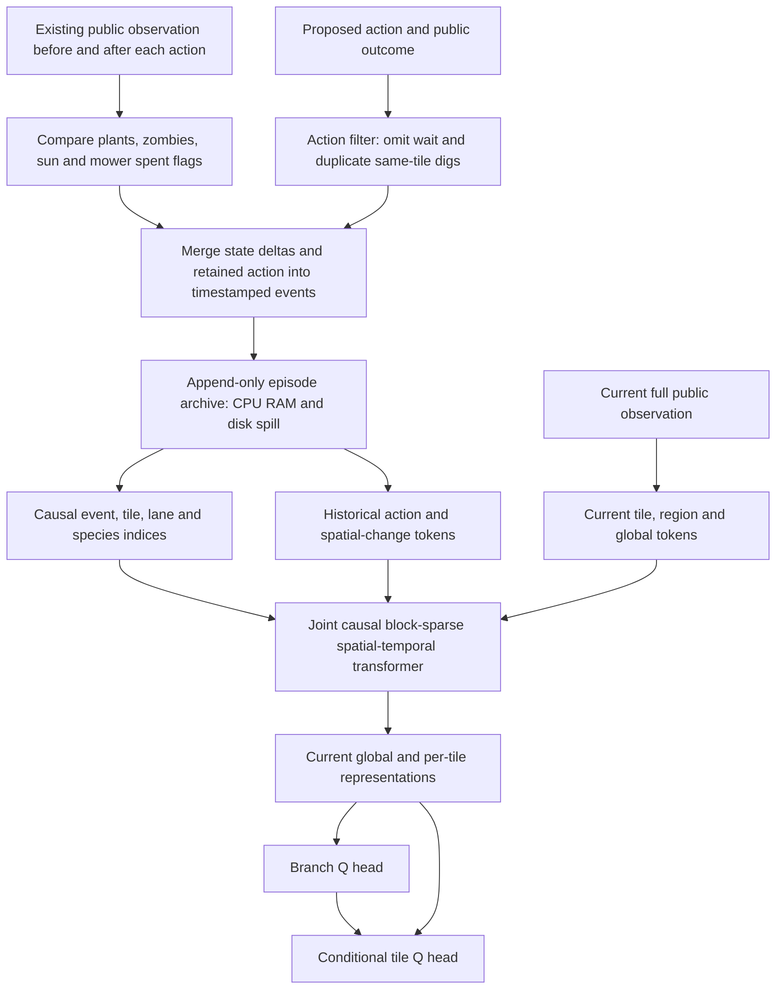
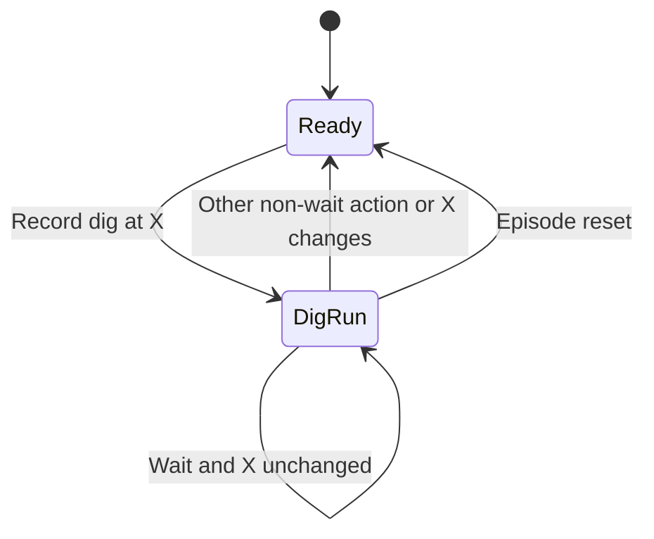

# Archived full-game memory proposal

Historical research notes for the removed event-memory model. Current entity
attention and LSTM behavior is documented in [architecture](architecture.md). See [sources](references.md#full-game-event-memory-and-efficient-attention--2026-09-26)
and [cost controls](math/history-attention.md).

## Retention contract

Retain every non-wait proposal, including rejected planting attempts, throughout
the episode. Consecutive digs at the same unchanged tile need only their first
action record. Here consecutive means consecutive in the non-wait action stream,
not neighboring spatial coordinates. A different non-wait action, a change to
that target, or an episode reset ends the run. Compare target state after the
first dig, so a successful removal followed by empty digs is one run.

Independently record every encoded change to plants, zombies, sun, or mower spent flags,
including changes during waits and duplicate digs. This includes observable
movement, health, behavior, appearance/removal, region/pole/headless state, and
existing wave/count inputs. Only a wait with no public-state change except elapsed
time is omitted. Preserve actual ticks on retained events and on the current
observation. No private timers, entity IDs, seeds, future schedules, or simulator
snapshots enter policy inputs. Internal archive indices are bookkeeping only.

An action and its resulting public delta can share one event envelope. Store
the proposal separately from its public execution outcome; an unsuccessful
plant must not become indistinguishable from an intentional wait. Do not expose
hidden rejection reasons. Preserve all transitions, durations, rewards and
penalties in the learning ledger, even when a memory action token is suppressed.

Keep the observation input schema unchanged. For mowers, record a change in the
existing spent flag only; do not add ready/moving states. Plant and zombie change
detection likewise uses existing encoded fields, not new private engine inputs.

## Framework

Record an initial public state and lossless deltas, with periodic keyframes for
fast reconstruction. Losslessness applies to the encoded public observations,
not inaccessible simulator state. Never evict an archive entry just because
it is old. GPU eviction affects only cached blocks; CPU/disk remains authoritative.
If storage runs out, checkpoint and report failure rather than silently discard
history. Archives remain available while their training samples are in use.

Tokenize actions and changed spatial fields into the same embedding space as
current tiles/regions, with type, location, and actual-time information. Avoid
duplicating the entire board after every rejected proposal. Delta storage is
lossless but does not guarantee few tokens: moving zombies can produce events
every tick even while the policy waits. The current board still contributes
45 tile, 15 region, and one global token, with no spatial CNN.

Use spatial connections within event blocks, a recent-event window, explicit
tile/lane/species links, and distant causal blocks. Keep the latest successful
planting for each species directly addressable, independent of how many later
failures occur. Consider configured dilated links or retrieval for distant blocks.
This is a project-specific graph inspired by Longformer/BigBird, not their exact
architecture or a transfer of their theoretical guarantees.

All records survive in the archive, but sparse attention does not make every
record directly influence every decision. Two layers of local attention cannot
cover arbitrary history; retrieval can miss an important event. Validate distant
event access explicitly. A current query scanning the full archive is a useful
small-scale reference, but scanning all prior events at every decision restores
quadratic total work over an episode. More stored history alone is not evidence
of better reasoning.

## Causality, caching and deduplication

Mask by episode and monotonic decision/event order. Allow bidirectional spatial
attention within one observable state. Simulation tick alone is unsafe because
successful actions can take zero ticks and later decisions can share timestamps.
Only outcomes known by the query decision are visible. A complete episode can be
loaded for fitting only with these prefix constraints applied at every layer.

The public-state delta recorder runs independently in both states. Never suppress
a new state-changing dig. Repetition metadata, if added later, must be immutable
per prefix: the final count/end time of a future run cannot appear in an earlier
training sample. Rewards remain exact regardless of action deduplication.

Frozen collection weights permit cached historical encodings only if links and
position encodings are prefix-stable. Growing LSH buckets, changing retrieval
neighbors, or encodings based on age relative to the latest query can invalidate
naive caches. Parameter updates invalidate learned caches. Training must recompute
contexts with active weights; detaching old encodings changes the gradient and
must not be presented as equivalent full-context training.

## Sparse attention and reversibility

| Method | Helps with | Does not solve |
|---|---|---|
| Causal block-sparse attention | Number of attention pairs and accelerator block scheduling | Exact full-history influence in every decision |
| Reformer LSH | Approximate content-based sparse lookup | Guaranteed retrieval of rare old events; streaming bucket changes |
| Reversible residual layers | Depth-dependent saved activations in backward | Archive eviction, growing KV memory, dense attention arithmetic |
| FlashAttention/SDPA | Dense score materialization and memory traffic | Quadratic dense pairwise arithmetic |

Prioritize the archive and causal sparse graph. Reversible blocks are a compatible
candidate after profiling, especially for deeper models; the proposed two-layer
baseline has less depth-related activation storage to save. Ordinary gated
residuals are not reversible coupling. Reversible backward needs independent
output/gradient checks, deterministic stochastic-operation replay, and numerical
reconstruction-error controls. No published speedup is assumed for this game.

The inspected machine has Torch 2.8.0+cu128, an 8 GiB RTX 4070 Laptop GPU, and no
importable Triton. FlexAttention 2.8 supports block masks, but a working fast local
sparse backend has not been demonstrated. Longformer's convenient sliding-chunks
implementation explicitly excludes autoregressive attention. Validate a real
causal sparse kernel; a sparse Boolean mask over dense scores is insufficient.

## Required verification

- Preserve original successful plant/dig and tile-specific decisions.
- Keep an early accepted plant and every later rejected plant proposal after a
  long failure burst; retrieve the old event rather than only retaining it on disk.
- During waits, independently vary plant status, zombie status/position, sun and
  mower spent flag: each change produces an event; a pure elapsed-time change
  does not. A duplicate dig with a world delta still produces a state event.
- Cover different-tile digs, dig/plant/dig, same-tick actions, empty prefixes,
  episode boundaries, interleaved environments, and resume inside a dig run.
- Future events or future repetition metadata must not alter earlier outputs.
  Cache eviction and disk spill must preserve exact public-state reconstruction.
- Compare sparse attention outputs and gradients with dense attention using the
  same allowed edges. Separately assess retrieval coverage and reversible backward.
- Profile typical and adversarial event counts, storage and latency. No formal
  training is authorized by this research step.
