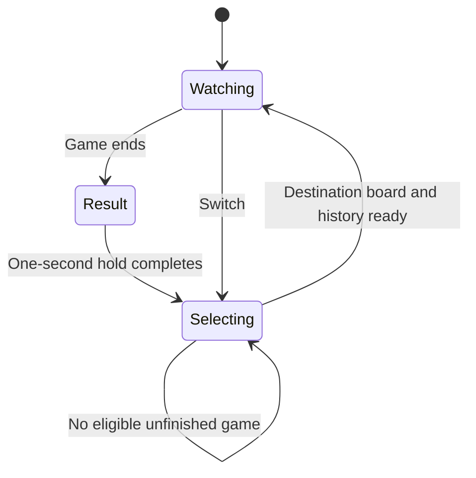

# Watching training decisions

Training opens a resizable 2×2 overview at five board refreshes per second.
Each panel follows an actual training environment. **Focus** fills the window
with that board and its action table; Escape returns to the grid. Maximize the
window normally or press F11 for fullscreen. Text stays at readable fixed sizes;
small overview panels show less history, so use Focus for detail.

**Switch** selects an unfinished, undisplayed environment and never resets it.
The old board stays visible with a switching label until the destination board
and first history page arrive together. Finished boards retain their result for
one second. If no replacement exists, the panel waits. Requests made during
validation are handled at the next collection safe point.

History has a separate following/browsing state. Browsing fixes the page and
selected action while new records arrive; Follow latest returns to the newest
decision. Pending replacement pages cannot be mixed with the retained old board.

The table retains planting and digging for the entire current game, even while
that environment is offscreen or the window is closed. Rows show decision number,
simulation time, action name, acceptance/rejection and all ten **raw estimated
returns**. `*` marks an unavailable branch; its numerical output was not eligible
for selection. Wait rows and tile information are omitted. Decision numbers still
advance during waiting, and multiple instantaneous commands may share a timestamp.

Use the mouse wheel to browse history and Shift+wheel to scroll columns. Click a
row to inspect that action's scores, greedy preference and exploration coins;
the heading labels it Historical action and retains its original timestamp.
The board timestamp is separate. **Follow latest** restores the current decision,
including waiting. Q-values are estimates, not probabilities or guarantees.

Each worker's journal stores the actual collection outputs. A shared 16 MiB
resident-block budget spills to temporary disk blocks; checkpoint archives stream
those blocks alongside training state. Bounded 64-row pages carry environment,
episode and selection-generation tags. Delayed pages cannot replace another game.
The viewer runs in a spawned CPU process and never evaluates a network. Closing
or losing the viewer leaves training running. Journals remain diagnostic outputs;
they do not alter actions, rewards or model inputs.

Output-only settings are `visualization.live_enabled`, `live_fps`,
`live_window_size` and `live_history_ram_mib`. Zero history RAM uses disk storage.
`train --live-view` and `--no-live-view` override only window visibility.
