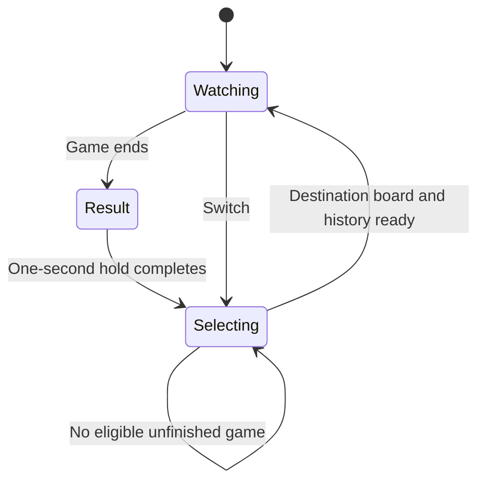
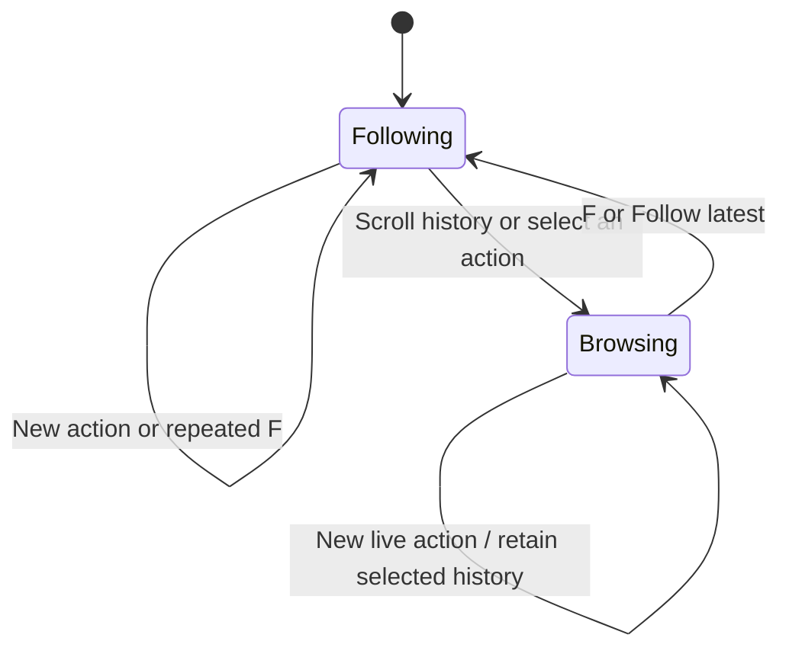

# Watching training decisions

Training opens a resizable 2×2 overview at five board refreshes per second.
Each panel follows an actual training environment. **Focus** fills the window
with that board and its action table; Escape returns to the grid. Maximize the
window normally or press F11 for fullscreen. Text stays at readable fixed sizes;
small overview panels show less history, so use Focus for detail.

The read-only **Learning settings** strip shows the active learning rate,
`max_grad_norm`, batch size, epochs, discount, sequence length, reward coefficients
and tile-exploration schedule. These come from the resolved run configuration;
on resume they are the checkpoint learning values retained during automatic execution refresh,
even if TOML now differs. Fresh `--init-from` runs use the current TOML values.
`training.max_grad_norm` is the shared clipping limit for demonstration and
autonomous fitting. Reward settings are coefficients; action-history penalties
are the corresponding signed reward contributions.
The strip remains visible during fitting and wraps at narrower window widths.
Press **S** to hide or show it when more board space is needed.

**Switch** selects an unfinished, undisplayed environment and never resets it.
The old board stays visible with a switching label until the destination board
and first history page arrive together. Finished boards retain their result for
one second. If no replacement exists, the panel waits. Requests made during
validation are handled at the next collection safe point.

```mermaid
stateDiagram-v2
    [*] --> Watching
    Watching --> Result: Game ends
    Result --> Selecting: One-second hold completes
    Watching --> Selecting: Switch
    Selecting --> Selecting: No eligible unfinished game
    Selecting --> Watching: Destination board and history ready
```

History has a separate following/browsing state. Browsing fixes the page and
selected action while new records arrive. Press **F** to return all visible
panels to the newest decision (all four in the grid, one in Focus). The
**Follow latest** button applies the same transition to its own panel. Both clear
selection and paging offsets, invalidate outstanding history replies, and retain
horizontal scrolling. Empty or unavailable panels and pending replacements do
not inherit another game's history. Repeated presses are safe.

```mermaid
stateDiagram-v2
    [*] --> Following
    Following --> Browsing: Scroll history or select an action
    Browsing --> Following: F or Follow latest
    Following --> Following: New action or repeated F
    Browsing --> Browsing: New live action / retain selected history
```

The table retains planting and digging for the entire current game, even while
that environment is offscreen or the window is closed. Rows show decision number,
simulation time, action name, acceptance/rejection and all ten **raw estimated
returns**. All ten branches participate in selection; affordability and cooldown do not
hide their scores. Rejected plants are labelled automatic waits with their reason; empty
digs show `empty_tile` and the configured penalty. Wait rows and tile information are omitted. Decision numbers still
advance during waiting, and multiple instantaneous commands may share a timestamp.

Use the mouse wheel to browse history and Shift+wheel to scroll columns. Click a
row to inspect that action's scores, greedy preference and exploration coins;
the heading labels it Historical action and retains its original timestamp.
The board timestamp is separate. **Follow latest** restores the current decision,
including waiting. Q-values are estimates, not probabilities or guarantees.

Each worker's journal stores the actual collection outputs. A shared 16 MiB
resident-block budget spills to temporary disk blocks; checkpoint archives stream
those blocks alongside training state. Bounded 64-row pages carry environment,
episode and selection-generation tags. Delayed pages cannot replace another game.
The viewer runs in a spawned CPU process and never evaluates a network. Closing
or losing the viewer leaves training running. Journals remain diagnostic outputs;
they do not alter actions, rewards or model inputs.

Output-only settings are `visualization.live_enabled`, `live_fps`,
`live_window_size` and `live_history_ram_mib`. Zero history RAM uses disk storage.
`train --live-view` and `--no-live-view` override only window visibility.

Selecting a row preserves the page and its absolute offsets. Scrolling may
replace the visible page but keeps the selected record and its scores until
Follow latest or a destination board arrives. Responses must match panel,
environment, episode, generation and request ID. Horizontal bounds derive from
the complete table width, including all ten Q columns.
