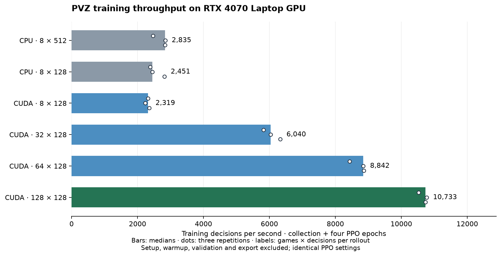

# Validation and measured results

Evidence is versioned below. Learning outcomes, simulation correctness and runtime
speed are separate measures; [research design](research.md) defines the protocol.

## Documentation checks — 2026-09-22

Consolidation checked 30 local file/section links, parsed all 13 PowerShell blocks,
and accepted 23 CLI examples against the real argument parser without executing
them. Three fresh-run examples also passed configuration validation. The seven
committed evidence/figure files and all executable configuration values are
unchanged; the only source-tree edit updates a documentation comment. Git
whitespace checks passed. No training or full runtime regression was rerun for
this documentation-only change; the latest full results remain dated below.

## Latest complete regression — 0.7.1, 2026-09-21

The research simulator remains **1.3.0**, pinned at `8861824`, with unchanged rules.
Native reader patches are CPU-game **1.2.2** / `a95524e` and CUDA-game **1.3.1** /
`314528a`. They do not replace the training installation. Existing run checkpoints
and recordings are preserved.

| Check | Result |
|---|---|
| Final complete research regression | **374 passed, 2 warnings in 271.86 s** |
| Complete CPU-game regression | **207 passed in 11.83 s** |
| Complete CUDA-game regression | **222 passed in 41.48 s** |
| Reward/kill/progress focused checks | **18 + 18 passed** in separate, overlapping runs |
| CUDA evaluation/learning focused checks | **24 passed, 1 warning in 34.49 s** |
| Final report-only change | **6 passed, 5 deselected in 44.99 s** |
| Lint, formatting, dependency check | Passed |
| Wheel/sdist and editable research install | Built and installed **0.7.1** |
| Native demos | Three original recordings verify in both source readers; exact final hashes and ticks, including rewind |

Focused checks overlap the complete suites; their counts are not added together.
An earlier complete run passed 371 tests; the final run includes the additional
digging-initialization and CPU custom-optimizer reload controls.
Warnings are the existing SB3 reference-policy GPU advisories. Game caches and test
outputs were kept outside their checkouts. No gameplay constraints or tolerances
were weakened. The source launcher was verified without changing the installed pin.

The new reward controls independently confirm +0.0999 offensive shaping on first
placement, −0.1 on removal and zero discounted gain for plant/dig cycles; −0.02
for a non-wall-nut eaten event; no eaten penalty for nuts, digging or detonation;
and the unchanged −0.2 empty-blast penalty. CPU and GPU agree to 1e-10 on double
reward components, with existing float32 rollout tolerances unchanged. Terminal
potential is zero and time-limit potential is retained.

Actor controls verify independent clipped losses, gradients and Adam updates;
forced-only and singleton choice batches remain finite. Slot-refill tests cover
out-of-order completion, slot reuse, wins, losses, truncations, exact action traces,
CPU hashes and plant/mower kill totals. Legacy replay and native viewer tests pass.

Logs and images are under `artifacts/`, including `research-final-v071.txt`,
`native-game-tests-v071.txt`, `cuda-game-tests-v071.txt`, `plant-rewards-tests-v071.txt`,
`report-focused-v071.txt` and `native-sc2-demo-v071.png`. The native winning final
frame was inspected visually; its outcome and 15/15 defeated counter are visible.

## Learning results

These are development results under different protocols. They must not be pooled.
The user's completed `runs/sc2-shared-101` collected 9,084 games / 18,055,168
decisions in 6,387 seconds. Best validation at 6,002 games: **42% easy, 0% standard,
0% hard**, 50 cases each (14% macro). Final weights: 40%/0%/0%. Demos bought only
wall-nuts and mines; the last 100 training games averaged 0.35 sustained attackers,
8.73 early voluntary digs and 6.35 mower kills. Earlier zero logs came from
mower-free lessons with plants being dug; independent CPU/CUDA attribution agrees.

### 0.7.1 bounded checks

Seed 101 optimization-only control, five-minute allowances, five common normal
validation cases per difficulty: baseline collected 1,024 games at 5,093 training
decisions/s; efficient collected 1,792 at 10,007 decisions/s. Both scored 0% normal
validation and remained in placement. The second-seed comparison was interrupted
when the scope changed to plant-role rewards; it is incomplete, not paired evidence.
This is a preliminary throughput observation, not a two-hour win-rate gain.

Reward-only v1: two five-minute allowances, both normal validations 0/15 and no
sampled training wins. Final v2 adds a trainable initial dig bias of −6, verified
to retain nonzero legal probability, finite gradients, learnable preference reversal
and exact checkpoint reload. Two three-minute allowances completed:

| Seed | Games | Seconds | Training wins (all / last 100) | Early digs/game (last 100) | Normal validation |
|---|---:|---:|---|---:|---|
| 101 | 821 | 173.50 | 144 / 64 | 0.01 | 2/15, both easy |
| 102 | 1,030 | 174.98 | 318 / 84 | 0.04 | 0/15 |

Both reached a 20/20 placement probe. Seed 101 advanced to saving and achieved two
20/20 saving probes; minimum stage residency prevented premature promotion. Seed
102 lacked the second consecutive placement pass before the deadline. Both remain
curriculum-incomplete. These diagnose improved early learning, **not** normal-game
improvement on both seeds or a two-hour result. V2 remains experimental.

Six completed check allowances total 26 minutes; actual elapsed was about 24.5
minutes, plus a short interrupted check. Only development seeds were used.
The committed [diagnostic summary](evidence/sc2-v071/diagnostics.json) retains
profile identities and individual measurements. Existing completed-run evidence, controls,
and new learning diagnostics must not be pooled. No formal training or final-test
evaluation was launched.

A loaded copy of the user's selected checkpoint also produced identical actions,
episode metrics and final hashes with fixed versus refilled evaluation batches
on easy development seeds 0, 1 and 2, including both losses and a win. See
`artifacts/refill-real-policy-v071.json`; its single timing pair is not a benchmark.

After training, the final v2 seed-101 checkpoint generated three more compact
demos at validation seed 100000. All use SHA-256
`33fe56f22763f56e6a6a5490f467e9d26bbd485dc4267eed7165e7a7037f8288`,
and each recording's CPU replay matches its CUDA evaluation state hash.

| Difficulty | Outcome / final tick | Plant / mower kills |
|---|---|---|
| Easy | Won / 3,419 | 6 / 9 |
| Standard | Lost / 3,652 | 2 / 11 |
| Hard | Lost / 3,652 | 2 / 11 |

The report and recordings are in
`artifacts/sc2-retention-check/sc2-plant-rewards-101/visualizations/`.
The training curves and easy final frame were visually inspected; previews are
`artifacts/retention-curves-preview-v071.png` and `artifacts/retention-demo-v071.png`.
Export took 23.32 seconds after the diagnostic run, without additional learning
or MP4 encoding. These predetermined demonstrations are not an additional
win-rate estimate.


### Earlier learning evidence

| Protocol / date | Observations | Conclusion and evidence |
|---|---|---|
| Archived `masked-cuda-101` | 10,229 games: 52,484 mines, 21,361 sunflowers, 36,012 nuts, no sustained attacker. Best at 2,252,800 decisions: 6/50 easy and 0/50 standard/hard; final macro 0% | Local failure diagnosis; not matched against later runs |
| 0.7.0 SC2 diagnostics, 2026-09-21 | Seeds 101/102: 768 games each, 851,968/835,584 decisions, 300.03 s each. Six placement probes each, all 0/20; no training wins; early digs 3.000/2.909 per game | Both unsuccessful; final normal validation stopped at 128/150 cases, remained pending and did not select a best checkpoint. [Summary](evidence/sc2-v070/diagnostics.json), local `artifacts/sc2-diagnostics-v070/` |
| Interim CUDA run, 2026-09-21 | At 2,923 games: last100 attacker purchases 0, maximum sun 50.5, best macro 8%; validation 416.6 of 1,496.8 seconds | Historical active-run snapshot, not final or paired evidence |
| First 0.4.0 paper pilot, 2026-09-20 | Placement 114,688 decisions, best 0/20; saving 73,728, best 1/20; no training wins | Interrupted for changed reward, no paired comparison; `artifacts/paper-pilot-v040/` |
| Revised 0.4.0 pilot, 2026-09-20 | At matched 65,536 decisions, baseline/tactical/grouped macro 0% for both seeds; full method 0%/6.7%. Placement 131,072 decisions: 0/20; saving 114,688: 1/20 | Diagnostics failed, neither full run left placement. `artifacts/paper-pilot-kill-reward-v040/`; original and revised objectives are separate |

The revised paper pilot used 1,355,776 total decisions in 1,210.92 seconds;
including 583.81 seconds of the interrupted pilot gives 1,794.73 seconds, within
its original 30-minute allowance. All eight comparison jobs used the same 15
validation cases (100000–100004 per difficulty). Full-method totals were
86,016/81,920 decisions, with no training wins or plant kills. Predetermined
`artifacts/pure-rl-diagnostic-traces/` showed peashooter planting at tick 0/digging
at tick 10, and repeated sunflower/dig cycles. These results used older rewards,
10-tick actions and decision budgets; they are not current-profile measurements.

No implementation task launched the two-hour comparison matrix or final-test
study. The completed user run, diagnostics, tiny integration games and benchmark
throughput answer different questions. Stronger normal-game performance remains
unverified, particularly standard/hard and changed scenarios.

## GPU performance

On 2026-09-21, the RTX 4070 Laptop GPU reached **10,733 training decisions/s**
with 128 parallel games and 128 decisions per game per rollout. This is **3.79×**
the 0.6.0 CPU-simulation baseline of 2,835 decisions/s. The largest tested
profile was stable; 64 games was outside 5% of its median. The promoted setting
is therefore **128 × 128 = 16,384 decisions per rollout**.



| Simulator and rollout | Decisions/s | Simulation ticks/s | Games/min |
|---|---:|---:|---:|
| CPU current, 8 × 512 | 2,835 | 2,814 | 41.52 |
| CPU equivalent, 8 × 128 | 2,451 | 2,434 | 35.91 |
| CUDA equivalent, 8 × 128 | 2,319 | 2,303 | 33.98 |
| CUDA, 32 × 128 | 6,040 | 5,996 | 88.47 |
| CUDA, 64 × 128 | 8,842 | 8,779 | 129.52 |
| CUDA, 128 × 128 | **10,733** | **10,657** | **157.22** |

These are three-repetition medians. At eight parallel games CUDA is about 5%
slower than equivalent CPU simulation. Batching more games is necessary to
amortize launches and synchronization. The chosen 128-game rates were 10,523,
10,774 and 10,733 decisions/s. Repeated rates must have coefficient of variation
at most 10%; the smallest stable configuration within 5% of the fastest wins.

### Workload and scope

Windows, Python 3.12, i9-14900HX, RTX 4070 Laptop GPU, Torch 2.8.0+cu128,
SB3/SB3-Contrib 2.7.1, CuPy 13.6.0, CUDA runtime 12.8.90, NVRTC 12.8.93.
Game package 1.3.0, commit `8861824df6893a34c2cd4df7f9b68613376d7964`.
The benchmark metadata records the rules, engine/backend, research source and
configuration hashes. It records a dirty development research tree at the time
of measurement; the collected data have not been relabeled as a clean commit.

All 18 trials completed within eight minutes. Each collected at least 4,096
decisions per game after one warmup rollout, including combat and resets. Trial
order alternated. The controlled throughput workload used the final 20/40/40
easy/standard/hard mix, one shared flat policy, existing rewards, 256-unit MLPs,
minibatch 256, four epochs and unchanged optimizer settings. Real training keeps
its configured curriculum and completed-game budget.

This measures **collection plus optimization**, excluding setup, warmup,
validation, checkpoint I/O and presentation. It is not a formal learning run or
a claim of faster convergence to the same win rate. Increasing parallelism also
increases rollout size as requested, so the 3.79× result combines the backend
change with the new collection size. The eight-game comparison isolates the
backend more closely.

### Time and resource use

For the 128-game trials, median collection time was 15.08 s and optimization
33.77 s for 524,288 decisions. Corresponding CUDA event totals were simulation
0.168 s, encoding/masks 6.111 s, inference 5.698 s, reward/metrics 0.061 s and
GAE 0.052 s. Host staging of scenarios took 0.508 s. The host spent 5.898 s
waiting at compact transfers; this includes waiting for preceding GPU work,
so **do not add it to the CUDA event totals**. Phase medians need not sum to the
median total. Timing instrumentation is optional and excluded from research
compatibility.

Median cached setup/warmup costs were 0.046/1.955 s for CUDA128 and
2.831/1.839 s for CPU-current. NVRTC kernels had already been compiled during
correctness checks. These setup numbers do not represent a fresh-machine cold
compile. A separate empty-cache check took 1.658 s for Torch context startup,
2.324 s for simulation/encoder compilation, allocations and 128 initial resets,
and 0.043 s for GAE compilation/execution, excluding Python imports.

Low-frequency system samples averaged 35.1% GPU use and 12.7% system CPU use
for CUDA128, versus 21.9% and 17.4% for CPU-current. CUDA128 collection averaged
40.2% GPU use; updating averaged 34.2%. Total sampled GPU memory peaked at
1,227 MiB; PyTorch peak allocated tensors were about 408 MiB. These differ
because driver, CuPy and graphics allocations are outside PyTorch's allocator.
No competing user training process was observed; system load was recorded, not
suppressed. Results remain specific to this laptop and short workload, without
a sustained thermal-soak experiment.

Encoding and policy launches, synchronization and small PPO minibatches now
dominate much more than ordered combat. Filling all VRAM would not establish
useful acceleration. See [architecture](architecture.md#game-boundary-and-gpu-implementation) for the
remaining synchronization and profiling targets.


### Reproduce measurements

Committed evidence: [measurements](evidence/gpu-v060/measurements.json),
[load samples](evidence/gpu-v060/load-samples.json),
[metadata](evidence/gpu-v060/metadata.json), and
[reviewed recommendation](evidence/gpu-v060/recommendation.json).

```powershell
.\.venv\Scripts\python.exe -m pvz_rl benchmark-gpu --output artifacts\gpu-new --minutes 15
.\.venv\Scripts\python.exe -m pvz_rl benchmark --steps 16384 --workers 1 4 8 --devices cpu cuda --repeats 3 --output artifacts\hardware-benchmark
.\.venv\Scripts\python.exe -m pvz_rl benchmark --workers 8 --devices cuda --steps 32768 --repeats 3 --compare-runtime --output artifacts\runtime-benchmark
```

Use `--hardware PATH_TO_RECOMMENDATION.json` with training to apply a measured
configuration; an explicit device overrides that recommendation. Avoid overlapping
other training/tests. Benchmarks perform short real updates, never formal training.
`tools/plot_gpu_benchmark.py` can redraw the committed throughput figure from its
measurements JSON.

The earlier **0.3.2 / game 1.2.1** transport benchmark is separate: eight CPU
workers with CUDA policy, three paired seeds 800/801/802, 32,768 measured decisions
plus 4,096 warmup, alternating order. Reference rates were 2,187/2,151/2,176 and
optimized rates 2,645/2,729/2,664 decisions/s: median **22.4%** improvement, exactly
equal final weights in all pairs. Median collection/update decreased from
12.26/2.80 s to 10.13/2.17 s. PyTorch allocation was 51.85 vs 100.99 MiB, excluding
context/driver. Raw data: `artifacts/speed-pvz121-final/measurements.json` and
`runtime-comparison.json`. Validation, startup and output are excluded; it is not
a full-run speed guarantee or evidence of better learning.

## Regression history

All dates are 2026. These are complete-suite results at each release, not counts
to add across overlapping suites. Focused checks and raw logs remain in the original
records. Older engine pins and reward/timing protocols are intentionally separate.

| Research version / date | Game package | Research suite | Game suite | Raw log prefix under `artifacts/` |
|---|---|---|---|---|
| 0.7.1 / 09-21 | Installed 1.3.0; readers 1.2.2/1.3.1 | 374, 271.86 s | CPU 207, 11.83 s; CUDA 222, 41.48 s | `research-final-v071`, `native-game-tests-v071`, `cuda-game-tests-v071` |
| 0.7.0 / 09-21 | 1.3.0 | 338, 265.26 s | 214, 44.74 s | `research-tests-v070`, `game-tests-v070` |
| 0.6.0 / 09-21 | 1.3.0 | 312, 218.54 s | 214, 49.23 s | `research-tests-v060`, `game-tests-v130` |
| 0.5.0 / 09-20 | 1.2.1 | 283, 248.80 s | 199, 10.75 s | `v050-release-research-tests`, `v050-final-engine-tests` |
| 0.4.1 / 09-20 | 1.2.1 | 207, 104.49 s | 199, 9.09 s | `v041-research-tests`, `v041-engine-tests` |
| 0.4.0 / 09-20 | 1.2.1 | 166, 100.40 s | 199, 9.82 s | `v040-release-tests`, `v040-engine-tests` |
| 0.3.2 / 09-20 | 1.2.1 | 120, 76.22 s | 199, 10.01 s | `speed-final-research-tests`, `speed-full-engine-tests` |
| 0.3.1 / 09-20 | 1.2.0 | 87, 59.47 s | 199, 9.43 s | `cuda-research-tests`, `cuda-engine-tests` |
| 0.3.0 / 09-20 | 1.2.0 | 87, 66.19 s | 199, 9.61 s | `pvz12-final-research-tests`, `pvz12-final-engine-tests` |
| 0.2.0 / 09-20 | Original source pin | 154 combined research/game checks | Included in combined count | `final-research-tests`, `final-engine-tests` |

The 0.7.0 follow-up controls passed 41 tests in 84.43 s and 3 export-budget tests
in 41.36 s; 0.6.0 inference-timing checks passed 19 in 23.36 s. These do not
replace the complete-suite records. SB3 small-MLP CUDA and Gym unbounded-observation
advisories are expected; the latter preserve unclipped crowds.

### Independent controls retained

- Exact 406-action round trips and mask agreement, exact costs/cooldowns, multiple
  same-tick actions and 45 digs, rejected/restricted requests, resets and cutoffs.
- CPU/CUDA integer state, ordered events, acceptance and canonical hashes match.
  Encoder tolerances: `atol=1e-7, rtol=1e-6`; float32 reward/GAE up to `2e-6`
  absolute; double reward parts `1e-10`; fixed-rollout parameter/gradient controls
  `atol=2e-7, rtol=2e-6`. Independently trained weights need not be bitwise equal.
- All plant/zombie mechanics, simultaneous spawning/death, armor, source/tick
  attribution, full/partial/custom-health bites, missed explosions, crowded states,
  storage limits, normalization, entity-order invariance and no private-state leakage.
- Independent joint probabilities, entropy, finite gradients, PPO losses/Adam,
  digging-prior reversal/reload, choice-only/forced/singleton states, shaping
  telescoping and plant/dig counterexamples. No assertions were relaxed for speed.
- Successful and failing controls: per-tick placement wins at 875, saving at 2074;
  waiting loses at 1000/2199 in every lane. Legacy ten-tick placement wins at 883.
- All five learning conditions on supported backends, Windows workers, CPU/CUDA
  GAE/bootstrap, curriculum stage residency/probes/resume, unchanged optimizer
  identity, update-boundary schedules, validation ties/deadlines and output recovery.
- Compact/plain/legacy/corrupt replays; embedded metadata versus sidecars; seeking
  inside batches, trailing immediate actions, terminal/rewind, hashes and render
  purity. One shared checkpoint for demos; output settings do not change learning.
- Native Gym RGB 1000×600 and MP4 1280×820 H.264/yuv420p, visible win/loss/truncation,
  offline links, no FFmpeg requirement for compact demos, encoder-failure recovery.
  Historical Edge tests played/searched all three videos at 2× without media errors.

Frozen heuristic regressions are development cases, not held-out estimates:

| Difficulty | Seed | Outcome | Final tick |
|---|---:|---|---:|
| Easy | 0 | Won | 3,146 |
| Standard | 0 | Won | 6,398 |
| Standard | 1 | Lost | 5,395 |
| Hard | 0 | Lost | 6,219 |
| Hard | 4 | Won | 9,401 |
| Hard | 6 | Lost | 4,463 |
| Easy | 42 | Won | 3,221 |
| Standard | 42 | Won | 6,105 |
| Hard | 42 | Won | 8,526 |

### Artifact index and historical detail

Native original demos verify in both updated readers: easy won at 4226, standard
lost at 4184, hard lost at 5074; shared checkpoint
`ce6b6fc3b480233c67b4009e6ce44d7412d2e2ef8fc7db8c047d34fe70fbb65e`.
The original model and recording files were not converted.

| Saved integration run | Scope |
|---|---|
| `artifacts/sc2-smoke-v070` | Two games / 64 decisions, one-second cutoff, three verified truncated demos |
| `artifacts/visual-check-v060/` | CUDA rollout, report/frames and availability checks |
| `artifacts/pytest-v050-final/test_global_games_across_windo0/game-smoke` | Two-game target ends with four games after the final update; shared truncated demos |
| `artifacts/pytest-v041-rewards/test_shared_checkpoint_reports0/shared` | 128 decisions, reward charts and truncated native/video output |
| `artifacts/pytest-v040-kill-full/test_grouped_spawn_and_same_ch0/grouped-spawn` | 64-decision grouped/Windows integration; actual winning/losing demos |
| `artifacts/speed-shared-smoke` | 8,192 decisions, two post-update rows, three verified losses; no default MP4 |
| `artifacts/pvz-1.2-shared-smoke` | 128 decisions; easy win, standard/hard loss; compact demos plus optional browser-verified video |
| `artifacts/shared-policy-visual-smoke` | Original 128-decision output check; no completed training episode, explicit missing statistics |

Committed `docs/evidence/` JSON and `docs/figures/` remain unchanged. Local ignored
`artifacts/` are not guaranteed to exist in a fresh clone. Expanded historical
logs, individual artifact hashes and old commands remain recoverable from Git:

```powershell
git show b642c9c:docs/validation.md
```

This reference identifies the last complete documentation snapshot before
consolidation; it does not turn old evidence into current-version results.

## Running checks

Research checks are listed in the [README](../README.md#evaluate-and-develop).
For game source suites, set `PYTHONPATH` to the chosen checkout's `src`, disable
bytecode, and put pytest/Hypothesis caches and temporary output inside research
`artifacts/`; restore environment variables afterward. Do not substitute a newer
reader package for the pinned training simulator. Complete test runs include short
learning checks but never formal training. A fresh CPU-only installation and
non-Windows operation have not been exercised; CPU execution was tested with the
installed CUDA-capable Torch distribution.
