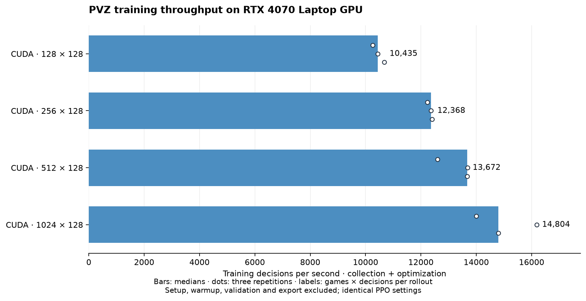

# Validation and measured results

Evidence is versioned below. Learning outcomes, simulation correctness and runtime
speed are separate measures; [research design](research.md) defines the protocol.

## 0.13.0 compact regional zombies — 2026-09-24

`event_v5` has 342 values and nine features per lane-region. The default independent
actor/critic model has 1,150,779 parameters. The game remains package 1.4.0,
simulation 1.1.0, pinned at `1fc80386859087b9d715c4706b3f7875844430cc`.
The installed source/rules/CUDA hashes still match the preceding release.

Independent controls cover literal regional sums and distances, all five lanes,
region edges, empty distance -1 versus a carrier at distance 0 or 1, crowd sums,
entity permutation, multiple carriers, nearer spent poles, and an actual vault.
CPU/CUDA comparisons use 1e-7 absolute / 1e-6 relative tolerance, with exact final
simulation hashes. Synthetic changes to all five zombie behavior labels and all
removed countdowns leave observations unchanged. Presence transitions retain an
event; movement alone does not. Memory resets, causal reconstruction, PPO math,
reload/resume and rejection of event_v4 remain covered.

Verification passed: **518 research tests** (831.30 seconds), **224 upstream game
tests** (167.41 seconds), and the preceding **132-test focused pass**. Doctor passed
CUDA compilation, DLPack/shared-stream access,
simulation/accounting checks, rendering and compact replay. Ruff, dependency checks,
package builds, shipped-config equality, wheel contents and README links passed.
Upstream tests run from an archive under `artifacts/v0130/game-source`; no game
checkout or engine pin was changed. Duplicate historical lesson/countdown/crowd
tests were removed, and the standalone dig-bias script was folded into policy tests.
Current lesson success/failure/timing and independent numerical controls remain.

The bounded one-second-cutoff integration generated an offline report and three
100 Hz demos, all CPU-verified from checkpoint
`8c1e350641e2e1dc5a31aff166a0a2fc727702af225e93baec3f5f176352ddf3`.
All three episodes are correctly labeled truncated. Training curves were visually
inspected; their near-empty combat statistics are expected in a one-second check.

One separate CLI smoke used two environments and a two-minute allowance. It
collected 3,840 transitions and completed one training game, then validated 0/1 on
the diagnostic case. Collection/optimization took 37.47 seconds and validation
63.82 seconds under concurrent regression load. At its deadline it saved
checkpoints/report and marked presentation pending. This checks recovery, not
learning quality. The README quick check now uses the bounded integration test
so three-demo verification does not depend on finishing a full-length game.
No comparisons or formal training were launched. Reduced biting/pole information
and any speed or learning benefit remain experimental and unmeasured.

Logs, JUnit records, doctor output, packages and smoke artifacts are under
`artifacts/v0130/`.

## 0.12.0 timer-free history and 100 Hz — 2026-09-24

The single method now uses 417 public inputs, bounded local/event/summary history,
independent actor/critic Transformers and contiguous PPO chunks. The default model
has 1,178,619 parameters. This release requires fresh models. Its raw public-history
recurrence is project-specific; it is not a reproduction of GTrXL or learned
Transformer-XL hidden-state recurrence.

Game package **1.4.0**, simulation **1.1.0**, is installed non-editably from merged
commit `1fc80386859087b9d715c4706b3f7875844430cc` ([game PR #1](https://github.com/Comb1e/pvz-cuda-work/pull/1)).
The full file manifest is in the engine lock. Normalized source hash:
`58c5a4f089fe17325562feaf804f85be091cdd520223129b7c989ecf9bd6b2dd`;
rules hash `d228ce2d09a58ace4b32d7b60bd9bd7510511fe4f9abde2007dd992e0d9f7754`;
CUDA source hash `98c7859a1804c63af8dd9f3e5cc7d40952933bab6b2133f1e5433d6e5ccbdc34`.
The original `E:/Projects/pvz` working tree remains unchanged.

### Independent controls and physical time

CPU/CUDA controls compare observations at 1e-7 absolute / 1e-6 relative tolerance,
float32 rewards at 2e-6 absolute, and ledger components at 1e-10 absolute. Integer
simulation snapshots and hashes must match exactly. Both encoders exclude all
plant, zombie and card countdowns. Crowds, categories and ordering checks remain.

History controls cover admission, categorical summaries, event FIFO order,
compression, future masking, mixed resets, rollout carryover, exact collected log
probabilities, prefix reconstruction, terminal context, timeout GAE, gradients and
reload. Cached boundary histories must match direct reconstruction, including
shuffled environment groups; cache contents are discarded with each rollout.

A real-game mine-age probe reaches identical current observations and legal masks
through different placement times. Actor tile preferences differ with these
histories and become identical after reset. This demonstrates usable history and
isolation, **not learned phase-age competence**. Finite memory may still lose useful
timing information. Independent PPO/Adam tests retain exact actor/critic isolation.
A one-state local-descent test uses a small explicit critic rate; Adam is not
assumed to reduce every minibatch loss at the production rate.

The three reference fixtures use identical physical spawn schedules and non-wait
actions. All remain victories, with normalized completion times below. Additional
trailing waits allow completion at the new resolution. Collision/attack rounding
can accumulate; identical hashes or seeded-generator outcomes across rates are not
claimed. Seeded integer jitter and the old ten-tick controller cadence also change
when expressed in seconds.

| Fixture | 20 Hz seconds | 100 Hz seconds |
|---|---:|---:|
| easy | 161.05 | 161.08 |
| standard | 305.25 | 305.29 |
| hard | 426.30 | 428.43 |

Independent movement, sunflower production, mine arming and shot-interval controls
assert real-time units. The 100 Hz saving control wins at tick 10501; waiting loses
at 9299. Its discounted return is 0.00761094, versus −0.000182364 for waiting.
Keeping the requested gamma/lambda 0.999 per tick changes gamma's real-time
half-life from 34.6 to 6.93 seconds. Noise also has five times as many per-second
opportunities. These are substantial learning confounds, not corrected coefficients.

### Presentation and cleanup

The short CUDA report/replay integration check creates three 100 Hz compact demos
from one checkpoint (`0c48f2efb6c2b46b4a7f17b417eb650285de04fcb0139e5e05aeb17bf9f793e5`).
CPU replay verifies every final hash. Explicit video export produces decodable
H.264 at 25 FPS while verifying every 100 Hz tick. This one-second cutoff test is
a pipeline check, not a normal-game success result. Its curves and native replay
frame were visually inspected; the throughput title was wrapped to avoid clipping.

Metadata inspection removed 4,122 verified 20 Hz recordings from generated/test
locations and the designated game checkout. Unknown/corrupt test payloads were
left intact. The removal manifest, source PDFs, physical controls, suite logs and
new verification outputs are under `artifacts/v0120/`. No formal training was run.

Automatic approval review rejected removal of generated game `.hypothesis`,
`.pytest_cache` and three `__pycache__` directories, reporting only “blocked by
policy”; those untracked caches remain. The complete game suite used external
caches and passed **224 tests in 192.30 seconds**.

### Bounded learning comparison

Two five-minute-equivalent development checks were run sequentially on seeds 101
and 102, using the same saving initialization protocol and three non-final cases
per task. The previous method used the archived 20 Hz research source; the
candidate used the current 100 Hz engine and timer-free event memory. Because the
engine pins differ, this is diagnostic evidence rather than a matched acceptance
experiment. The candidate's 100 Hz gamma is also five times faster in simulation
time, as described above.

| Method / seed | Learning seconds | Transitions | Completed games | Decisions/s | Easy wins | Saving wins |
|---|---:|---:|---:|---:|---:|---:|
| Previous / 101 | 112.6 | 983,040 | 490 | 8,729 | 2/3 | 0/3 |
| Previous / 102 | 118.8 | 1,179,648 | 545 | 9,932 | 0/3 | 0/3 |
| Candidate / 101 | 103.5 | 163,840 | 0 | 1,584 | 1/3 | 0/3 |
| Candidate / 102 | 104.6 | 163,840 | 0 | 1,566 | 0/3 | 0/3 |

The candidate used 256 environments and 128 transitions per environment. Its
peak PyTorch allocation was 1,102 MiB. Collection was about two seconds per
update; the four-epoch temporal optimization took about 19 seconds per update.
The previous feed-forward run completed many short games because its 20 Hz
episodes and policy path were much cheaper. Candidate validation still completed
all 15 cases per seed within the five-minute evaluation allowance, but the
candidate failed all saving cases and did not improve the easy macro result for
both seeds. It therefore does not meet the improvement criterion and remains
experimental. The result also exposes a practical issue: long games dominate a
game-count comparison when the candidate has not yet completed any games.

Candidate training diagnostics reported memory compression ratios near 32 retained
decisions per token, event admission near 0.8%, and final-batch attention split
approximately 19% local, 59% retained events and 22% summaries. These describe
the untrained policy's computation, not evidence that it learned useful event
selection. No formal training was launched.

## 0.11.1 exploration and critic adaptation — 2026-09-23

The saving diagnosis found 7,039 completed saving games with zero wins, followed
by no planting. The source placement actor waited with probability 0.998508 on
the initial saving board. Its critic predicted +0.559 versus a frozen sampled
return of −0.281. The later waiting policy's critic was accurate after a wait
(−0.320 versus −0.312) but pessimistic after a supplied sunflower purchase
(−0.541 versus −0.296). These are own-policy continuation checks, not optimal
controller targets. Local diagnostic artifacts remain under `artifacts/v0110/`.

The implementation adds a configurable wait/plant mixture, exponential decay
and an initial critic-only period at each stage. The final settings hold 10% for
1,024 completed stage games, reach 0.1% at game 3,000, then approach zero. Resume
preserves residency and the last-used rate. Digging remains learned and legal;
rewards, network, game pin and ordinary PPO coefficients are unchanged.

### Bounded development checks

[Machine-readable evidence](evidence/exploration-v0111.json) records all six short
runs, source/config/engine hashes, endpoint checks and calibration measurements.
Each run starts from the same mastered placement checkpoint, with fresh optimizer
states and saving-stage counters. The control disables the two new features in
the current implementation; it is not an old-source performance benchmark.
Each gets a 120-second learning deadline, finishing a complete update, followed
by 20 development cases per lesson (100050–100069). Final-test seeds are untouched.
No competing GPU test job ran during these comparisons.

The initial 256-game adaptation trial still lost all endpoint saving and placement
cases. Critic mean absolute error improved for seed 101 (0.199 → 0.063) but worsened
for seed 102 (0.030 → 0.130); seed 102's last 100 saving games dug early after 70%
of accepted plantings. The one subsequent adjustment increased adaptation to
1,024 games. This is post-hoc development evidence, not held-out confirmation.

| Method / seed | Games | Transitions | Training seconds | Actor-updating rollouts | Saving wins | Placement wins |
|---|---:|---:|---:|---:|---:|---:|
| Control / 101 | 662 | 1,409,024 | 120.63 | 43 | 0/20 | 0/20 |
| Adaptation / 101 | 1,111 | 2,031,616 | 121.04 | 3 | 0/20 | 20/20 |
| Control / 102 | 774 | 1,441,792 | 120.62 | 44 | 0/20 | 0/20 |
| Adaptation / 102 | 1,111 | 2,031,616 | 120.96 | 3 | 0/20 | 20/20 |

In the last 100 saving games, seed 101's accepted plantings increased from 116 to
663 and idle games fell from 65 to zero. Seed 102's plantings increased from 211
to 650; neither run had idle games. Both candidates bought exactly one attacker
per saving game and recorded zero early digs. One attacker is insufficient for
the two-lane saving task. Deterministic saving checks still failed; increased
activity is not competence. The actor was frozen for most of these short runs,
which explains both greater collection throughput and a substantial part of the
placement retention. This does not establish improved steady-state PPO speed or
retention after prolonged actor learning. Neither candidate reached game 3,000.

Critic checks supply one legal wait, rear sunflower or rear peashooter action,
then follow the frozen sampled actor at its saved exploration rate. Remaining
returns remove that first action's reward and elapsed-time discount. The final
mean absolute errors across these three sets were **0.199 → 0.093** for seed 101
and **0.030 → 0.130** for seed 102. The latter still predicted −0.554 after a
peashooter where measured continuation averaged −0.274. Stage adaptation reduces
the transferred critic's initial optimism but does not uniformly fix its errors.
Training value-target residuals are bootstrapped diagnostics, not these complete
continuation measurements.

**Experimental, acceptance not established.** Saving wins did not improve, critic
calibration remains mixed, and the checks contain only three actor-updating
rollouts per final candidate. The requested 10% start is aggressive; it is not a
demonstrated optimal rate. A separate successful-control sensitivity check scored
10/10 without injected actions, 5/10 at 0.1%, 5/10 at 0.5%, and 0/10 at 5%. Its
uniform legal tiles differ from the actual learned tile head, so it cannot measure
candidate performance. No additional coefficient tuning followed the six runs.
Training plus comparison evaluation took **931.04 seconds (15m31s)**. No formal
training was launched.

### Correctness and release verification

Independent controls enumerate mixture probabilities, joint entropy and analytic
gradients; illegal actions, forced wait/dig and learned greedy selection retain
their contracts. Schedule checks cover exact milestones, exponential ratios,
underflow, disabled/constant rates, stage resets and interruption/resume. A rate
cannot change between rollout collection and PPO updates. Critic-only updates
leave actor weights and Adam state unchanged; raw checkpoint reload preserves
the saved rate. Numerical PPO/GAE, CPU/CUDA accounting, shared-checkpoint demos,
archived reports and failure recovery passed with the final implementation.

| Check | Result |
|---|---|
| Complete research suite | **498 passed**, 385.12 s |
| Complete pinned game 1.3.0 suite (`8861824`) | **214 passed**, 49.20 s |
| Ruff lint/format and dependency check | Passed |
| CUDA doctor: NVRTC, tensor sharing, accounting and reference rendering | Passed; RTX 4070 Laptop, 0.11.1 / game 1.3.0 |
| Wheel/sdist and packaged default configuration/kernel | Passed |
| Documentation relative links and nine PowerShell blocks | Passed |
| Report regeneration, offline assets, shared checkpoint and H.264 decode | Passed |

The final suite's marked integration checks, including report/export time, took
276.02 seconds. The game checkouts and dependency pin are unchanged. Local logs
and packages are in `artifacts/v0111/`. The retained `artifacts/v0111/smoke`
contains three verified demos and 1280×820 videos from checkpoint SHA-256
`e40f97cf40a1ab99ff3387e9c7a550f5dfce85ae8e5816ee8eb83b8e7b55bb4e`.
These two-second smoke games correctly show truncation, not victories. Task and
optimizer curves from the longer check were visually inspected, including zero
actor steps during adaptation; the native replay's final frame visibly shows its
truncation outcome. Regenerating `adapted-101`'s report required no model loading
or additional training because that run has no validated best checkpoint.

## 0.11.0 net realized value — 2026-09-23

This release changes the reward objective and discount clock, requiring fresh
models. It retains the 500 inputs, independent actor/critic, pinned combat rules,
curriculum and 256×128 / batch-1,024 / four-epoch PPO settings. Historical peak
and drawdown are diagnostic only. Full configuration, source hashes, engine pin
and endpoint outcomes are in [the comparison evidence](evidence/net-value-v0110.json).

### Independent accounting and duration controls

Purchases conserve value; healthy/damaged removal costs only remaining assets.
Damage followed by death cannot charge the same HP twice. Real cherry-bomb cases
net −100 for one basic, 0 for three basics or one conehead, +175 for one buckethead
and −150 for an empty explosion. Effective damage caps at actual HP/armor removed;
mower damage earns none, and activation costs 600 once. A projectile fired before
a plant is dug retains its damage credit. Loss then repayment and repayment then
loss give equal undiscounted accounting; historical-maximum gates are absent.

All ten saving lane pairs retain the test-only investment win at tick 2101,
net +525 sun-equivalents and discounted return +0.177951. Always-wait loses at
1859 with −0.311679; immediate sunflower/shooter purchase-and-dig loses with
−0.361679. Sunflower-only controls across all pairs lose and rank below the
winning control. All five placement lanes retain the successful, failing and
exact timing-boundary controls. None supplies learner demonstrations.

CPU/CUDA comparisons cover complete lesson games, mixed resets, sky/flower income
at the cap, armor, overkill, explosions and late projectiles. Public observations
use `atol=1e-7, rtol=1e-6`; scalar float32 reward checks use up to `atol=2e-7,
rtol=1e-6`; component comparisons use double intermediates with `atol=1e-9`.
Independent duration-aware GAE/timeout controls use `atol=2e-6, rtol=2e-6`, including
zero-duration actions, durations 1/2/7/9, reset boundaries and gamma/lambda 0/1.
No discount-clock advantage arises from inserted zero-time actions.

### Bounded fresh-saving comparison

Reference commit: `c2e01839c79cae096f92714507e38a8324601ae3` (0.10.4).
Each run receives five minutes including startup; collection stops before the
next complete update would exceed the allowance. The game ceiling is 100,000 so
time controls termination. Runs start fresh at saving with its ordinary 80/20
saving/placement mix. Order is reference101, candidate101, candidate102,
reference102. Evaluation uses the same 20 development cases per lesson
(100050–100069), outside final-test seeds. Neither method masters the stage, so
scheduled normal-game checkpoint validation correctly does not run. The separate
endpoint lesson checks are comparison evidence, not mastery certification.

| Method / seed | Games | Transitions | Training wall seconds | Transitions/s | Saving wins | Placement wins |
|---|---:|---:|---:|---:|---:|---:|
| Previous / 101 | 1,817 | 3,309,568 | 296.97 | 11,144 | 0/20 | 5/20 |
| Net value / 101 | 1,817 | 3,309,568 | 298.93 | 11,072 | 0/20 | 0/20 |
| Previous / 102 | 1,900 | 3,375,104 | 298.92 | 11,291 | 0/20 | 0/20 |
| Net value / 102 | 1,820 | 3,342,336 | 297.75 | 11,225 | 0/20 | 0/20 |

| Seed | Saving early digs / planting, previous → candidate | Last 100 saving games, previous → candidate |
|---|---:|---:|
| 101 | 5.45% → 6.88% | 33.48% → 0.14% |
| 102 | 61.10% → 0.97% | 100% → 0% |

Every method/seed purchased exactly one sustained attacker per completed saving
game, insufficient to cover its two lanes. Candidate endpoint policies bought
sunflowers (151 total plants for seed 101; 110 for seed 102), but still bought
only one attacker per game. Deterministic endpoint early digging was zero for
both candidates; this did not establish competence. Placement checks measure
rehearsal learning from a fresh start, not retention from mastered weights.

**Acceptance not met.** No saving wins improved; seed 101's placement result
regressed and aggregate digging increased. The late digging reduction is useful
diagnostic evidence, not a solved collapse. Keep the requested method experimental;
no coefficients were tuned after these results. Twenty cases and two short runs
cannot establish generalization. This tests the combined accounting/time-clock
change, not either factor independently. Observed throughput is similar, roughly
0.6% lower for the candidate in each pair; these are ordinary desktop runs, not a
controlled hardware benchmark. Other GPU tests were idle during comparison.
A single RTX 4070 Laptop snapshot showed 67% utilization and 770 MiB used, which
is not a time-averaged performance measurement.

Training plus endpoint evaluation took **1,252.96 seconds (20m53s)**. Final-test
performance was not measured and no formal training was launched. Complete-suite
integration checks and final verification totals are recorded below.

### Release verification and retained outputs

| Check | Result |
|---|---|
| Complete research suite | **474 passed**, 389.60 s |
| Net-value controls after replacing a deprecated pytest iterator with an equivalent list | **44 passed**, 6.01 s, warnings treated as errors |
| Complete pinned game 1.3.0 suite (`8861824`) | **214 passed**, 42.40 s |
| Complete CPU viewer checkout 1.2.2 suite (`a95524e`) | **207 passed**, 10.03 s |
| Complete CUDA viewer checkout 1.3.1 suite (`314528a`) | **222 passed**, 41.20 s |
| Ruff lint/format, dependency check, CUDA doctor | Passed |
| Editable installation, 0.11.0 wheel and sdist, required packaged resources | Passed |
| README local links and nine PowerShell command blocks | Passed |
| Offline report assets, replay hashes, shared checkpoint and H.264 decode | Passed |

The complete suite covers independent PPO loss/gradient/optimizer controls,
KL stopping, source staging, old-model rejection, archived report regeneration,
weights-only handoffs, exact saved optimizer/schedule reload, interruption,
CPU/CUDA observations/rewards, validation tie handling and presentation failures.
The single initial warning was the new test's iterable parametrization, corrected
without changing test cases; all 44 net-value tests then passed under `-W error`.

A conservative total counting the **entire** research suite, focused checks and
comparison wall time (including non-learning tests) is under 29 minutes; actual
learning plus comparison evaluation is therefore within the 30-minute cap.
No additional training followed the comparisons. Upstream suites and caches ran
outside the game checkouts; their HEADs and working trees are unchanged.

Retained smoke output: `artifacts/v0110/smoke`, copied from the full suite's
128-transition CUDA integration. Its report, three verified compact demos and
three decoded MP4s share checkpoint SHA-256
`652fcce88fbb7e558eeb68b2e320864e466ff321f6e8e629eb2744b2757c0e02`.
Each ends at a deliberate two-second cutoff: 41 frames at 20 fps, 1280×820.
These confirm integration, not playing competence. Accounting/task curves from
`candidate-101/visualizations` and representative replay frames were visually
inspected: labels are readable, outcome is visible, and lesson sky/mower curves
are correctly zero. Relative report assets resolve without a server or CDN.
Report regeneration does not update weights.

Full logs and checksums are under `artifacts/v0110`: `research-full.txt`,
`game-pinned.txt`, `game-cpu.txt`, `game-cuda.txt`, `net-final.txt`,
`verification-progress.json`, `availability.json`, `artifact-inspection.json`,
`packages/`, and `comparison-*.json`. Candidate source hashes differ only by a
retired-model/report eligibility guard; numerical learning code and settings did
not change between their runs.

Before cleanup, the archived `compact-stages-101/saving` diagnosis was retained
in concise form: 11,159 completed games, including 8,897 saving losses and 2,262
placement rehearsals (1,184 wins); all five saving probes were 0/100. The frozen
interrupted model scored 0/100 with both sampling and deterministic selection.
Sampling dug 200/200 plantings early; deterministic play dug none of 623, but
still failed. Digging had negative immediate reward. Potential telescoping,
repeated stochastic digging opportunities and decision-clock discounting supplied
plausible mechanisms, not proof of a single cause.

Cleanup is **blocked locally**: automatic approval review rejected both the bounded
inventory cleanup and a smaller deletion using explicit temporary-baseline paths.
Its only stated reason was "blocked by policy". No deletion ran. The 337 inspected
pre-existing artifact entries and temporary baseline files remain ignored by Git;
`runs` is absent. Their concise historical findings have been preserved above.
The reviewed cleanup script is `artifacts/v0110/cleanup-old-outputs.ps1`, for manual
execution. It preserves all new release evidence and checks every old path stays
a direct child of the artifact directory before deleting anything.
Current verification outputs live under `artifacts/v0110`. The installed game pin
and both game checkouts remain unchanged. None of the local baseline code, models
or generated outputs is included in the release commit.

## 0.10.4 sunless lesson pressure trial — 2026-09-23

Placement now starts with 100 sun and basics at ticks 1/21/41. Saving starts with
150 sun and six basics in two distinct lanes at ticks 860/1100/1340. Both disable
sky income. These are configurable experimental tasks; normal-game rules, PPO,
reward coefficients and 256×128 collection remain unchanged.

Independent calculations prove saving cannot be won without sunflower income:
150 sun cannot buy a shooter in both lanes. The public-state investment control
wins all ten lane pairs at tick 2101; always-wait and no-flower controls lose at
1859. Every placement lane wins with the prompt shooting control at 872. Exact
control-specific boundaries are 98/99 ticks for placement and 67/68 ticks of
delayed investment for saving. Immediate plant/dig counterexamples lose. These
are feasibility controls, not learning demonstrations or universal timing optima.

CPU/CUDA differential tests cover complete winning/failing saving games across
all pairs, exact state hashes and masks, observations (`atol=1e-7`, `rtol=1e-6`)
and rewards (`atol=2e-7`, `rtol=1e-6`). Mixed normal/lesson batches retain income
across partial resets. Detailed event equality covers simultaneous sky/flower
payments and the sun cap. Snapshot restore, invalid-rule rejection without
partial mutation, kernel-hook failure, native replay verification and seeking
are covered. Existing literal successful/failing scenarios retain their expected
ticks as independent regression fixtures, not a shipped legacy training mode.

| Check | Result |
|---|---|
| Complete research suite | **427 passed**, 308.60 seconds |
| Follow-up weight-transfer/stage/math controls after source-settings validation cleanup | **78 passed**, 43.16 seconds |
| Complete CPU game suite | **207 passed**, 9.55 seconds |
| Complete CUDA game suite | **222 passed**, 40.49 seconds |
| Real CUDA saving-stage smoke | 2 completed games, 3,840 transitions, checkpoint and offline report; 13.35 seconds total |
| Ruff lint/format, dependency check, CUDA doctor | Passed |
| Editable install, wheel and source distribution | Passed for 0.10.4 |
| README links, ten PowerShell blocks, bundled lesson settings | Passed |

The smoke correctly reports `curriculum_incomplete` and does not trigger normal
validation or demos without mastery. Existing regression checks cover those
successful-stage exports, one checkpoint identity, resume and final metrics.
Weights-only transfer checks validate the new target configuration and structural
source compatibility; obsolete source lesson settings are not restored. Current
runs remain resumable. Older configurations missing explicit sky availability
are rejected instead of silently replaying different lessons.

Logs are `artifacts/v0104-full.log`, `v0104-transfer.log`, `v0104-game-cpu.log`,
`v0104-game-cuda.log`, `v0104-smoke.log`, `v0104-doctor.log`, `v0104-install.log`
and `v0104-build.log`; the smoke report/checkpoint is under
`artifacts/v0104-saving-smoke`. No formal training or performance comparison was
launched. Upstream caches/temp output stayed outside both game checkouts. The
installed pin and game checkouts remain unchanged. Stronger easy performance and
less destructive digging remain unverified research outcomes.

## 0.10.3 parallelism and rollout accounting — 2026-09-23

Default parallelism is 256, with 128 transitions per environment and 32,768 per
rollout. This is a user-selected configuration, not a newly benchmarked optimum.
The minibatch size, epochs, per-tick controls, rewards and game-based schedules
remain unchanged. Waiting still contributes to learning; only accepted plant/dig
actions increment the new `agent_actions` diagnostic.

Independent controls cover 129 consecutive waits without an episode ending,
accepted planting/digging, cooldown and empty-tile rejections, reset accounting,
CPU fixed/per-tick execution and CUDA execution. A short two-update CUDA control
checks that the entire simulator header is unchanged across the update boundary,
unfinished episodes are not reset, and each environment reaches 256 transitions.
Saved 1,024-environment configurations still retain their own values on resume.
Missing archived action counts remain missing instead of becoming false zeros.

| Check | Result |
|---|---|
| Complete research suite | **393 passed**, 318.34 seconds |
| Focused rollout/configuration/log controls | **15 passed**, 5.13 seconds |
| Complete CPU game suite | **207 passed**, 10.25 seconds |
| Complete CUDA game suite | **222 passed**, 43.09 seconds |
| Default 256-environment availability | CUDA reset, actor inference and step passed; finite 256×500 observations |
| Ruff lint/format, dependency check, CUDA doctor | Passed |
| Editable install, wheel and source distribution | Passed for 0.10.3 |
| README links, ten PowerShell blocks, bundled configuration equality | Passed |

The report's new accepted plant/dig plot and transition labels were visually
inspected on the integration run. Regression coverage includes checkpoint/resume,
stage validation, verified compact demos, reports and timeout handling. Game
checkouts and the installed game pin are unchanged; upstream caches and temporary
files stayed inside research artifacts. No formal training was launched.

Logs: `artifacts/v0103-full.log`, `v0103-focused.log`, `v0103-game-cpu.log`,
`v0103-game-cuda.log`, `v0103-default-availability.log`, `v0103-doctor.log`,
`v0103-install.log` and `v0103-build.log`. Read-only archived waiting counts are in
`artifacts/v0103-wait-audit.json`; their limitations and proposed follow-up are
recorded in [research design](research.md). Waiting subsampling/compression was
not implemented, benchmarked or claimed to improve learning in this change.

## 0.10.2 validation after stage success — 2026-09-23

New teaching runs probe mastery every 2,000 completed games instead of 500.
Normal easy/standard/hard validation runs once after each individual stage passes,
including standalone stages. All 100 mastery cases, 100/100 thresholds and 50
normal validation cases per difficulty are retained. Normal validation neither
runs periodically during an unpassed stage nor runs merely because its budget ends.
This is 75% fewer scheduled mastery probes, not a measured wall-time speedup.

Independent scheduling controls cover every stage, failed/truncated/incomplete
probes, insufficient stage residency, interval boundaries and crossed thresholds.
They verify one evaluation per successful stage, earliest ties, saving before
evaluation, deadline recovery and no duplicate evaluation on finalization/resume.
Short CUDA controls check both recovery paths: remaining training budget and an
already exhausted budget. Pending evaluation finishes with unchanged update and
decision counts. Stage handoffs still reset both optimizers and preserve weights.

A successful-stage integration control supplies synthetic probe passes solely to
exercise scheduling; it is **not learned mastery evidence**. Its normal evaluation
and three compact demonstrations use the actual CUDA policy. Every demonstration
is verified through the CPU engine and has the same selected checkpoint hash.
An independent incomplete-stage run saves its report/final model, never invokes
normal evaluation or demo generation, and resumes without extra learning or
evaluation. Suite jobs without validated weights are recorded as skipped, with
missing learning curves excluded from report inputs.

Archived periodic protocols remain explicit regression controls, including CLI
exports without pygame/FFmpeg. New behavior has separate positive/negative tests;
old expected outputs are not silently used as evidence for the new schedule.
The empty validation curve and report were inspected: missing performance is
shown explicitly, and the report explains the stage-success requirement.

| Check | Result |
|---|---|
| Complete research regression suite | **388 passed**, 342.93 seconds |
| Focused stage/schedule/SC2 controls | **59 passed**, 48.99 seconds; final suite includes the added suite-skip control |
| Independent schedule unit controls | **9 passed**, 2.51 seconds |
| CPU game regression suite | **207 passed**, 13.43 seconds |
| CUDA game regression suite | **222 passed**, 55.31 seconds |
| Ruff lint/format, dependency check and CUDA doctor | Passed |
| Editable install, wheel and source distribution | Passed for 0.10.2 |
| Bundled-recipe equality, Markdown links and README PowerShell syntax | Passed; all ten command blocks parsed |

Logs: `artifacts/v0102-final.log`, `v0102-schedule.log`, `v0102-game-cpu.log`,
`v0102-game-cuda.log`, `v0102-doctor.log`, `v0102-install.log` and
`v0102-packaging-final.log`. Game test bytecode, pytest and Hypothesis caches all
stay outside the game checkouts. The verified stage-success demo check is under
`artifacts/v0102-final-temp/test_mastered_stage_saves_with0/mastered/`; its
normal outcomes are truncations under a one-second test cutoff. Synthetic mastery
results are test inputs, never training examples or evidence of competence.

No formal training, comparison matrix or claim of stronger playing performance
is included. Both game checkouts and the installed dependency pin remain unchanged.

## 0.10.1 saving economy and CUDA parallelism — 2026-09-23

The changed lesson has a necessary resource investment under the pinned rules:
three distinct attacked lanes require at least three 100-sun plants, while a
sunflower-free policy has at most 275 sun before one unblocked lane loses at
tick 1999. This is a budget/pigeonhole proof covering any legal sequence, not
an inference from a losing heuristic. Its derivation and feasible witness are in
[research](research.md#saving-lesson). All ten lane combinations are checked with
the two-sunflower winning control (tick 1831) and no-sunflower losing control
(tick 1999). The original single-lane placement/saving cases retain explicit
regression fixtures.

Economic shaping defaults to 0.1 instead of 0.5; all other reward coefficients,
network widths, PPO settings and game rules are unchanged. Tests retain purchase/
dig telescoping, income/death, terminal/truncation and CPU/CUDA reward agreement.
Resume preserves old configurations; explicit current-config weights-only
initialization adopts the new experiment. Old saving scores do not certify this
new task. No learned win-rate or early-dig improvement is claimed.

### Hardware measurement protocol

Measured 128, 256, 512 and 1024 parallel games, three times each, with seed
800/801/802 and reversed count order in the middle repetition. Each measurement
uses one excluded warmup rollout and 16 measured rollouts, with 128 decisions
per game, batch size 1024, four configured epochs and the current independent
actor/critic. The shared normal-game mixture is 20/40/40. CUDA synchronizes at
measurement boundaries; setup/warmup, collection, optimization and device/host
phases are separate. These short windows contain no completed games, so a
longer baseline/selected comparison additionally checks completion/reset costs.
Validation, report/video export and disk episode logging are excluded. This is
throughput evidence, not a comparison of policy quality.

The selection rule is the smallest count within 5% of the fastest stable median
(sample coefficient of variation at most 10%, all three repetitions complete).
VRAM utilization alone never selects a default. System/GPU load is sampled each
second; no other training process was running. Ordinary desktop/editing activity
remains. Larger batches change PPO rollout size and can change sample efficiency.

| Parallel games | Median decisions/s | Variation (CV) | Sampled peak total GPU memory |
|---:|---:|---:|---:|
| 128 | 10,435 | 2.00% | 897 MiB |
| 256 | 12,368 | 0.72% | 969 MiB |
| 512 | 13,672 | 4.67% | 1,133 MiB |
| **1024** | **14,804** | **7.39%** | **1,427 MiB** |

All twelve trials completed. 1024 is the smallest candidate within 5% of the
fastest median; it improves on 128 by **41.87%**. The repeated measurement took
15m31s including setup and warmup. The 8,188-MiB RTX 4070 Laptop GPU had ample
memory headroom. Sampled system CPU load averaged 16–19%; updating-phase GPU
utilization averaged about 65% at 1024. At that size the median 16-rollout
collection took 14.78s and optimization 127.17s, so optimization now dominates.
The 1-second load sampler can straddle phase boundaries and is not a profiler.

A separate seed-803 confirmation used **32** measured rollouts at 128 and 1024,
with identical settings and no warmup in the timing. At 128 it took 50.99s,
completed 118 games and reached **10,282 decisions/s** (138.85 games/min). At
1024 it took 286.47s, completed 1024 games and reached **14,641 decisions/s**
(214.47 games/min), a **42.40%** decisions/s gain including resets. Different
learned actions/episode lengths mean games/min is descriptive, not a win-rate
comparison. Setup plus warmup took 3.36s and 12.49s respectively. The unchanged
minibatch size is 1024; only parallelism/total rollout changes between profiles.

New runs therefore default to **1024 × 128 = 131,072 transitions per rollout**.
The recorded CLI recommendation is intentionally provisional until reviewed
alongside correctness and the longer check; this release records that review.
Saved configurations retain their original parallelism, rewards and lessons.



Committed [measurements and provenance](evidence/saving-economy-v0101/benchmark.json)
include the original development metadata, raw per-run timings, load summaries
and confirmation. The benchmark began before the package version bump; its
original version/revision and dirty-tree flag are preserved. Local raw logs and
1-second samples are in `artifacts/saving-economy-benchmark/` and
`artifacts/saving-economy-confirmation/`.

### Regression verification

| Check | Result |
|---|---|
| Complete research suite | **376 passed**, 269.66s |
| Focused lesson/reward/compatibility/benchmark controls | **99 passed**, 18.03s |
| Final benchmark compatibility controls after ignoring historical nonnumeric profile names | **9 passed** |
| Native CPU game (`a95524e`, package 1.2.2) | **207 passed**, 9.49s |
| Native CUDA game (`314528a`, package 1.3.1) | **222 passed**, 39.56s |
| 1024-environment training/report/demo check | **Passed**, 34.67s total |

The complete suite covers CPU/CUDA observation, reward and canonical state
agreement for both winning and losing new saving cases, legal masks including
purchase/cooldown boundaries, archived lesson cases, telescoping, truncation,
checkpoint transfer/resume, curriculum and shared-checkpoint demonstrations.
The last benchmark-only guard is also tested against historical `cuda-equivalent`
records. No simulator or learning-loop code changed after the measurements.
Ruff lint/format, dependency checks, editable installation, wheel/sdist build,
wheel contents, README links, matching bundled configuration and all ten
PowerShell examples pass. The throughput chart was visually inspected.
CUDA doctor verifies the unchanged installed 1.3.0 source/rules pin, compilation,
simulation, rendering and compact replay support.

The final smoke uses a deliberately **two-second** simulation cutoff, the new
reward/lesson and production 1024×128 rollout. Its two-game target overshoots to
3072 completed truncated games in one full update, as the existing budget contract
requires; this is an integration test, not 3072 full learning games or mastery
evidence. The 100-case saving probe correctly fails under that cutoff. An offline
report and three verified truncated demonstrations are generated from one
checkpoint, SHA-256
`409e4caa0e589097d309b40410a4af61972a1ab9d4630e93c23d2e5426922463`.
Relative HTML assets resolve, and the single-point training curves were visually
inspected. Outputs are under `artifacts/v0101-cuda-smoke/`; no formal training ran.

Logs: `artifacts/v0101-full.log`, `v0101-targeted.log`,
`v0101-final-benchmark-controls.log`, `v0101-game-cpu.log`,
`v0101-game-cuda.log`, `v0101-packaging.log`, `v0101-install.log`,
`v0101-smoke.log` and `v0101-doctor.log`.
Game caches, bytecode and test output stay outside both unchanged game checkouts.

## 0.10.0 independent policy/value learning — 2026-09-22–23

The bounded comparison improves easy validation for both learner seeds, but
**does not resolve the collapse**: saving competence was lost and seed 102
developed destructive digging later. The implementation remains experimental.
Rewards, exploration coefficients, action rules and the game dependency are unchanged.

### Verification

| Verification | Result |
|---|---|
| Complete research regression after final test updates | **345 passed**, 319.50 s |
| Targeted separation/conversion/numerical controls | **24 passed**, 5.15 s |
| Native CPU game (`a95524e`, package 1.2.2) | **207 passed**, 10.57 s |
| Native CUDA game (`314528a`, package 1.3.1) | **222 passed**, 44.09 s |
| Installed simulator contract | Remains package 1.3.0, simulation 1.0.0, pin `8861824`; source/rule checks and CPU/CUDA observation/reward/replay controls pass |
| Static and packaging checks | Ruff lint/format, dependency check, editable installation, wheel/sdist, wheel contents, README links, matching bundled default and all ten PowerShell examples pass |

Independent controls cover actor/critic parameter and Adam ownership, updates
that leave the other network unchanged, PPO losses/gradients/Adam states against
upstream calculations, forced actions, singleton batches and actor KL stop with
continued critic updates. Deferred values, timeout correction and GAE match an
independent per-step control with batch sizes 1, 4 and 1,024 on CPU/CUDA. Neural
critic batching agrees within `rtol=atol=2e-6`; fixed optimizer comparisons use
`atol=2e-7, rtol=2e-6`. Timeout correction is applied exactly once.

The real saving checkpoint's action probabilities and values were **bitwise
identical on CPU across 75 public states** before and after tensor conversion,
with one Torch thread for both implementations. Tests verify changed-parameter
weights-only initialization, both fresh Adam states, incompatible structure and
shared-checkpoint resume rejection, complete new-checkpoint reload/resume,
curriculum identity and counters, final-update metrics and legal-dig diagnostics.
Early-dig controls include same-tick, exactly 100-tick and 101-tick removals.

The first complete run exposed one obsolete test that expected a shared feature
tensor and a single optimizer; it was updated to assert both encoders and disjoint
optimizer coverage. The final complete rerun above has no failures. No learning
code or hyperparameters changed in response to pilot results.

Offline assets resolve locally. Task curves for both candidate seeds and native
winning/losing outcome frames were visually inspected. The short pipeline tests
produce three verified compact demos and decodable H.264 videos (1280×820, 20 fps,
41 frames), including truncation, failure/recovery and archived-report cases.
The full-game seed-101 demonstrations use seed 100000 and one selected checkpoint,
SHA-256 `5bd849ae27eef775b56771bab40a2da83df45e9b4ac3eb49912f671cce34470d`:
easy wins, standard and hard lose. Each GPU trace matches the CPU replay state hash.
Report/demo generation took 42.06 seconds after the comparison and did not train.

Logs: `artifacts/v010-final-full.log`, `v010-final-targeted.log`,
`v010-game-cpu.log`, `v010-game-cuda.log`, `v010-packaging.log`,
`v010-install.log`, `v010-doctor.log` and `v010-presentation.log`.
All game-test caches/output are under research `artifacts/`; both game checkouts
remain clean and unchanged. No formal training was launched.

### Matched saving-to-easy comparison

All four runs start from the same mastered saving checkpoint, SHA-256
`3bc3d252e3107c34c26c0f5623ddaf57eb3bac0d62fb74f54d5362e4b9d364ab`.
Its saving probe was 100/100; normal easy validation was 13/50. The reference
is committed implementation `1ab8c59`. Encoder separation, separate clipping/Adam
states and actor-only KL stopping form the tested optimization change; this does
not isolate one of those mechanisms as the cause of any improvement.

Order was reference-101, separated-101, separated-102, reference-102. Each had a
300-second learning window including startup and scheduled probes, stopping at
an update boundary. Endpoint evaluation could finish afterward, with a 420-second
per-run limit. Total learning/comparison evaluation was **1,436.61 seconds
(23 minutes 57 seconds)**. Settings were not tuned after seeing results.

| Method / seed | Training games | Decisions | Easy wins / 50 | Placement / 100 | Saving / 100 | Early digs / accepted plantings | Sustained attackers purchased |
|---|---:|---:|---:|---:|---:|---:|---:|
| Reference / 101 | 994 | 2,916,352 | 1 | 100 | 77 | 5,966 / 12,091 (49.34%) | 571 |
| Separated / 101 | 719 | 2,473,984 | 33 | 100 | 65 | 45 / 17,180 (0.26%) | 1,928 |
| Separated / 102 | 854 | 2,637,824 | 14 | 100 | 0 | 3,125 / 14,551 (21.48%) | 1,333 |
| Reference / 102 | 1,011 | 2,949,120 | 0 | 87 | 0 | 6,712 / 11,469 (58.52%) | 493 |

Standard and hard were **0/50 for every run**. Normal validation uses the same
50 seeds, 100000–100049, per difficulty. Lesson retention uses the same 100 cases,
100050–100149. All endpoint evaluations completed. These results use `final.zip`;
it also supplies `best.zip` because there was only one complete normal validation
per run. Curriculum probes remain separate from checkpoint selection.

Digging ratios above include all completed training games. More planting and
attacker purchases accompany the lower ratios, so they are not explained by
simply ceasing to plant. Nevertheless, the separated seed-102 last-100-game ratio
reached **99.89%**, versus 0% for separated seed 101. Aggregate ratios alone hide
that late failure. Stochastic training outcomes and deterministic evaluation
are distinct: seed 102 could have zero recent stochastic wins yet 14/50 easy
deterministic wins.

The first **200 completed stage games**, including rehearsals, were inspected
without interpolating rollout milestones. The easy subset was:

| Method / seed | Easy wins / completed easy games | Early digs / accepted plantings in those easy games |
|---|---:|---:|
| Reference / 101 | 26/140 | 288/2,890 (9.97%) |
| Separated / 101 | 52/136 | 8/3,674 (0.22%) |
| Separated / 102 | 48/137 | 1/3,573 (0.03%) |
| Reference / 102 | 32/142 | 290/3,119 (9.30%) |

Task-specific windows avoid mistaking fast placement completions for early-game
mastery. Candidate seed 102 subsequently regressed after roughly 500 stage games.
The evidence JSON includes the first 100, games 101–200, first 200, all and last
100 windows, each separated by task, plus actual transition composition.

Paired case-resampling within each fixed learner gives easy-win improvements of
64 percentage points (95% interval 50–76) and 28 points (16–40). These intervals
condition on these two trained policies; they do not measure uncertainty across
independent full training runs. Both runs reuse one saving model and all cases
are development validation. Final-test seeds remain untouched.

Elapsed time including endpoint diagnostics was 349.22, 368.48, 357.33 and 361.58
seconds in execution order. Complete-pipeline throughput was 8,351, 6,714, 7,382
and 8,156 decisions/s. Collection-plus-update rates were 10,587, 9,305, 9,672 and
11,102 decisions/s. Deferred value inference reduces per-decision work, but the
additional encoder, independent updates and drift diagnostics cost more overall
here. This is not a controlled speed benchmark: desktop/thermal load and game
lengths vary. No speed improvement is claimed.

The acceptance criterion fails because saving skill was not retained. The next
research question remains how to preserve learned economy behavior during easy
training; these results do not justify claiming shared-feature interference as
the sole cause. No additional behavioral rules or post-comparison tuning were added.

Committed [comparison evidence](evidence/separated-v010/comparison.json) includes
resolved configurations, source/engine hashes, checkpoint identities, paired
case outcomes, update metrics, timings and task-level statistics. Local raw files
are under `artifacts/v010-comparison/`; the temporary reference source is test
evidence only, not a shipped training mode. Existing user runs are preserved.

## 0.9.0 compact method — 2026-09-22

The implementation passes correctness checks, but the five-minute learning
comparison **does not support adopting this method as a performance improvement**.
It is the single configurable implementation requested, with experimental status.
Both game checkouts and the pinned game/rules hashes remain unchanged.

| Verification | Result |
|---|---|
| Complete research regression | **314 passed**, 222.56 s |
| Final targeted regression | **76 passed**, 3 learning cases deselected, 16.34 s |
| Native CPU-game regression | **207 passed**, 11.60 s |
| Native CUDA-game regression | **222 passed**, 47.62 s |
| Independent controls | Compact CPU/CUDA observations and rewards, category boundaries, crowded regions, leakage/order invariance, shaping telescoping, forced actions, PPO losses/gradients/Adam updates and KL stopping passed |
| Checkpoints and curriculum | Reload, weights-only initialization with changed parameters, fresh optimizer, incompatible structure rejection, saved-state resume, stage residency and validation selection passed |
| Presentation | Offline curves inspected; three verified compact demos and decoded MP4s share one selected checkpoint; native final outcome frame inspected |
| Static and packaging checks | Lint, formatting, dependency checks, wheel/sdist, bundled default, README links and PowerShell parsing passed |

The complete suite ran before the final report-label/archive and configuration
boundary checks; the targeted run verifies those final changes. The smoke
uses short cutoffs to exercise learning and final outputs, not establish ability.
Its three demonstration outcomes are accurately marked truncated. Their shared
checkpoint SHA256 is
`6608f58a7c1371f48ee0ad438f0774ec0d0eb6718edcecc002672e6778870125`.
Resume restores weights, optimizer and experiment schedules, but restarts active
games; it is not bit-for-bit continuation of simulation trajectories.

### Bounded learning comparison

Fresh starts compare previous commit `0dbe95e` with the compact method using learner
seeds 101/102. Each run receives 300 seconds including initialization and evaluation,
with 36 seconds reserved for finalization. Order is previous-101, compact-101,
compact-102, previous-102. Both use 128 parallel games, 128 decisions/game/rollout,
the same game pin, mastery gates and development cases. Automatic presentation
is disabled in these timed runs. No final-test seeds are used and no settings were
tuned after inspecting the results.

| Method / seed | Completed training games | Decisions | Early digs / accepted plantings | Attacker purchases | Final placement | Final saving | Normal validation wins |
|---|---:|---:|---:|---:|---:|---:|---:|
| Previous / 101 | 1,527 | 2,408,448 | 292 / 12,273 (2.379%) | 4,936 | 20/20 | 20/20 | 0/15 |
| Compact / 101 | 2,009 | 2,097,152 | 93 / 4,628 (2.010%) | 4,628 | 0/20 | 0/20 | 0/15 |
| Compact / 102 | 1,755 | 1,785,856 | 59 / 5,074 (1.163%) | 5,074 | 0/20 | Incomplete | 0/15 |
| Previous / 102 | 1,825 | 1,703,936 | 65 / 5,862 (1.109%) | 4,603 | 20/20 | Incomplete | 1/15 |

Early digs mean voluntary removal within five simulated seconds of planting.
Ratios use all completed training games, including their different achieved stages;
they are behavioral diagnostics, not a controlled causal estimate. Both previous
runs reached saving; both compact runs remained in placement. In the last 100
training games, the compact runs won 59 and 79 games, yet each final deterministic
placement evaluation won zero. Stochastic training success therefore did not
translate into deterministic mastery. Fewer late digs alone cannot establish a fix.

Normal validation uses five seeds per difficulty, 100000–100004. The single previous
seed-102 win is on easy (1/5); standard and hard are 0/5. Macro win rates are 0%,
0%, 0%, and 6.67% in table order. Final lesson diagnostics use `final.zip` and 20
fixed cases, 100050–100069, distinct from normal validation. Both seed-102 saving
checks hit the deadline; missing results are not counted as losses or zeroes.
Mastery probes still use the configured 100 cases, separately from these diagnostics.

Elapsed times including diagnostics were 297.73, 285.53, 300.00 and 300.01 seconds
in execution order. Collection-plus-update throughput was approximately 9,856,
9,607, 7,533 and 7,119 decisions/s. These are not complete-pipeline benchmark rates:
initialization/evaluation are excluded, desktop load varied and later trials ran
slower. No speed advantage is established. The two bundled-method comparisons
cannot identify which change caused the deterministic lesson regression.

The acceptance condition fails: lesson performance worsened for both seeds and
early digging did not improve for seed 102. No stronger learning or generalization
claim is warranted. A subsequent experiment should diagnose the stochastic versus
deterministic action gap before increasing training time or adding behavioral rules.

Committed evidence: [comparison records](evidence/compact-v090/comparison.json),
including resolved configurations, engine/source hashes, probes, optimizer metrics,
timing and missing-result flags. Local logs are `artifacts/v090-full.txt`,
`v090-game-cpu.txt`, `v090-game-cuda.txt`, `v090-final-targeted.txt`,
`v090-packaging.txt` and `artifacts/v090-comparison/`.
All 1,576 retired checkpoint files (about 5.48 GiB) were deleted at the user's
request, including temporary reference-trial models; historical episode
records, reports and recordings are retained. Archived reports rebuild without
loading old models. Game-test caches and temporary files stay outside game checkouts.
No formal training was launched.

## 0.8.1 strict mastery follow-up — 2026-09-22

New teaching recipes require 100/100 wins on every required task, including all
three normal difficulties in the shared stage. Probes run every 500 training
games; checkpoint validation runs every 2,000 with the original 50 seeds per
difficulty. Tests cover 99/100 failures for every task, 100/100 passes, stage-start
residency, invalid/partial counts, truncations, final-stage completion, saved-state
resume, and explicit handoff from older gates. Archived gate controls remain.

| Verification | Result |
|---|---|
| Complete research regression | **400 passed**, one upstream stock-PPO advisory, 315.38 s |
| Native CPU-game regression | **207 passed**, 9.58 s |
| Native CUDA-game regression | **222 passed**, 46.15 s |
| CUDA CLI handoff | Older placement checkpoint → saving with new gates; 2 games / 64 decisions, 18.02 s including outputs |
| Actual mastery evaluation | Exactly 100 distinct curriculum cases, separate from normal validation; all correctly marked truncated and no mastery awarded |
| Presentation | Three verified demos share the selected checkpoint; all 11 relative report assets resolve; training curves inspected |
| Static and packaging checks | Lint, 73-file formatting check, dependencies, wheel/sdist and bundled-default checks passed |
| Documentation | 32 local links checked and 11 README PowerShell blocks parsed |

The CLI smoke intentionally uses one-second cutoffs, two CUDA environments,
one optimization epoch, and a one-game probe interval to exercise 100-case
evaluation quickly. It keeps the 100-case pass requirement and uses one normal
validation seed per difficulty. These are integration results, not evidence of
learning quality. Passing probes in mastery-stop tests are injected scheduling
controls; the actual smoke earned no passing result.

Evidence: `artifacts/mastery-full-tests.txt`, `mastery-game-tests.txt`,
`mastery-cuda-game-tests.txt`, `mastery-cli-evidence.json`, `mastery-cli/`,
`mastery-package-build.txt`, and `mastery-doc-links.json`. The initial targeted
run found three outdated default expectations; the complete rerun above passed
after updating those controls. Both game checkouts remain unchanged, with test
caches outside them. No formal training or comparison matrix was launched.

## 0.8.1 stage checkpoints — 2026-09-22

Stage training and explicit checkpoint handoffs keep the existing learning rules.
New controls cover all five stages, unchanged rehearsal mixes, residency/pass
boundaries, failure resets, mastery stopping without promotion, first-episode
selection, fresh local budgets and schedules, and same-stage interruption/resume.
Independent checks compare every restored policy parameter and Adam moment before
the next stage's first update. Incompatible learning settings and ambiguous
resume/initialization requests fail before creating a run directory.

| Verification | Result |
|---|---|
| Complete research regression | 383 passed, 1 upstream PPO advisory in 334.71 s |
| Native CPU-game regression | 207 passed in 13.36 s |
| Native CUDA-game regression | 222 passed in 55.73 s |
| Focused stage/CUDA checks | 43 passed; metadata compatibility follow-up: 8 passed |
| CLI stage chain | Placement → saving, 2 games / 64 decisions each; 16.49 s and 13.57 s including outputs |
| Reports and recordings | Two offline reports; three CPU-verified demos per run sharing that run's best checkpoint identity |
| Lint, formatting, dependencies, packaging | Passed; 0.8.1 wheel/sdist and existing-environment editable installation |
| Documentation | 32 local links checked, 11 PowerShell blocks parsed; train help exposes stage and handoff options |

The CLI smoke uses one-second cutoffs, two CUDA environments, one optimization
epoch and one validation case per difficulty. Both stages ended at their budgets;
neither achieved mastery. All six normal-game demos accurately show truncation.
Saving inherited learner seed 102, source weights and optimizer history, while
its counters restarted at zero. The normal evaluation cases still use all plant
cards. Curves and a final replay frame were inspected; all 11 relative report
assets per run resolve offline. These are availability tests, not win-rate evidence.
The mastery-stop integration test uses injected passing probe results only to
verify scheduling; its results do not certify a learned policy.

Local evidence: `artifacts/stage-release-tests.txt`, `stage-game-tests.txt`,
`stage-cuda-game-tests.txt`, `stage-targeted-tests.txt`, `stage-cli-evidence.json`,
and `stage-cli/{placement,saving}/visualizations/index.html`.
Game-test caches and temporary files remain in the research artifacts directory.
No formal training or comparison matrix was launched.
The advisory is from the stock PPO implementation used as an independent optimizer
control. The initial full run caught missing optional metadata in the CLI reader;
after correcting it, the complete final rerun above passed.

## 0.8.0 CUDA-only release — 2026-09-22

Training now requires CUDA simulation and optimization. Historical CPU metadata
and model inference remain readable; CPU/hybrid training is deliberately rejected.
Tests for removed worker/transport/pilot implementations were replaced by CUDA
learning and explicit rejection/compatibility controls. Independent CPU reward,
observation, probability, optimizer, and game controls remain.

| Verification | Result |
|---|---|
| Complete research regression | **363 passed, 1 upstream advisory in 429.55 s** |
| Complete native CPU-game regression | **207 passed in 10.25 s** |
| Complete native CUDA-game regression | **222 passed in 45.45 s** |
| CUDA availability | PyTorch, NVRTC compilation, shared CuPy tensors, simulation hash parity, compact replay and renderer passed |
| Lint / format / dependencies | Passed; 72 Python files formatted; no broken requirements |
| Packaging | 0.8.0 wheel and sdist built; removed modules absent |
| Documentation | 33 local file/anchor links, 10 CLI examples, 9 PowerShell blocks and installer parsed |
| Source staging | Actual pinned game archive matches every manifest entry with newer source HEAD; neither game checkout modified |

The complete suite covers masked/unmasked/sparse/mixed learning, grouped and
spatial policies, exact reward/observation controls, PPO loss/gradient/Adam controls,
timeout bootstrap, curriculum transitions, validation ties, interruption/resume,
report recovery, videos, and native replay hashes. Added controls reject missing
CUDA/compiler, CPU configurations and recommendations before creating a run;
load historical inference despite retired buffer metadata; resume CUDA with dormant
hybrid fields; and run a four-condition miniature suite with idempotent resume.
Staging tests include dirty/newer source HEAD, missing commit, and bad manifest.

Both existing shared-policy checkpoints were loaded through the original native
loader and the new compatibility loader. All weights, 128 deterministic decisions
per difficulty, and corresponding game hashes matched for both models. Retained
recipes have unchanged learning-protocol settings after ignoring retired runtime
flags and inactive conditions. Original checkpoints and recordings were preserved.

The README diagnostic smoke command completed **2 games / 2,240 decisions in
22.16 seconds**, including an offline report and one verified `.pvzdemo`, without
MP4 encoding. Its loss at tick 1099 is reported honestly; this is an integration
check, not learning evidence. Curves and the final outcome frame were inspected.
Separate integration checks produced three normal-game demos with identical
checkpoint identity and exact CPU replay verification. No formal research run or
comparison matrix was launched.

Evidence: `artifacts/v080-release-tests.txt`, `v080-native-game-tests.txt`,
`v080-cuda-game-tests.txt`, `v080-availability.json`, `v080-doc-checks.json`,
`v080-checkpoint-compatibility.json`, `v080-package-final.txt`, and
`artifacts/cuda-smoke-v080/visualizations/index.html`. The only research warning
is the upstream stock-PPO advisory in the independent optimizer control. Game
caches and temporary output remained outside the game checkouts. The existing
Windows environment was updated in place; a clean-machine reinstall was not run.
No convergence or throughput improvement is claimed by this maintenance release.

## Documentation checks — 2026-09-22

Consolidation checked 30 local file/section links, parsed all 13 PowerShell blocks,
and accepted 23 CLI examples against the real argument parser without executing
them. Three fresh-run examples also passed configuration validation. The seven
committed evidence/figure files and all executable configuration values are
unchanged; the only source-tree edit updates a documentation comment. Git
whitespace checks passed. No training or full runtime regression was rerun for
this documentation-only change; the latest full results remain dated below.

## Latest complete regression — 0.7.1, 2026-09-21

The research simulator remains **1.3.0**, pinned at `8861824`, with unchanged rules.
Native reader patches are CPU-game **1.2.2** / `a95524e` and CUDA-game **1.3.1** /
`314528a`. They do not replace the training installation. Existing run checkpoints
and recordings are preserved.

| Check | Result |
|---|---|
| Final complete research regression | **374 passed, 2 warnings in 271.86 s** |
| Complete CPU-game regression | **207 passed in 11.83 s** |
| Complete CUDA-game regression | **222 passed in 41.48 s** |
| Reward/kill/progress focused checks | **18 + 18 passed** in separate, overlapping runs |
| CUDA evaluation/learning focused checks | **24 passed, 1 warning in 34.49 s** |
| Final report-only change | **6 passed, 5 deselected in 44.99 s** |
| Lint, formatting, dependency check | Passed |
| Wheel/sdist and editable research install | Built and installed **0.7.1** |
| Native demos | Three original recordings verify in both source readers; exact final hashes and ticks, including rewind |

Focused checks overlap the complete suites; their counts are not added together.
An earlier complete run passed 371 tests; the final run includes the additional
digging-initialization and CPU custom-optimizer reload controls.
Warnings are the existing SB3 reference-policy GPU advisories. Game caches and test
outputs were kept outside their checkouts. No gameplay constraints or tolerances
were weakened. The source launcher was verified without changing the installed pin.

The new reward controls independently confirm +0.0999 offensive shaping on first
placement, −0.1 on removal and zero discounted gain for plant/dig cycles; −0.02
for a non-wall-nut eaten event; no eaten penalty for nuts, digging or detonation;
and the unchanged −0.2 empty-blast penalty. CPU and GPU agree to 1e-10 on double
reward components, with existing float32 rollout tolerances unchanged. Terminal
potential is zero and time-limit potential is retained.

Actor controls verify independent clipped losses, gradients and Adam updates;
forced-only and singleton choice batches remain finite. Slot-refill tests cover
out-of-order completion, slot reuse, wins, losses, truncations, exact action traces,
CPU hashes and plant/mower kill totals. Legacy replay and native viewer tests pass.

Logs and images are under `artifacts/`, including `research-final-v071.txt`,
`native-game-tests-v071.txt`, `cuda-game-tests-v071.txt`, `plant-rewards-tests-v071.txt`,
`report-focused-v071.txt` and `native-sc2-demo-v071.png`. The native winning final
frame was inspected visually; its outcome and 15/15 defeated counter are visible.

## Learning results

These are development results under different protocols. They must not be pooled.
The user's completed `runs/sc2-shared-101` collected 9,084 games / 18,055,168
decisions in 6,387 seconds. Best validation at 6,002 games: **42% easy, 0% standard,
0% hard**, 50 cases each (14% macro). Final weights: 40%/0%/0%. Demos bought only
wall-nuts and mines; the last 100 training games averaged 0.35 sustained attackers,
8.73 early voluntary digs and 6.35 mower kills. Earlier zero logs came from
mower-free lessons with plants being dug; independent CPU/CUDA attribution agrees.

### 0.7.1 bounded checks

Seed 101 optimization-only control, five-minute allowances, five common normal
validation cases per difficulty: baseline collected 1,024 games at 5,093 training
decisions/s; efficient collected 1,792 at 10,007 decisions/s. Both scored 0% normal
validation and remained in placement. The second-seed comparison was interrupted
when the scope changed to plant-role rewards; it is incomplete, not paired evidence.
This is a preliminary throughput observation, not a two-hour win-rate gain.

Reward-only v1: two five-minute allowances, both normal validations 0/15 and no
sampled training wins. Final v2 adds a trainable initial dig bias of −6, verified
to retain nonzero legal probability, finite gradients, learnable preference reversal
and exact checkpoint reload. Two three-minute allowances completed:

| Seed | Games | Seconds | Training wins (all / last 100) | Early digs/game (last 100) | Normal validation |
|---|---:|---:|---|---:|---|
| 101 | 821 | 173.50 | 144 / 64 | 0.01 | 2/15, both easy |
| 102 | 1,030 | 174.98 | 318 / 84 | 0.04 | 0/15 |

Both reached a 20/20 placement probe. Seed 101 advanced to saving and achieved two
20/20 saving probes; minimum stage residency prevented premature promotion. Seed
102 lacked the second consecutive placement pass before the deadline. Both remain
curriculum-incomplete. These diagnose improved early learning, **not** normal-game
improvement on both seeds or a two-hour result. V2 remains experimental.

Six completed check allowances total 26 minutes; actual elapsed was about 24.5
minutes, plus a short interrupted check. Only development seeds were used.
The committed [diagnostic summary](evidence/sc2-v071/diagnostics.json) retains
profile identities and individual measurements. Existing completed-run evidence, controls,
and new learning diagnostics must not be pooled. No formal training or final-test
evaluation was launched.

A loaded copy of the user's selected checkpoint also produced identical actions,
episode metrics and final hashes with fixed versus refilled evaluation batches
on easy development seeds 0, 1 and 2, including both losses and a win. See
`artifacts/refill-real-policy-v071.json`; its single timing pair is not a benchmark.

After training, the final v2 seed-101 checkpoint generated three more compact
demos at validation seed 100000. All use SHA-256
`33fe56f22763f56e6a6a5490f467e9d26bbd485dc4267eed7165e7a7037f8288`,
and each recording's CPU replay matches its CUDA evaluation state hash.

| Difficulty | Outcome / final tick | Plant / mower kills |
|---|---|---|
| Easy | Won / 3,419 | 6 / 9 |
| Standard | Lost / 3,652 | 2 / 11 |
| Hard | Lost / 3,652 | 2 / 11 |

The report and recordings are in
`artifacts/sc2-retention-check/sc2-plant-rewards-101/visualizations/`.
The training curves and easy final frame were visually inspected; previews are
`artifacts/retention-curves-preview-v071.png` and `artifacts/retention-demo-v071.png`.
Export took 23.32 seconds after the diagnostic run, without additional learning
or MP4 encoding. These predetermined demonstrations are not an additional
win-rate estimate.


### Earlier learning evidence

| Protocol / date | Observations | Conclusion and evidence |
|---|---|---|
| Archived `masked-cuda-101` | 10,229 games: 52,484 mines, 21,361 sunflowers, 36,012 nuts, no sustained attacker. Best at 2,252,800 decisions: 6/50 easy and 0/50 standard/hard; final macro 0% | Local failure diagnosis; not matched against later runs |
| 0.7.0 SC2 diagnostics, 2026-09-21 | Seeds 101/102: 768 games each, 851,968/835,584 decisions, 300.03 s each. Six placement probes each, all 0/20; no training wins; early digs 3.000/2.909 per game | Both unsuccessful; final normal validation stopped at 128/150 cases, remained pending and did not select a best checkpoint. [Summary](evidence/sc2-v070/diagnostics.json), local `artifacts/sc2-diagnostics-v070/` |
| Interim CUDA run, 2026-09-21 | At 2,923 games: last100 attacker purchases 0, maximum sun 50.5, best macro 8%; validation 416.6 of 1,496.8 seconds | Historical active-run snapshot, not final or paired evidence |
| First 0.4.0 paper pilot, 2026-09-20 | Placement 114,688 decisions, best 0/20; saving 73,728, best 1/20; no training wins | Interrupted for changed reward, no paired comparison; `artifacts/paper-pilot-v040/` |
| Revised 0.4.0 pilot, 2026-09-20 | At matched 65,536 decisions, baseline/tactical/grouped macro 0% for both seeds; full method 0%/6.7%. Placement 131,072 decisions: 0/20; saving 114,688: 1/20 | Diagnostics failed, neither full run left placement. `artifacts/paper-pilot-kill-reward-v040/`; original and revised objectives are separate |

The revised paper pilot used 1,355,776 total decisions in 1,210.92 seconds;
including 583.81 seconds of the interrupted pilot gives 1,794.73 seconds, within
its original 30-minute allowance. All eight comparison jobs used the same 15
validation cases (100000–100004 per difficulty). Full-method totals were
86,016/81,920 decisions, with no training wins or plant kills. Predetermined
`artifacts/pure-rl-diagnostic-traces/` showed peashooter planting at tick 0/digging
at tick 10, and repeated sunflower/dig cycles. These results used older rewards,
10-tick actions and decision budgets; they are not current-profile measurements.

No implementation task launched the two-hour comparison matrix or final-test
study. The completed user run, diagnostics, tiny integration games and benchmark
throughput answer different questions. Stronger normal-game performance remains
unverified, particularly standard/hard and changed scenarios.

## GPU performance

On 2026-09-21, the RTX 4070 Laptop GPU reached **10,733 training decisions/s**
with 128 parallel games and 128 decisions per game per rollout. This is **3.79×**
the 0.6.0 CPU-simulation baseline of 2,835 decisions/s. The largest tested
profile was stable; 64 games was outside 5% of its median. The promoted setting
is therefore **128 × 128 = 16,384 decisions per rollout**.


| Simulator and rollout | Decisions/s | Simulation ticks/s | Games/min |
|---|---:|---:|---:|
| CPU current, 8 × 512 | 2,835 | 2,814 | 41.52 |
| CPU equivalent, 8 × 128 | 2,451 | 2,434 | 35.91 |
| CUDA equivalent, 8 × 128 | 2,319 | 2,303 | 33.98 |
| CUDA, 32 × 128 | 6,040 | 5,996 | 88.47 |
| CUDA, 64 × 128 | 8,842 | 8,779 | 129.52 |
| CUDA, 128 × 128 | **10,733** | **10,657** | **157.22** |

These are three-repetition medians. At eight parallel games CUDA is about 5%
slower than equivalent CPU simulation. Batching more games is necessary to
amortize launches and synchronization. The chosen 128-game rates were 10,523,
10,774 and 10,733 decisions/s. Repeated rates must have coefficient of variation
at most 10%; the smallest stable configuration within 5% of the fastest wins.

### Workload and scope

Windows, Python 3.12, i9-14900HX, RTX 4070 Laptop GPU, Torch 2.8.0+cu128,
SB3/SB3-Contrib 2.7.1, CuPy 13.6.0, CUDA runtime 12.8.90, NVRTC 12.8.93.
Game package 1.3.0, commit `8861824df6893a34c2cd4df7f9b68613376d7964`.
The benchmark metadata records the rules, engine/backend, research source and
configuration hashes. It records a dirty development research tree at the time
of measurement; the collected data have not been relabeled as a clean commit.

All 18 trials completed within eight minutes. Each collected at least 4,096
decisions per game after one warmup rollout, including combat and resets. Trial
order alternated. The controlled throughput workload used the final 20/40/40
easy/standard/hard mix, one shared flat policy, existing rewards, 256-unit MLPs,
minibatch 256, four epochs and unchanged optimizer settings. Real training keeps
its configured curriculum and completed-game budget.

This measures **collection plus optimization**, excluding setup, warmup,
validation, checkpoint I/O and presentation. It is not a formal learning run or
a claim of faster convergence to the same win rate. Increasing parallelism also
increases rollout size as requested, so the 3.79× result combines the backend
change with the new collection size. The eight-game comparison isolates the
backend more closely.

### Time and resource use

For the 128-game trials, median collection time was 15.08 s and optimization
33.77 s for 524,288 decisions. Corresponding CUDA event totals were simulation
0.168 s, encoding/masks 6.111 s, inference 5.698 s, reward/metrics 0.061 s and
GAE 0.052 s. Host staging of scenarios took 0.508 s. The host spent 5.898 s
waiting at compact transfers; this includes waiting for preceding GPU work,
so **do not add it to the CUDA event totals**. Phase medians need not sum to the
median total. Timing instrumentation is optional and excluded from research
compatibility.

Median cached setup/warmup costs were 0.046/1.955 s for CUDA128 and
2.831/1.839 s for CPU-current. NVRTC kernels had already been compiled during
correctness checks. These setup numbers do not represent a fresh-machine cold
compile. A separate empty-cache check took 1.658 s for Torch context startup,
2.324 s for simulation/encoder compilation, allocations and 128 initial resets,
and 0.043 s for GAE compilation/execution, excluding Python imports.

Low-frequency system samples averaged 35.1% GPU use and 12.7% system CPU use
for CUDA128, versus 21.9% and 17.4% for CPU-current. CUDA128 collection averaged
40.2% GPU use; updating averaged 34.2%. Total sampled GPU memory peaked at
1,227 MiB; PyTorch peak allocated tensors were about 408 MiB. These differ
because driver, CuPy and graphics allocations are outside PyTorch's allocator.
No competing user training process was observed; system load was recorded, not
suppressed. Results remain specific to this laptop and short workload, without
a sustained thermal-soak experiment.

Encoding and policy launches, synchronization and small PPO minibatches now
dominate much more than ordered combat. Filling all VRAM would not establish
useful acceleration. See [architecture](architecture.md#important-constraints) for the
remaining synchronization and profiling targets.


### Reproduce measurements

Committed evidence: [measurements](evidence/gpu-v060/measurements.json),
[load samples](evidence/gpu-v060/load-samples.json),
[metadata](evidence/gpu-v060/metadata.json), and
[reviewed recommendation](evidence/gpu-v060/recommendation.json).

```powershell
.\.venv\Scripts\python.exe -m pvz_rl benchmark-gpu --output artifacts\gpu-new --minutes 15
.\.venv\Scripts\python.exe -m pvz_rl benchmark --steps 16384 --workers 1 4 8 --devices cpu cuda --repeats 3 --output artifacts\hardware-benchmark
.\.venv\Scripts\python.exe -m pvz_rl benchmark --workers 8 --devices cuda --steps 32768 --repeats 3 --compare-runtime --output artifacts\runtime-benchmark
```

Use `--hardware PATH_TO_RECOMMENDATION.json` with training to apply a measured
configuration; an explicit device overrides that recommendation. Avoid overlapping
other training/tests. Benchmarks perform short real updates, never formal training.
`tools/plot_gpu_benchmark.py` can redraw the committed throughput figure from its
measurements JSON.

The earlier **0.3.2 / game 1.2.1** transport benchmark is separate: eight CPU
workers with CUDA policy, three paired seeds 800/801/802, 32,768 measured decisions
plus 4,096 warmup, alternating order. Reference rates were 2,187/2,151/2,176 and
optimized rates 2,645/2,729/2,664 decisions/s: median **22.4%** improvement, exactly
equal final weights in all pairs. Median collection/update decreased from
12.26/2.80 s to 10.13/2.17 s. PyTorch allocation was 51.85 vs 100.99 MiB, excluding
context/driver. Raw data: `artifacts/speed-pvz121-final/measurements.json` and
`runtime-comparison.json`. Validation, startup and output are excluded; it is not
a full-run speed guarantee or evidence of better learning.

## Regression history

All dates are 2026. These are complete-suite results at each release, not counts
to add across overlapping suites. Focused checks and raw logs remain in the original
records. Older engine pins and reward/timing protocols are intentionally separate.

| Research version / date | Game package | Research suite | Game suite | Raw log prefix under `artifacts/` |
|---|---|---|---|---|
| 0.7.1 / 09-21 | Installed 1.3.0; readers 1.2.2/1.3.1 | 374, 271.86 s | CPU 207, 11.83 s; CUDA 222, 41.48 s | `research-final-v071`, `native-game-tests-v071`, `cuda-game-tests-v071` |
| 0.7.0 / 09-21 | 1.3.0 | 338, 265.26 s | 214, 44.74 s | `research-tests-v070`, `game-tests-v070` |
| 0.6.0 / 09-21 | 1.3.0 | 312, 218.54 s | 214, 49.23 s | `research-tests-v060`, `game-tests-v130` |
| 0.5.0 / 09-20 | 1.2.1 | 283, 248.80 s | 199, 10.75 s | `v050-release-research-tests`, `v050-final-engine-tests` |
| 0.4.1 / 09-20 | 1.2.1 | 207, 104.49 s | 199, 9.09 s | `v041-research-tests`, `v041-engine-tests` |
| 0.4.0 / 09-20 | 1.2.1 | 166, 100.40 s | 199, 9.82 s | `v040-release-tests`, `v040-engine-tests` |
| 0.3.2 / 09-20 | 1.2.1 | 120, 76.22 s | 199, 10.01 s | `speed-final-research-tests`, `speed-full-engine-tests` |
| 0.3.1 / 09-20 | 1.2.0 | 87, 59.47 s | 199, 9.43 s | `cuda-research-tests`, `cuda-engine-tests` |
| 0.3.0 / 09-20 | 1.2.0 | 87, 66.19 s | 199, 9.61 s | `pvz12-final-research-tests`, `pvz12-final-engine-tests` |
| 0.2.0 / 09-20 | Original source pin | 154 combined research/game checks | Included in combined count | `final-research-tests`, `final-engine-tests` |

The 0.7.0 follow-up controls passed 41 tests in 84.43 s and 3 export-budget tests
in 41.36 s; 0.6.0 inference-timing checks passed 19 in 23.36 s. These do not
replace the complete-suite records. SB3 small-MLP CUDA and Gym unbounded-observation
advisories are expected; the latter preserve unclipped crowds.

### Independent controls retained

- Exact 406-action round trips and mask agreement, exact costs/cooldowns, multiple
  same-tick actions and 45 digs, rejected/restricted requests, resets and cutoffs.
- CPU/CUDA integer state, ordered events, acceptance and canonical hashes match.
  Encoder tolerances: `atol=1e-7, rtol=1e-6`; float32 reward/GAE up to `2e-6`
  absolute; double reward parts `1e-10`; fixed-rollout parameter/gradient controls
  `atol=2e-7, rtol=2e-6`. Independently trained weights need not be bitwise equal.
- All plant/zombie mechanics, simultaneous spawning/death, armor, source/tick
  attribution, full/partial/custom-health bites, missed explosions, crowded states,
  storage limits, normalization, entity-order invariance and no private-state leakage.
- Independent joint probabilities, entropy, finite gradients, PPO losses/Adam,
  digging-prior reversal/reload, choice-only/forced/singleton states, shaping
  telescoping and plant/dig counterexamples. No assertions were relaxed for speed.
- Successful and failing controls: per-tick placement wins at 875, saving at 2074;
  waiting loses at 1000/2199 in every lane. Legacy ten-tick placement wins at 883.
- All five learning conditions on supported backends, Windows workers, CPU/CUDA
  GAE/bootstrap, curriculum stage residency/probes/resume, unchanged optimizer
  identity, update-boundary schedules, validation ties/deadlines and output recovery.
- Compact/plain/legacy/corrupt replays; embedded metadata versus sidecars; seeking
  inside batches, trailing immediate actions, terminal/rewind, hashes and render
  purity. One shared checkpoint for demos; output settings do not change learning.
- Native Gym RGB 1000×600 and MP4 1280×820 H.264/yuv420p, visible win/loss/truncation,
  offline links, no FFmpeg requirement for compact demos, encoder-failure recovery.
  Historical Edge tests played/searched all three videos at 2× without media errors.

Frozen heuristic regressions are development cases, not held-out estimates:

| Difficulty | Seed | Outcome | Final tick |
|---|---:|---|---:|
| Easy | 0 | Won | 3,146 |
| Standard | 0 | Won | 6,398 |
| Standard | 1 | Lost | 5,395 |
| Hard | 0 | Lost | 6,219 |
| Hard | 4 | Won | 9,401 |
| Hard | 6 | Lost | 4,463 |
| Easy | 42 | Won | 3,221 |
| Standard | 42 | Won | 6,105 |
| Hard | 42 | Won | 8,526 |

### Artifact index and historical detail

Native original demos verify in both updated readers: easy won at 4226, standard
lost at 4184, hard lost at 5074; shared checkpoint
`ce6b6fc3b480233c67b4009e6ce44d7412d2e2ef8fc7db8c047d34fe70fbb65e`.
The original model and recording files were not converted.

| Saved integration run | Scope |
|---|---|
| `artifacts/sc2-smoke-v070` | Two games / 64 decisions, one-second cutoff, three verified truncated demos |
| `artifacts/visual-check-v060/` | CUDA rollout, report/frames and availability checks |
| `artifacts/pytest-v050-final/test_global_games_across_windo0/game-smoke` | Two-game target ends with four games after the final update; shared truncated demos |
| `artifacts/pytest-v041-rewards/test_shared_checkpoint_reports0/shared` | 128 decisions, reward charts and truncated native/video output |
| `artifacts/pytest-v040-kill-full/test_grouped_spawn_and_same_ch0/grouped-spawn` | 64-decision grouped/Windows integration; actual winning/losing demos |
| `artifacts/speed-shared-smoke` | 8,192 decisions, two post-update rows, three verified losses; no default MP4 |
| `artifacts/pvz-1.2-shared-smoke` | 128 decisions; easy win, standard/hard loss; compact demos plus optional browser-verified video |
| `artifacts/shared-policy-visual-smoke` | Original 128-decision output check; no completed training episode, explicit missing statistics |

Committed `docs/evidence/` JSON and `docs/figures/` remain unchanged. Local ignored
`artifacts/` are not guaranteed to exist in a fresh clone. Expanded historical
logs, individual artifact hashes and old commands remain recoverable from Git:

```powershell
git show b642c9c:docs/validation.md
```

This reference identifies the last complete documentation snapshot before
consolidation; it does not turn old evidence into current-version results.

## Running checks

Research checks are listed in the [README](../README.md#evaluate-and-verify).
For game source suites, set `PYTHONPATH` to the chosen checkout's `src`, disable
bytecode, and put pytest/Hypothesis caches and temporary output inside research
`artifacts/`; restore environment variables afterward. Do not substitute a newer
reader package for the pinned training simulator. Complete test runs include short
learning checks but never formal training. Training requires CUDA. Reference CPU controls run with the installed CUDA-capable
Torch distribution. Non-Windows installation has not been exercised.
